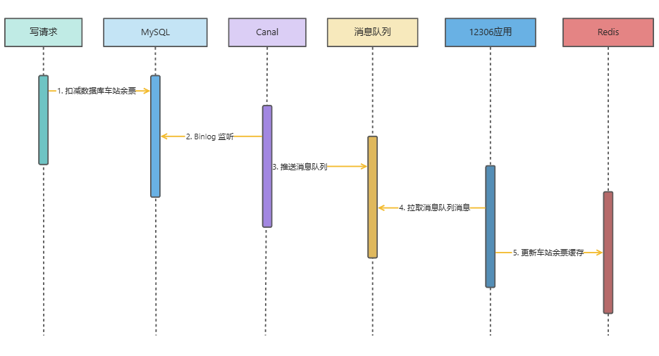

使用 Canal 监听 MySQL 的 BinLog：

1. Canal 监听 BinLog
2. Canal 将监听到的数据变更转发到消息队列的特定 Topic
3. 客户端监听该 Topic，根据消息更新缓存



## Canal 的使用

1. 首先，开启 MySQL 的 BinLog 日志：

```properties
[mysqld]
log-bin=mysql-bin # 开启 binlog
binlog-format=ROW # 选择 ROW 模式
server_id=1 # 不能和 canal 的 slaveId 重复
```

2. 在 MySQL 中创建 canal 单独使用的账号，以进行 BinLog 的同步和监听

```sql
CREATE USER canal IDENTIFIED BY 'canal';  
GRANT SELECT, REPLICATION SLAVE, REPLICATION CLIENT ON *.* TO 'canal'@'%';
FLUSH PRIVILEGES;
```

3. 配置 Canal 中 MySQL 的地址和 RocketMQ 的地址和监听的表或者数据库
4. 在应用程序中监听 RocketMQ 消息，以更新缓存

其中，消息的格式如下：

```json
{
    "data":[
        {
            "id":"1684913289981231104",
            "train_id":"1",
            "carriage_number":"01",
            "seat_number":"02C",
            "seat_type":"0",
            "start_station":"北京南",
            "end_station":"南京南",
            "price":"186400",
            "seat_status":"1",
            "create_time":"2023-07-28 21:06:47",
            "update_time":"2023-08-17 15:41:00",
            "del_flag":"0"
        }
    ],
    "database":"12306",
    "es":1692516745000,
    "id":2,
    "isDdl":false,
    "mysqlType":{
        "id":"bigint(20) unsigned",
        "train_id":"bigint(20)",
        "carriage_number":"varchar(64)",
        "seat_number":"varchar(64)",
        "seat_type":"int(3)",
        "start_station":"varchar(256)",
        "end_station":"varchar(256)",
        "price":"int(11)",
        "seat_status":"int(3)",
        "create_time":"datetime",
        "update_time":"datetime",
        "del_flag":"tinyint(1)"
    },
    "old":[
        {
            "seat_status":"0"
        }
    ],
    "pkNames":[
        "id"
    ],
    "sql":"",
    "sqlType":{
        "id":-5,
        "train_id":-5,
        "carriage_number":12,
        "seat_number":12,
        "seat_type":4,
        "start_station":12,
        "end_station":12,
        "price":4,
        "seat_status":4,
        "create_time":93,
        "update_time":93,
        "del_flag":-6
    },
    "table":"t_seat",
    "ts":1692516746008,
    "type":"UPDATE"
}
```

根据这个格式，定义如下的事件：

```java
@Data
public class CanalBinlogEvent {

    /**
     * 变更数据
     */
    private List<Map<String, Object>> data;

    /**
     * 数据库名称
     */
    private String database;

    /**
     * es 是指 Mysql Binlog 里原始的时间戳，也就是数据原始变更的时间
     * Canal 的消费延迟 = ts - es
     */
    private Long es;

    /**
     * 递增 ID，从 1 开始
     */
    private Long id;

    /**
     * 当前变更是否是 DDL 语句
     */
    private Boolean isDdl;

    /**
     * 表结构字段类型
     */
    private Map<String, Object> mysqlType;

    /**
     * UPDATE 模式下旧数据
     */
    private List<Map<String, Object>> old;

    /**
     * 主键名称
     */
    private List<String> pkNames;

    /**
     * SQL 语句
     */
    private String sql;

    /**
     * SQL 类型
     */
    private Map<String, Object> sqlType;

    /**
     * 表名
     */
    private String table;

    /**
     * ts 是指 Canal 收到这个 Binlog，构造为自己协议对象的时间
     * 应用消费的延迟 = now - ts
     */
    private Long ts;

    /**
     * INSERT（新增）、UPDATE（更新）、DELETE（删除）等等
     */
    private String type;
}
```

然后监听 Topic：

```java
@Slf4j
@Component
@RequiredArgsConstructor
@RocketMQMessageListener(
        topic = TicketRocketMQConstant.CANAL_COMMON_SYNC_TOPIC_KEY,
        consumerGroup = TicketRocketMQConstant.CANAL_COMMON_SYNC_CG_KEY
)
public class CanalCommonSyncBinlogConsumer implements RocketMQListener<CanalBinlogEvent> {

    private final AbstractStrategyChoose abstractStrategyChoose;

    @Value("${ticket.availability.cache-update.type:}")
    private String ticketAvailabilityCacheUpdateType;

    @Override
    public void onMessage(CanalBinlogEvent message) {
        // 如果是 DDL 返回
        // 如果不是 UPDATE 类型数据变更返回
        // 如果没有开启 binlog 数据同步模型返回
        if (message.getIsDdl()
                || CollUtil.isEmpty(message.getOld())
                || !Objects.equals("UPDATE", message.getType())
                || !StrUtil.equals(ticketAvailabilityCacheUpdateType, "binlog")) {
            return;
        }
        // 通过策略模式进行不同 Binlog 变更类型的监听，比如说订单和座位两个表就分别有两个处理类
        abstractStrategyChoose.chooseAndExecute(
                message.getTable(),
                message,
                CanalExecuteStrategyMarkEnum.isPatternMatch(message.getTable())
        );
    }
}
```

上述的策略模式是通过表明来与策略实现类进行匹配。

需要注意的是，在监听座位表的策略实现类中，只需要更新数据库对应的余票数量就好了。而不用更新沿途的余票数量。因为操作数据库的时候，已经有逻辑更新了沿途的票数。

