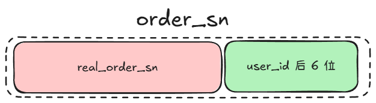

## 限流

限流： 用于限制系统在单位时间内处理的请求数量，以防止服务器过载、保障服务稳定性 。

常见的限流算法：

+ **固定窗口算法**： 在固定时间窗口（如 1 秒）内限制请求数量，例如每秒最多允许 100 次请求  。
+ **滑动窗口算法**：将大小为 `windowSize` 的时间窗口 `windows` 分割为 `n` 个小的窗口 `window`，每个 `window` 都有一个计数器，用于记录该窗口到达的请求数量。然后，判断是否 `windows` 中的所有的 `window` 的计数器之和是否小于等于固定的限定值（QPS），如果是，则返回 `true`，否则返回 `false`。随着时间的推移，会将过时的窗口移出 `windows`，或者复用该 `window`，但将其计数器归 0.
+ **令牌桶算法**：模拟一个以 **固定速率** 生成令牌的令牌桶。
+ **漏桶算法**：漏桶以 **固定速率** 来处理请求，如果漏桶已满，则多余的请求被丢弃或者延迟处理。

各个算法的优缺点：

| 限流算法 | 适用场景 | 优点 | 缺点 |
| --- | --- | --- | --- |
| 固定窗口 | 基本 API 速率限制 | 实现简单 | 存在突发流量问题 |
| 滑动窗口 | 平滑流量控制 | 避免流量突增 | 需要存储时间戳 |
| 令牌桶 | API 请求、突发流量 | 允许短时间超限 | 高并发下可能过多积累令牌 |
| 漏桶 | 严格限速 | 处理速率稳定 | 可能丢弃请求 |


### 12306 限流

通过在 redis 存储每一辆列车的每种类型的座位的余票，如果有余票，则可以获取继续购票。

上述方式解决了如下问题：

+ 过多的请求竞争分布式锁：如果没有这个 token 来进行限流，则一辆列车可能会有几十万的用户同时竞争分布式锁，而如果有 Token，则可以将请求的数量限制在余票数量当中

下面是实现：

1. 在 redis 中查询列车，因为用于限流的 Token 是根据列车的 ID 来分类存储的：

```java
TrainDO trainDO = distributedCache.safeGet(
        TRAIN_INFO + requestParam.getTrainId(),
        TrainDO.class,
        () -> trainMapper.selectById(requestParam.getTrainId()),
        ADVANCE_TICKET_DAY,
        TimeUnit.DAYS);

StringRedisTemplate stringRedisTemplate = (StringRedisTemplate) distributedCache.getInstance();

// 以列车 ID 对 Redis Token 进行分类存储
String tokenBucketRedisKey = TICKET_AVAILABILITY_TOKEN_BUCKET + requestParam.getTrainId();

Boolean hasTokenBucketInRedis = distributedCache.hasKey(tokenBucketRedisKey);
```

值得注意的是，该列车对应的 Token 的 redis key 由 **出发站点 + 终点站点 + 座位类型** 构成，value 则是该类型车票的余量。

2. 如果该令牌桶不存在，则从数据库查找然后添加：

```java
if (!hasTokenBucketInRedis) {
    RLock lock = redissonClient.getLock(String.format(LOCK_TICKET_AVAILABILITY_TOKEN_BUCKET, requestParam.getTrainId()));
    if (!lock.tryLock()) {
        throw new ServiceException("购票异常，请稍候再试");
    }

    try {
        Boolean hasKeyTwo = distributedCache.hasKey(tokenBucketRedisKey);
        if (!hasKeyTwo) {
            List<Integer> seatTypes = VehicleTypeEnum.findSeatTypesByCode(trainDO.getTrainType());
            // key -> redis key； value -> 余票
            // redis key 由 出发车站 + 终点车站 + 车票的座位类型 组成
            Map<String, String> redisTokens = new HashMap<>();

            List<RouteDTO> routeDTOList = trainStationService
                    .listTrainStationRoute(requestParam.getTrainId(), trainDO.getStartStation(), trainDO.getEndStation());

            for (RouteDTO each : routeDTOList) {
                List<SeatTypeCountDTO> seatTypeCountDTOList = seatService.listSeatTypeCount(Long.parseLong(requestParam.getTrainId()), each.getStartStation(), each.getEndStation(), seatTypes);
                for (SeatTypeCountDTO eachSeatTypeCountDTO : seatTypeCountDTOList) {
                    String redisTokenKey = StrUtil.join("_", each.getStartStation(), each.getEndStation(), eachSeatTypeCountDTO.getSeatType());
                    redisTokens.put(redisTokenKey, String.valueOf(eachSeatTypeCountDTO.getSeatCount()));
                }
            }

            stringRedisTemplate.opsForHash().putAll(TICKET_AVAILABILITY_TOKEN_BUCKET + requestParam.getTrainId(), redisTokens);
        }
    } finally {
        lock.unlock();
    }
}
```

3. 执行 Lua 脚本，以执行票的扣取逻辑（如果购买了  A -> D 的车票，则 A -> B、A -> C、A -> D、B -> C、 B -> D、C -> D 的车票都要被扣减）。其中，Lua 脚本不可能获取列车的行进路线，所以，这些要扣减的车票需要通过参数来传递给 Lua 脚本：

```java
// 使用单例模式获取脚本对象
DefaultRedisScript<String> decreaseTokenScript = Singleton.get(LUA_TICKET_AVAILABILITY_TOKEN_BUCKET_PATH, () -> {
    DefaultRedisScript<String> redisScript = new DefaultRedisScript<>();
    redisScript.setScriptSource(new ResourceScriptSource(new ClassPathResource(LUA_TICKET_AVAILABILITY_TOKEN_BUCKET_PATH)));
    redisScript.setResultType(String.class);
    return redisScript;
});

Assert.notNull(decreaseTokenScript);

Map<Integer, Long> seatTypeCount = requestParam.getPassengers().stream()
        .collect(Collectors.groupingBy(PurchaseTicketPassengerDetailDTO::getSeatType, Collectors.counting()));

JSONArray seatTypeCountArray = seatTypeCount.entrySet().stream()
        .map(entry -> {
            JSONObject jsonObject = new JSONObject();
            jsonObject.put("seatType", String.valueOf(entry.getKey()));
            jsonObject.put("count", String.valueOf(entry.getValue()));
            return jsonObject;
        })
        .collect(Collectors.toCollection(JSONArray::new));

List<RouteDTO> route = trainStationService
        .listTakeoutTrainStationRoute(requestParam.getTrainId(), requestParam.getDeparture(), requestParam.getArrival());

String purchaseTokenPrefix = StrUtil.join("_", requestParam.getDeparture(), requestParam.getArrival());

String resultJSON = stringRedisTemplate.execute(
        // 脚本
        decreaseTokenScript,
        // KEYS
        Lists.newArrayList(tokenBucketRedisKey, purchaseTokenPrefix),
        // ARGV [1]，通过 purchaseTokenPrefix + seatTypeCountArray [i].seatType 就可以获取到该列车对应的 Token
        // 从而减少余票
        JSON.toJSONString(seatTypeCountArray),
        // ARGV [2]
        JSON.toJSONString(route)
);
```

其中，Lua 脚本如下：

```lua
local purchaseTokenPrefix = KEYS[2]
local actualTokenPrefix = purchaseTokenPrefix

local colonIndex = string.find(actualTokenPrefix, ":")
if colonIndex ~= nil then
    actualTokenPrefix = string.sub(actualTokenPrefix, colonIndex + 1)
end

local seatTypeCountsJSON = ARGV[1]
local seatTypeCounts = cjson.decode(seatTypeCountsJSON)

local result = {}
local tokenIsNull = false
local tokenIsNullTable = {}

for _, seatTypeCount in ipairs(seatTypeCounts) do
    local seatType = tonumber(seatTypeCount.seatType)
    local count = tonumber(seatTypeCount.count)

    local tokenKey = actualTokenPrefix .. "_" .. seatType
    local tokenCount = tonumber(redis.call('hget', KEYS[1], tostring(tokenKey)))
    if tokenCount < count then
        tokenIsNull = true
        table.insert(tokenIsNullTable, seatType .. "_" .. count)
    end
end

result['tokenIsNull'] = tokenIsNull

if tokenIsNull then
    result['tokenIsNullSeatTypeCounts'] = tokenIsNullTable
    return cjson.encode(result)
end

-- 如果运行到这里，则说明已经确定要买了，所以，还要扣减沿途的车票
local routeJSON = ARGV[2]
local routes = cjson.decode(routeJSON)

for _, seatTypeCount in ipairs(seatTypeCounts) do
    local seatType = tonumber(seatTypeCount.seatType)
    local count = tonumber(seatType.count)

    for _, route in ipairs(routes) do
        local startStation = tostring(route.startStation)
        local endStation = tostring(route.endStation)

        local tokenKey = startStation .. "_" .. endStation .. "_" .. seatType
        redis.call('hincrby', KEYS[1], tostring(tokenKey), -count)
    end
end

return cjson.encode(result)
```

## 购票逻辑

1. 使用责任链模式来验证参数是否合法：

```java
// 责任链模式，验证 1：参数必填 2：参数正确性 3：乘客是否已买当前车次等...
purchaseTicketAbstractChainContext.handler(TicketChainMarkEnum.TRAIN_PURCHASE_TICKET_FILTER.name(), requestParam);
```

2. 使用令牌来进行限流：

```java
TokenResultDTO tokenResult = ticketAvailabilityTokenBucket.takeTokenFromBucket(requestParam);
```

3. 如果 tokenResult 中表示无法分配，则去数据库中查找票的数量，以确定是否余票是否真的不够了（这主要解决如下情况：当更新缓存后，此服务器上的服务器宕机了，没有更新数据库，所以导致了缓存中的数据少于了数据库的数据），但是要确保这个比对的操作只执行一次：

```java
if (tokenResult.getTokenIsNull()) {
    // 如果存在，则说明对该列车已经查过了一次数据库，不需要再查了（如果应用宕机了，则 tokenTicketsRefreshMap 是空的） 
    Object present = tokenTicketsRefreshMap.getIfPresent(requestParam.getTrainId());
    if (present == null) {
        synchronized (TicketService.class) {
            if (tokenTicketsRefreshMap.getIfPresent(requestParam.getTrainId()) == null) {
                present = new Object();
                tokenTicketsRefreshMap.put(requestParam.getTrainId(), present);
                tokenIsNullRefreshToken(requestParam, tokenResult);
            }
        }
    }
    throw new ServiceException("列车站点已无余票");
}
```

其中，`tokenIsNullRefreshToken` 的工作是从数据库中查找真实的数据，如果大于该请求所需要的数量，则说明缓存和数据库的数据不一致，删除该座位类型的缓存数据：

```java
// 单独开启一个线程完成这个工作
private final ScheduledExecutorService tokenIsNullRefreshExecutor = Executors.newScheduledThreadPool(1);

private void tokenIsNullRefreshToken(PurchaseTicketReqDTO requestParam, TokenResultDTO tokenResult) {
    RLock lock = redissonClient.getLock(String.format(LOCK_TOKEN_BUCKET_ISNULL, requestParam.getTrainId()));
    if (!lock.tryLock()) {
        return;
    }
    tokenIsNullRefreshExecutor.schedule(() -> {
        try {
            List<Integer> seatTypes = new ArrayList<>();
            Map<Integer, Integer> tokenCountMap = new HashMap<>();

            tokenResult.getTokenIsNullSeatTypeCounts().stream()
                    // 这其中的字符串的格式是 seatType_count，即缓存中该作为类型的票少于 count 张，故而不能进行分配
                    .map(each -> each.split("_"))
                    .forEach(split -> {
                        int seatType = Integer.parseInt(split[0]);
                        seatTypes.add(seatType);
                        tokenCountMap.put(seatType, Integer.parseInt(split[1]));
                    });

            List<SeatTypeCountDTO> actualSeatTypeCount = seatService.listSeatTypeCount(Long.parseLong(requestParam.getTrainId()), requestParam.getDeparture(), requestParam.getArrival(), seatTypes);
            for (SeatTypeCountDTO actual : actualSeatTypeCount) {
                // 注意，tokenCount 是需要分配的 count，而不是缓存中还有多少
                Integer tokenCount = tokenCountMap.get(actual.getSeatType());
                if (tokenCount < actual.getSeatCount()) {
                    // 说明数据库的 count 还有需要的 count，所以，从 redis 中删除，以加载最新的数据
                    ticketAvailabilityTokenBucket.delTokenInBucket(requestParam);
                    break;
                }
            }
        } finally {
            lock.unlock();
        }
    }, 10, TimeUnit.SECONDS);
}
```

4. 细化锁的粒度，对于用户的锁购买的每种不同座位类型都施加一把锁，等所有的锁都拿到了之后，才进行购买：

```java
// 类字段
private final Cache<String, ReentrantLock> localLocks = Caffeine.newBuilder()
        .expireAfterWrite(1, TimeUnit.DAYS)
        .build();

// .............

// 根据作为类型来进行加锁：优化锁的粒度
List<ReentrantLock> localLockList = new ArrayList<>();
// 为什么需要 2 重锁？
//  localLockList 主要用于同一台服务器的竞争
//  而下面的分布式锁主要用于不同服务器的竞争
List<RLock> distributedLockList = new ArrayList<>();

// 对 seatTypes 进行排序，以避免死锁
// 这是因为如果所有线程都使用相同的顺序获取锁，则不会出现死锁
List<PurchaseTicketPassengerDetailDTO> seatTypes = requestParam.getPassengers().stream()
        .sorted(Comparator.comparing(PurchaseTicketPassengerDetailDTO::getSeatType))
        .distinct()
        .toList();

seatTypes.forEach(seatType -> {
    String lockKey = environment.resolvePlaceholders(String.format(LOCK_PURCHASE_TICKETS_V2, requestParam.getTrainId(), seatType));
    ReentrantLock localLock = localLocks.getIfPresent(lockKey);
    if (localLock == null) {
        synchronized (TicketService.class) {
            if ((localLock = localLocks.getIfPresent(lockKey)) == null) {
                localLock = new ReentrantLock(true);
                localLocks.put(lockKey, localLock);
            }
        }
    }

    localLockList.add(localLock);
    RLock distributedLock = redissonClient.getFairLock(lockKey);
    distributedLockList.add(distributedLock);
});

try {
    // 按照顺序进行加锁
    localLockList.forEach(ReentrantLock::lock);
    distributedLockList.forEach(RLock::lock);
    
    return ticketService.executePurchaseTickets(requestParam);
} finally {
    localLockList.forEach(localLock -> {
        try {
            localLock.unlock();
        } catch (Throwable ignored) {
        }
    });

    distributedLockList.forEach(distributedLock -> {
        try {
            distributedLock.unlock();
        } catch (Throwable ignored) {
        }
    });
}
```

5. 获取全部的锁之后，真正执行购票的逻辑（即 `ticketService.executePurchaseTickets` 方法）：
    1. 分配座位（多个乘车人优先分配到一起）
    2. 调用订单接口创建订单

其中，订单的创建流程如下：

1. 使用基因法来生成订单号

### 基因法

因为我们对订单进行了分表，所以每次查询订单的时候必须携带分片键，所以分片键的选择至关重要。我们希望如下方式查询订单：

+ 用户能够查询自己的订单（分片键为 `user_id`）
+ 支持订单号的精准匹配（分片键为 `order_sn`）

如果有 2 个分片键，则查询的时候很不方便，所以，将 `order_sn` 和 `user_id` 融合在了一起（这种方法被称为 **基因法**）。

此时，订单的订单号有 2 部分组成：



其中，`real_order_sn` 是使用雪花算法来进行创建的。`user_id` 则是数据库表的 ID。

然后，分片的逻辑如下：

+ 如果 SQL 语句中包含了 `user_id` 列，则直接通过 `user_id` 的后 6 位来取模进行分片
+ 如果 SQL 语句中不包含 `user_id` 列，则通过 `order_sn` 的后 6 位提取出 `user_id` 的后 6 位来取模分片

所以，实际上的分片策略还是根据 `user_id` 来进行分片的。

那么，`user_id` 势必会重复，但是重复不要紧，来看一下重复情况下用户如何查询自己的订单：

1. 通过完整的 `user_id` 来进行查找该 `user_id` 对应的库和表

2. 即使 `user_id` 的后 6 位重复了，仍然可以通过完整的 `user_id` 来精确定位属于该用户订单

通过基因法处理过后，一个用户查询自己的订单不需要携带订单号，而且精确查询订单也不需要用户 ID。

---

下面继续订单的创建流程：

2. 创建订单并将其插入数据库中，其中，与订单有关的表有 3 张：
   + 主订单：用户购买的本次订单相关信息
   + 订单明细表：用户发起购票订单请求时，可能会为多名乘车人购票，每个乘车人会有对应的订单明细记录。
   + 订单乘车人明细表：这个表主要解决乘车人没有在系统中注册的问题。通过这个表，当用户在系统中注册的时候，就可以通过证件号找到他已经购买过的订单。
3. 延时关闭订单（如果长时间未支付）

### 延时关闭订单

#### 技术选型

##### 定时任务

常用的定时任务库有：

- https://github.com/xuxueli/xxl-job
- https://github.com/PowerJob/PowerJob
- https://github.com/apache/shardingsphere-elasticjob

定时任务的缺点有：

- 延迟时间不精确
- 不适合高并发场景：定时任务的执行频率通常是固定的，无法根据订单的数量来实时调整速率，从而导致大量的定时任务同时被执行
- 由于分库和分表，如果从数据库读取相关的数据，则会导致**读扩散**问题。

##### RabbitMQ

要使 `RabbitMQ` 能够延时关闭订单，需要安装 `rabbitmq_delayed_message_exchange` 插件来实现延时消息功能。

然后创建两个队列：

- 订单队列：用于存储需要延时关闭的订单消息
- 死信队列：用于存储延时时间到达了的订单消息

当订单消息的延时时间到达后，消息会自动转发到死信队列，从而触发关闭订单的操作。

为了确保消息的可靠性，可以在关闭订单操作前添加适当的幂等性措施，这样即使消息重复处理，也不会对系统产生影响。

RabiitMQ 延迟消息的缺点：

- 延时精度不高：延时消息的实现是通过消息的 TTL 实现的，存在一定的误差
- 高并发环境下消息堆积问题（取决于消费者的消费能力）
- 可靠性问题（RabbtiMQ 的可靠性较弱）
- 重复消息问题

##### Redis 过期监听

相当于把 Redis 当做 RabiitMQ 来用，也需要自己创建订单消息，并监听 Redis 的过期事件。

为了能够长期监听，还得处理 Redis 宕机或者重启等问题。

##### RocketMQ

RocketMQ 原生支持延迟消息，并且不是通过 TTL 机制实现的。

RocketMQ 预设了 18 个级别的延迟消息，分别是：

```
1s 5s 10s 30s 1m 2m 3m 4m 5m 6m 7m 8m 9m 10m 20m 30m 1h 2h
```

然后，不同级别的延迟消息被投放到不同的主题（命名格式为 `SCHEDULE_TOPIC_XXX`）中，而不是投递到生产者指定的队列中，然后 `ScheduleMessageService` 定时任务线程会定期扫描这些主题，找到到期的消息并转发到真正的目标队列中。

RocketMQ 5.0 之后，已经支持了自定以的时间延迟，而不局限于特定的延迟级别。

RocketMQ 还有一个特性：

- 保证消息传递的可靠性（消费者需要手动提交一个 ACK 以确认该消息被消费了）
- 如果长时间没有收到 ACK，则 MQ 会自动重试

所以，需要在消费端保证消息的幂等性。

在 12306 中使用了 RocketMQ 来进行延迟关闭。

#### 12306 延时关闭实现

1. 订单成功创建之后，发送一个延时消息到 RocketMQ 的一个主题中
2. 消费者订阅同一个主题，然后进行消费：
   1. 修改订单状态
   2. 修改数据库中座位的信息为无人购买
   3. 回退 Redis 中令牌桶的余票数量

需要注意的是，延时消息的发送和消费分别在 2 个不同的地方，分别是订单服务和 ticket 服务。

这么做的原因是：

- 购票服务调用了订单服务。而延迟关闭订单中，涉及到订单状态的变更和列车座位的变更等，这样就涉及到两个服务的调用。
- 如果消息消费在订单服务，就涉及到远程循环依赖，这对于微服务涉及中是需要尽可能避免的。所以，最终将消费延迟关闭消息放在了购票服务。


