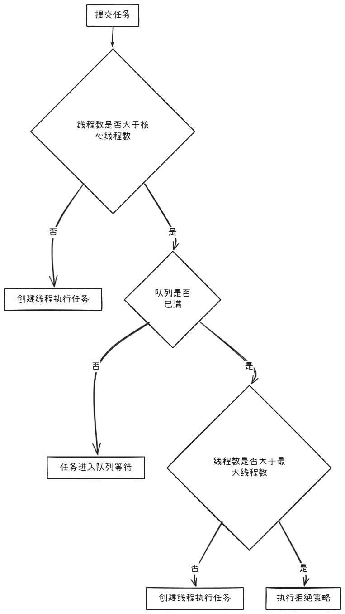
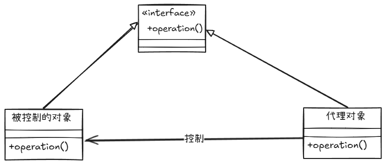
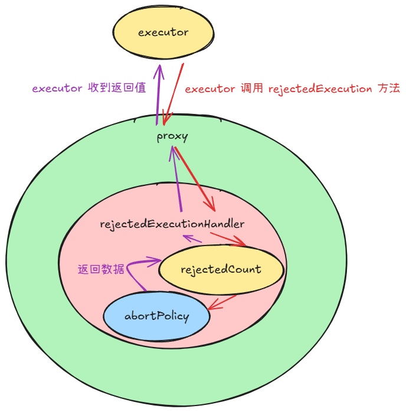

包括：

+ 公共枚举值
+ 线程池的封装
+ 公共工具类

## 枚举值
包括：

+ **删除**枚举类

```java
public enum DelEnum {

    NORMAL(0),

    DELETE(1);

    private final Integer statusCode;

    DelEnum(Integer statusCode) {
        this.statusCode = statusCode;
    }

    public Integer code() {
        return this.statusCode;
    }

    public String strCode() {
        return String.valueOf(this.statusCode);
    }

    @Override
    public String toString() {
        return strCode();
    }
}

```

+ 标志枚举类：

```java
public enum FlagEnum {

    FALSE(0),

    TRUE(1);

    private final Integer flag;
     
    //....
}

```

+ 操作类型枚举类：

```java
public enum OperationTypeEnum {

    SAVE,

    UPDATE,

    DELETE
}
```

+ 状态枚举类：

```java
public enum StatusEnum {

    SUCCESS(0),

    FAIL(1);

    private final Integer statusCode;

    // .......
}
```

## 线程池
这里的线程池有 2 个特征：

+ 快速消费线程池：减少任务排队时间，尽可能快地执行任务，提高吞吐量 
+ 动态代理扩展**拒绝策略**的线程池 

拒绝策略是任务无法被提交到线程池中时，所触发的不同策略。

Java 提供了 4 种默认策略：

| **策略** | **类名** | **行为** |
| --- | --- | --- |
| **直接丢弃** | `DiscardPolicy` | 直接丢弃任务，不做任何处理 |
| **抛异常** | `AbortPolicy` | 抛出 `RejectedExecutionException` |
| **调用者执行** | `CallerRunsPolicy` | 由提交任务的线程执行任务 |
| **丢弃队列最老任务** | `DiscardOldestPolicy` | 丢弃队列头部的任务，再尝试添加新任务 |


Java 提供的线程池有如下几种：

| **线程池类型** | **线程数** | **任务队列** | **适用场景** | **说明** |
| --- | --- | --- | --- | --- |
| **FixedThreadPool** | 固定（nThreads） | 无界（LinkedBlockingQueue） | 任务量稳定、并发数固定的场景，如 Web 服务器、数据库连接池 | 核心线程数与最大线程数相同，适用于并发量可预测的任务，避免频繁创建和销毁线程带来的开销。 |
| **CachedThreadPool** | 动态（0 到 Integer.MAX_VALUE） | 无队列（SynchronousQueue） | 短时间高并发任务，如 HTTP 请求、消息队列消费者 | 可根据需要动态扩展线程数，线程在 60 秒后会被回收，适合短时间高并发任务，但容易导致内存溢出。 |
| **SingleThreadExecutor** | 1 | 无界（LinkedBlockingQueue） | 串行任务、按顺序执行任务，如日志记录、任务队列 | 所有任务在同一个线程中顺序执行，适用于只需单线程并按顺序处理的场景。 |
| **ScheduledThreadPool** | 固定（corePoolSize） | 无界（DelayedQueue） | 定时任务、周期任务，如定时任务调度、缓存刷新 | 支持延迟执行和周期性任务。适用于需要定时任务的场景，例如每隔一段时间执行的任务。 |
| **WorkStealingPool** | 与 CPU 核数相同 | 工作窃取机制（ForkJoinPool） | 大规模并行计算任务，如数据分治任务、MapReduce | 基于工作窃取的并行处理机制，适用于计算密集型的任务，能在多个线程间分配工作。 |
| **ThreadPoolExecutor**（自定义） | 自定义（corePoolSize 到 maximumPoolSize） | 自定义队列（LinkedBlockingQueue、ArrayBlockingQueue 等） | 适用于各种自定义场景，灵活调整线程池大小和任务队列 | 可以根据需求定制线程池的大小、队列类型以及拒绝策略，灵活性强，适用于复杂场景。 |


### 快速消费线程池（自定义 ThreadPoolExecutor）
#### ThreadPoolExecutor 前置知识
下面是 `ThreadPoolExecutor` 的构造函数：

```java
public ThreadPoolExecutor(int corePoolSize,
                          int maximumPoolSize,
                          long keepAliveTime,
                          TimeUnit unit,
                          BlockingQueue<Runnable> workQueue,
                          ThreadFactory threadFactory,
                          RejectedExecutionHandler handler) {...}
```


+ **corePoolSize：**线程池中的核心线程数量，如果没有全局设置池内线程的过期时间，池内会维持此数量线程。
+ **maximumPoolSize：**线程池中的最大线程数量，当核心线程都在运行任务，并且**阻塞队列中任务数量已满**，此时会创建非核心线程。（这里指的已满是指在不进行扩容的条件下）
+ **keepAliveTime & unit：**线程池中线程过期时间以及时间单位。
+ **workQueue：**存放线程池内任务的阻塞队列，如 ArrayBlockingQueue、LinkedBlockingQueue...
+ **threadFactory：**创建线程池中线程的线程工厂，可以在创建线程时初始化优先级、名称、守护状态...
+ **handler：**当线程池中全部线程都在运行，阻塞队列也满的时候，会将添加的任务执行拒绝策略，默认为 **AbortPolicy**，即抛出异常。

---

任务的添加流程：



注意到上述线程池的行为中，当队列已满才会创建超过核心线程数数量的线程。

那么，如果 `ThreadPoolExector` 使用的是**无边界**的阻塞队列，例如 `LinkedBlockingQueue`，就会导致线程的数量永远无法超过核心线程数。

为了解决这个问题，需要让 `ThreadPoolExector` 误认为无边界的阻塞队列是有边界的。

源码中有如下语句：

```java
public void execute(Runnable command) {
    if (command == null)
        throw new NullPointerException();

    // 一个复杂的字段，包含了线程的数量和当前正在执行任务的线程的数量  
    int c = ctl.get();
    // 检查线程数是否超过了核心线程数
    if (workerCountOf(c) < corePoolSize) {
        // addWorker 的第二个参数表示是否是核心线程
        if (addWorker(command, true))
            return;
        c = ctl.get();
    }

    // 执行到这里就说明工作线程已经等于了核心线程数量
    // 接下来判断阻塞队列是否已满，如果阻塞队列的 offer 方法返回 true，则说明
    // 工作队列还没满
    if (isRunning(c) && workQueue.offer(command)) {
        int recheck = ctl.get();
        if (! isRunning(recheck) && remove(command))
            reject(command);
        else if (workerCountOf(recheck) == 0)
            addWorker(null, false);
    }
    else if (!addWorker(command, false))
        reject(command);
}
```

`offer` 方法是 `BlockingQueue<E>` 接口定义的：

```java
/**
 * Inserts the specified element into this queue if it is possible to do
 * so immediately without violating capacity restrictions, returning
 * {@code true} upon success and {@code false} if no space is currently
 * available.  When using a capacity-restricted queue, this method is
 * generally preferable to {@link #add}, which can fail to insert an
 * element only by throwing an exception.
 *
 * @param e the element to add
 * @return {@code true} if the element was added to this queue, else
 *         {@code false}
 * @throws ClassCastException if the class of the specified element
 *         prevents it from being added to this queue
 * @throws NullPointerException if the specified element is null
 * @throws IllegalArgumentException if some property of the specified
 *         element prevents it from being added to this queue
 */
boolean offer(E e);
```

总结一句话来说就是：在不对队列进行扩容的条件下，是否还有剩余的空间来插入元素。

在无边界的队列中（例如 `LinkedBlockingQueue`），如果在构造的时候，没有提供构造参数 `capacity`，则 `capacity `的默认值为 `Integer.MAX_VALUE`。这意味着 offer 总是返回 true。

这也就意味着，对于无边界队列，线程池的线程数量最多只会是核心线程数。

#### 实现
快速消费线程池要在 `ThreadPoolExecutor` 上实现如下功能：

+ 当池内线程数大于核心线程数时，不放入阻塞队列，而是创建一个非核心线程来进行消费

从而保证任务能够快速被执行。

1. 为 `ThreadPoolExecutor` 添加新的方法（主要维护了一个变量用于表示存活在线程池中任务数量和任务被拒后自动重试一次）

```java
public class EagerThreadPoolExecutor extends ThreadPoolExecutor {

    public EagerThreadPoolExecutor(int corePoolSize,
                                   int maximumPoolSize,
                                   long keepAliveTime,
                                   TimeUnit unit,
                                   TaskQueue<Runnable> workQueue,
                                   ThreadFactory threadFactory,
                                   RejectedExecutionHandler handler) {
        super(corePoolSize, maximumPoolSize, keepAliveTime, unit, workQueue, threadFactory, handler);
    }

    // 这个的
    private final AtomicInteger submittedTaskCount = new AtomicInteger(0);

    public int getSubmittedTaskCount() {
        return submittedTaskCount.get();
    }

    @Override
    protected void afterExecute(Runnable r, Throwable t) {
        submittedTaskCount.decrementAndGet();
    }

    @Override
    public void execute(Runnable command) {
        submittedTaskCount.incrementAndGet();
        try {
            // 现在，execute 会调用 TaskQueue 中已经被重写了的 offer 方法
            super.execute(command);
        } catch (RejectedExecutionException ex) {
            TaskQueue taskQueue = (TaskQueue) super.getQueue();
            try {
                // 尝试将该任务加入到队尾（不等待任何时间）
                if (!taskQueue.retryOffer(command, 0, TimeUnit.MILLISECONDS)) {
                    submittedTaskCount.decrementAndGet();
                    throw new RejectedExecutionException("Queue capacity is full.", ex);
                }
            } catch (InterruptedException iex) {
                submittedTaskCount.decrementAndGet();
                throw new RejectedExecutionException(iex);
            }
        } catch (Exception ex) {
            submittedTaskCount.decrementAndGet();
            throw ex;
        }
    }
}

```

2. 重写阻塞队列的 `offer` 方法：

```java
public class TaskQueue<R extends Runnable> extends LinkedBlockingQueue<Runnable> {

    @Setter
    private EagerThreadPoolExecutor executor;

    public TaskQueue(int capacity) {
        super(capacity);
    }

    @Override
    public boolean offer(Runnable runnable) {
        int currentPoolThreadSize = executor.getPoolSize();
        // 如果有核心线程正在空闲，将任务加入阻塞队列，由核心线程进行处理任务
        if (executor.getSubmittedTaskCount() < currentPoolThreadSize) {
            return super.offer(runnable);
        }
        // 当前线程池线程数量小于最大线程数，返回 False，根据线程池源码，会创建非核心线程
        if (currentPoolThreadSize < executor.getMaximumPoolSize()) {
            return false;
        }
        // 如果当前线程池数量大于最大线程数，任务加入阻塞队列
        return super.offer(runnable);
    }

    // 添加一个元素到队尾、如果成功，则返回 true
    // 如果等到了一段时间之后，还是不能插入元素到队尾，则返回 false
    public boolean retryOffer(Runnable o, long timeout, TimeUnit unit) throws InterruptedException {
        if (executor.isShutdown()) {
            throw new RejectedExecutionException("Executor is shutdown!");
        }
        return super.offer(o, timeout, unit);
    }
}

```

### 通过代理扩展线程池的拒绝策略
什么时候任务会被拒绝：

+ 当线程池处于非运行状态（已经被关闭了）
+ 阻塞队列已满，并且线程池中已经创建了最大数量的线程

线程池拒绝任务会调用它的 `reject` 方法，而这个方法本身是 `final` 的：

```java
/**
 * Invokes the rejected execution handler for the given command.
 * Package-protected for use by ScheduledThreadPoolExecutor.
 */
final void reject(Runnable command) {
    handler.rejectedExecution(command, this);
}
```

注释上说，之所以是 `final` 的，是因为 `ScheduledThreadPoolExecutor` 的要求。

这意味着，不能通过继承来重写 `reject` 方法以实现我们所需要的功能。

那么，只能通过`RejectedExecutionHandler` 来处理被拒绝之后的逻辑。

下面是通过代理模式来统计任务被拒次数的实现方法。

由于只是简单的统计任务的被拒次数，所以，我们想重用标准库已经提供了的 4 中拒绝策略。

所以，使用代理模式来优雅地实现我们所需要的功能。

我们可以通过**代理模式**来**优雅**地实现我们想要的功能。

代理模式的 UML 类图：



然后，用户访问 `代理对象` 的 `operation` 方法就可以获得比 `被控制对象` 更多的功能。

#### 静态代理
1. 首先，定义一个 `ThreadPoolExecutor` 的子类，以存储统计数据：

```java
public class SupportThreadPoolExecutor extends ThreadPoolExecutor {

    private final AtomicInteger rejectCount = new AtomicInteger();

    public SupportThreadPoolExecutor(int corePoolSize, int maximumPoolSize, long keepAliveTime, TimeUnit unit, BlockingQueue<Runnable> workQueue, RejectedExecutionHandler handler) {
        super(corePoolSize, maximumPoolSize, keepAliveTime, unit, workQueue, handler);
    }

    public void incrementRejectCount() {
        rejectCount.incrementAndGet();
    }

    public int getRejectCount() {
        return rejectCount.get();
    }
}
```

2. 扩展 `RejectedExecutionHandler` 接口，以增加统计相关的方法：

```java
public interface SupportRejectedExecutionHandler extends RejectedExecutionHandler {

    default void beforeReject(ThreadPoolExecutor executor) {
        if (executor instanceof SupportThreadPoolExecutor) {
            SupportThreadPoolExecutor supportExecutor = (SupportThreadPoolExecutor) executor;
            // 自增
            supportExecutor.incrementRejectCount();
        }
    }
}
```

3. 实现扩展后的接口`SupportRejectedExecutionHandler`：

```java
// 继承 AbortPolicy
public class SupportAbortPolicyRejected extends ThreadPoolExecutor.AbortPolicy implements SupportRejectedExecutionHandler {
    // 扩展/重写 RejectedExecutionHandler 中的方法
    @Override
    public void rejectedExecution(Runnable r, ThreadPoolExecutor e) {
        beforeReject(e);
        super.rejectedExecution(r, e);
    }
}
```

可以想象，如果需要为 4 中拒绝策略都实现这种功能，那么，就会导致 `SupportRejectedExecutionHandler` 有 4 个不同的实现类，并且这 4 个实现类的代码都是差不多的。

可以引入动态代理来解决这个问题。

#### 动态代理
##### 前置知识
动态代理可以实现在运行时创建所需要的代理对象（通过` java.lang.reflect.Proxy.newProxyInstance()` 来实现）。

该方法的声明：

```java
/**
 * .........
 *
 * @param   loader the class loader to define the proxy class
 * @param   interfaces the list of interfaces for the proxy class
 *          to implement
 * @param   h the invocation handler to dispatch method invocations to
 * @return  a proxy instance with the specified invocation handler of a
 *          proxy class that is defined by the specified class loader
 *          and that implements the specified interfaces
 */
@CallerSensitive
public static Object newProxyInstance(ClassLoader loader,
                                      Class<?>[] interfaces,
                                      InvocationHandler h) {
    // ..........
}
```

JDK 动态代理技术要求被代理的对象必须实现接口。

其中，InvocationHandler 具有如下结构：

```java
public class A implements InvocationHandler {
    // 被代理的对象
    private final Object target;

    // <其它字段>

    // 在创建 A 的时候，就需要设置被代理的对象
    A(Object target) {
        this.target = target;
    }

    // 所有在 interfaces 中声明的方法都会被“重定向”到此处
    // proxy 是 Proxy.newProxyInstance(...) 返回的代理对象
    // method 是 proxy 对象中，interfaces 所定义的方法
    // args 是 method 对应的参数
    @Override
    public Object invoke(Object proxy, Method method, Object[] args) throws Throwable {
        // 扩展的代码 ............
        
        // 访问被代理对象的方法
        // 会在 target 中找到与 method 相同签名的方法，然后传入 args 进行调用
        method.invoke(target, args);
    }
}
```

注意到，上面的类 `A` 是没有实现参数 `interfaces` 中接口的。

而是 `newProxyInstance` 返回的代理对象 proxy 实现了 `interfaces` 中的接口，并在接口的方法中调用了 `this.h.invoke(this, method, args)` （this 指的是代理对象 proxy，即 h 会被“安装”在代理对象中）从而将所有对接口中方法的访问“重定向”到 `h` 中的 `invoke` 方法中。

注意到，经过上面的步骤之后，代理对象和被代理对象都实现了 `interfaces` 中的接口。所以，代理对象可以像被代理对象一样被使用。例如，都可以传入一个接收某个接口的方法中。

需要特别注意的是：

+ 代理对象的 `toString`、`hashCode` 和 `equals` 方法也会被重定向到 `invoke` 方法中。
+ `InvocationHandler` 的实现类中，不一定要有被代理的对象。如果这样的话，代理对象中的 `h`的 `invoke` 方法就是调用的终点。例如，Mybatis 中的 Mapper 接口就不需要被代理的对象。

##### 实现
1. 定义一个实现了 `InvocationHandler` 的类：

```java
@Slf4j
@AllArgsConstructor
public class RejectedProxyInvocationHandler implements InvocationHandler {
    // 被代理对象
    private RejectedExecutionHandler target;

    private final AtomicLong rejectedCount;

    @Override
    public Object invoke(Object proxy, Method method, Object[] args) throws Throwable {
        // 这里之所以可以直接增加，是因为 RejectedExecutionHandler 中
        // 只有 rejectedExecution 一个方法，而这个方法被调用一次，刚好说明被拒绝一次
        // 如果 RejectedExecutionHandler 中有多个方法，还需要确定 method
        // 是否是 rejectedExecution
        rejectedCount.incrementAndGet();
        
        return methond.invoke(target, args);
    }
}

```

2. 生成代理对象：

```java
ThreadPoolExecutor.AbortPolicy abortPolicy = new ThreadPoolExecutor.AbortPolicy();
AtomicLong rejectedCount = new AtomicLong();

RejectedExecutionHandler proxy = (RejectedExecutionHandler) Proxy.newProxyInstance(
    abortPolicy.getClass().getClassLoader(),
    abortPolicy.getClass().getInterfaces(),
    new RejectedExecutionProxyInvocationHandler(abortPolicy, rejectedNum)
);
```

3. 将代理对象传入 `ThreadPoolExecutor`：

```java
ThreadPoolExecutor executor =
        new ThreadPoolExecutor(1, 3, 1024, TimeUnit.SECONDS, new LinkedBlockingQueue<>(1));

executor.setRejectedExecutionHandler(proxy);
```

4. 最后，可以通过访问 `rejectedNum` 来查看统计数据：

```java
rejectedCount.get();
```

上述代码之间的依赖关系可以用如下图来说明：



这里的返回值是 `void`。


