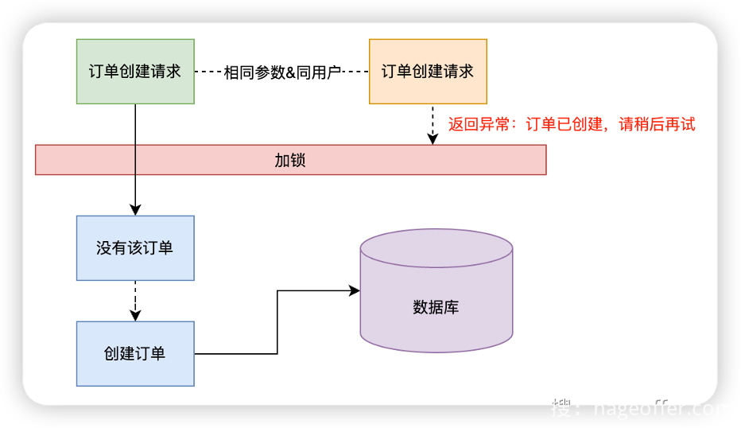
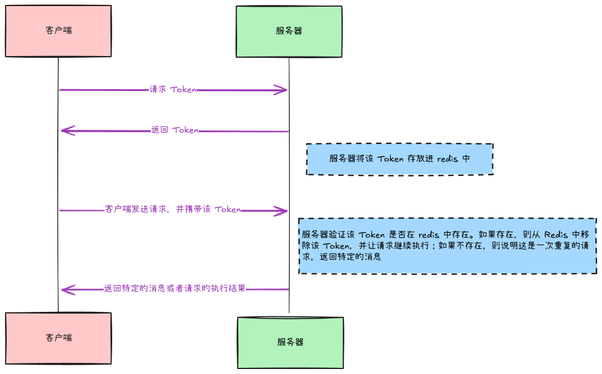
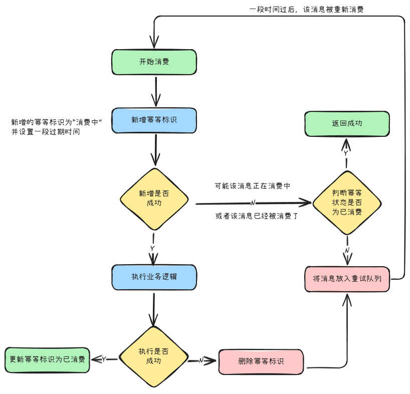
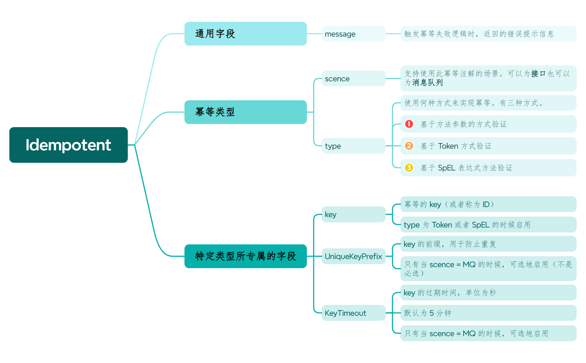

幂等是指：

+ 相同的操作无论执行多少次，都产生相同的结果

例如，某个接口如果满足幂等性，如果它往数据库插入一条数据 D，则当另一个完全一样的请求到达该接口的时候，它**不会**再次插入 D，因为如果插入了的话，就不满足幂等性了。

所以，关于幂等可以换一个更好理解的定义：

+ 相同的操作无论执行多少次，系统的状态变化只能发生一次。

系统中常见的幂等：

+ **接口幂等**是指对于相同的请求，只执行一次
+ **消息队列幂等**是指一个消费者对同样的消息只消费一次

## 接口幂等性
### 实现方法一：分布式锁
1. 对于同一个请求，服务器端生成同一个 ID（这可以通过 SHA-256 来完成）
2. 使用该 ID 来标识并创建一个**分布式锁**
3. 请求获取该请求  ID 对应的分布式锁，如果可以获取，则继续执行；否则，说明其它相同的请求正在执行，返回对应的信息即可。
4. 获取到分布式锁的请求在完成处理之后，需要释放掉该分布式锁



### 实现方法二：Token 令牌
1. 客户端在发送请求之前，需要先向服务器申请一个 Token（相当于领一个**入场券**）
2. 服务器返回该 Token，并将 Token 存放在服务器的 Redis 中
3. 客户端发送真正的请求，并将 Token 携带进请求中
4. 服务器检查请求携带的 Token 是否还存在于 Redis 中。如果存在，则从 Redis 中移除该 Token，并让请求继续执行；如果不存在，则说明这是一次重复的请求，返回特定的消息。



此方法需要解决如下问题：

1. 开始执行业务逻辑就删除 Token 还是执行完成之后删除 Token?
+ 先删除可能导致，业务确实没有执行（可能由于服务器故障），重试还带上**之前的** Token，由于防重设计导致，请求还是不能执行。
+  后删除可能导致，业务处理成功，但是服务闪断，出现超时，没有删除token，别人继续重试，导致业务被执行两遍

最好设计为先删除token，如果业务调用失败，就重新获取token 再次请求。

2. 验证 Token 是否存在，如果存在则删除这两个操作需要是原子的。否则，就可能两个相同的请求验证的结果都为存在，然后这两个请求都执行。

可以使用 lua 脚本来完成这一点。

### 实现方法三：去重表
1. 客户端发送请求时，服务器对于同一个请求生成同一个 ID
2. 服务器检查该 ID 在去重表中是否存在，如果不存在，就放入该去重表中；如果存在，则说明这是一个重复的请求，返回特定的消息。

去重表可能由数据库或者 Redis 等来实现。

## 消息队列幂等性


其中，幂等标识存放在 Redis 中。

重试队列是指 `RocketMQ` 所管理的重试队列。

## 实现
### 一、定义幂等注解
使用幂等注解（`Idempotent`），其中包含如下字段：



其定义如下：

```java
@Target({ElementType.TYPE, ElementType.METHOD})
@Retention(RetentionPolicy.RUNTIME)
@Documented
public @interface Idempotent {

    String key() default "";

    String message() default "您操作太快，请稍后再试";

    IdempotentTypeEnum type() default IdempotentTypeEnum.PARAM;

    IdempotentSceneEnum scene() default IdempotentSceneEnum.RESTAPI;

    String uniqueKeyPrefix() default "";

    long keyTimeout() default 300L;
}

```

其中，`scence` 的值可以为：

```java
public enum IdempotentSceneEnum {   
    RESTAPI, 
    MQ
}
```

`type` 的值可以为：

```java
public enum IdempotentTypeEnum {
    TOKEN,
    // 基于方法参数
    PARAM,
    SPEL
}
```

其中，`SpEL` 全称为 `Spring Exetention Language`：[SpEL 手册](https://docs.spring.io/spring-framework/docs/3.0.x/reference/expressions.html#expressions-language-ref)。

### 二、使用 AOP 来增强方法
```java
@Aspect
public final class IdempotentAspect {

    // 取得方法中的 Idempotent，以获得注解中的值
    public static Idempotent getIdempotent(ProceedingJoinPoint joinPoint) throws NoSuchMethodException {
        MethodSignature methodSignature = (MethodSignature) joinPoint.getSignature();
        Method targetMethod = joinPoint.getTarget().getClass().getDeclaredMethod(methodSignature.getName(), methodSignature.getMethod().getParameterTypes());
        return targetMethod.getAnnotation(Idempotent.class);
    }

    @Around("@annotation(org.opengoofy.index12306.framework.starter.idempotent.annotation.Idempotent)")
    public Object idempotentHandler(ProceedingJoinPoint joinPoint) throws Throwable {
        Idempotent idempotent = getIdempotent(joinPoint);

        // 基于不同的 scene 和 type 来选择不同的 handler
        IdempotentExecuteHandler instance = IdempotentExecuteHandlerFactory.getInstance(idempotent.scene(), idempotent.type());

        // 执行业务逻辑时的返回值
        Object result;
        try {
            // 通过 execute 方法是否抛出异常来决定是否执行业务逻辑
            instance.execute(joinPoint, idempotent);
            result = joinPoint.proceed();
            // 完成资源清理等工作
            instance.postProcessing();
        } catch (RepeatConsumptionException ex) {
            // 有 2 种情况会抛出这个异常：
            //      1. 在 redis 中新增幂等标识时没有成功，因为消息已经**消费完成**了
            //      2. 在 redis 中新增幂等标识时没有成功，因为消息正在**消费中**
            // 对于第 2 种，需要重新消费
            if (ex.shouldReconsume()) {
                // 抛出异常，以触发后面一个 catch 块中将消息加入重试队列中的操作
                throw ex;
            }
            // 对于第 1 种情况，则直接返回 null 表示成功
            return null;
        } catch (Throwable ex) {
            // 消费者消费存在异常，可能是由于消费的逻辑，也有可能是消息正在消费中
            // 需要删除幂等标识方便下次 RocketMQ 再次通过重试队列投递
            instance.exceptionProcessing();
            throw ex;
        } finally {
            // 清理幂等上下文
            IdempotentContext.clean();
        }
        return result;
    }
}
```

上面的 AOP 代码中，通过`IdempotentExecuteHandlerFactory` 来创建对应的 `Handler`：

```java
public final class IdempotentExecuteHandlerFactory {

    public static IdempotentExecuteHandler getInstance(IdempotentSceneEnum scene, IdempotentTypeEnum type) {
        IdempotentExecuteHandler result = null;
        switch (scene) {
            case RESTAPI -> {
                // 接口可以选择 3 种实现幂等方式
                switch (type) {
                    case PARAM -> result = ApplicationContextHolder.getBean(IdempotentParamService.class);
                    case TOKEN -> result = ApplicationContextHolder.getBean(IdempotentTokenService.class);
                    case SPEL -> result = ApplicationContextHolder.getBean(IdempotentSpELByRestAPIExecuteHandler.class);
                    default -> {
                    }
                }
            }
            case MQ -> result = ApplicationContextHolder.getBean(IdempotentSpELByMQExecuteHandler.class);
            default -> {
            }
        }
        return result;
    }
}
```

---

在介绍 Handler 的具体实现方式之前，先来看看所有的实现所具有的共同的抽象：

1. 所有 Handler 的实现了 `IdempotentExecuteHandler` 接口：

```java
public interface IdempotentExecuteHandler {

    // 实现幂等逻辑
    void handle(IdempotentParamWrapper wrapper);

    // 执行幂等逻辑（调用 handler 方法）
    void execute(ProceedingJoinPoint joinPoint, Idempotent idempotent);

    // 当执行业务逻辑的过程中或者处理器本身抛出异常时调用
    default void exceptionProcessing() {

    }

    // 执行完业务逻辑之后调用
    default void postProcessing() {

    }
}
```

2. 一个实现了 `IdempotentExecuteHandler` 的抽象处理器 `AbstractIdempotentExecuteHandler`：

```java
public abstract class AbstractIdempotentExecuteHandler implements IdempotentExecuteHandler {

    // 模版方法
    // 由每个 Handler 决定自己需要什么参数
    // 返回的 IdempotentParamWrapper 包含了该 Handler 所需要的所有参数
    // 即聚合多个参数为一个
    protected abstract IdempotentParamWrapper buildWrapper(ProceedingJoinPoint joinPoint);

    @Override
    public void execute(ProceedingJoinPoint joinPoint, Idempotent idempotent) {
        // 模板方法模式：构建幂等参数包装器
        IdempotentParamWrapper idempotentParamWrapper = buildWrapper(joinPoint).setIdempotent(idempotent);
        // 调用具体实现类的 handler 方法
        handle(idempotentParamWrapper);
    }
}
```

上述抽象类的目的是：

+ 实现 `execute` 方法，让子类专门实现 `handle` 方法

其中，`IdempotentParamWrapper` 包含了如下字段：

```java
@Data
@Builder
@NoArgsConstructor
@AllArgsConstructor
@Accessors(chain = true)
public final class IdempotentParamWrapper {

    // 注解
    private Idempotent idempotent;

    // AOP 连接点
    private ProceedingJoinPoint joinPoint;

    // 被用于唯一地表示一个请求或者一条消息
    private String key;
}

```

3. 所有 Handler 都继承了 `AbstractIdempotentExecuteHandler`，从而都实现了 `IdempotentExecuteHandler`，并且它们的 `execute` 方法都是已经写好了的。
4. 为所有 Handler 提供了一个 `IdempotentContext` 上下文，用于存储 Handler 中需要用到的数据：

```java
public final class IdempotentContext {
    
    private static final ThreadLocal<Map<String, Object>> CONTEXT = new ThreadLocal<>();
    
    public static Map<String, Object> get() {
        return CONTEXT.get();
    }
    
    public static Object getKey(String key) {
        Map<String, Object> context = get();
        if (CollUtil.isNotEmpty(context)) {
            return context.get(key);
        }
        return null;
    }
    
    // .......
    
    public static void put(String key, Object val) {
        Map<String, Object> context = get();
        if (CollUtil.isEmpty(context)) {
            context = Maps.newHashMap();
        }
        context.put(key, val);
        putContext(context);
    }
    
    public static void putContext(Map<String, Object> context) {
        Map<String, Object> originalContext = CONTEXT.get();
        if (CollUtil.isNotEmpty(threadContext)) {
            // 如果不为空，则将传进来的 context 全部加入到原来的 context 中
            originalContext.putAll(context);
            return;
        }
        
        CONTEXT.set(context);
    }
    
    public static void clean() {
        CONTEXT.remove();
    }
}

```

其中，每个数据由 Map 的 Key，即一个字符串标识。

5. 为 MQ 的消息前缀或者 Token 的前缀定义了一个配置：

```java
@Data
@ConfigurationProperties(prefix = IdempotentProperties.CONFIG_PREFIX)
public class IdempotentProperties {

    public static final String CONFIG_PREFIX = "framework.idempotent.token";

    private String prefix;

    private Long timeout;
}
```

这样的话，可以在配置文件中进行如下定义：

```yaml
framework.idempotent.token.prefix=my_prefix
framework.idempotent.token.timeout=3000
```

#### 基于入参的幂等 Handler
该 Handler 实现了 `IdempotentParamService` 这个标记接口。

```java
@RequiredArgsConstructor
public final class IdempotentParamExecuteHandler extends AbstractIdempotentExecuteHandler implements IdempotentParamService {

    // redisson 用于实现分布式锁
    private final RedissonClient redissonClient;

    // 用于标识分布式锁在 IdempotentContext 中的 key
    private final static String CONTEXT_KEY = "lock:param:restAPI";

    // 覆盖父类的 buildWrapper 方法，以定义自己 handler 中需要的参数
    @Override
    protected IdempotentParamWrapper buildWrapper(ProceedingJoinPoint joinPoint) {
        // 分布式锁的组成为：请求路径 + 当前用户 ID + 请求参数的 MD5
        String lockKey = String.format("idempotent:path:%s:currentUserId:%s:md5:%s", getServletPath(), getCurrentUserId(), calcArgsMD5(joinPoint));
        return IdempotentParamWrapper.builder().lockKey(lockKey).joinPoint(joinPoint).build();
    }

    // 获取请求路径
    private String getServletPath() {
        ServletRequestAttributes sra = (ServletRequestAttributes) RequestContextHolder.getRequestAttributes();
        return sra.getRequest().getServletPath();
    }

    private String getCurrentUserId() {
        String userId = UserContext.getUserId();
        if(StrUtil.isBlank(userId)){
            throw new ClientException("用户ID获取失败，请登录");
        }
        return userId;
    }

    // 计算请求参数的 MD5，相同的请求参数会有相同的 MD5 值
    private String calcArgsMD5(ProceedingJoinPoint joinPoint) {
        return DigestUtil.md5Hex(JSON.toJSONBytes(joinPoint.getArgs()));
    }

    // 正式实现幂等逻辑
    @Override
    public void handle(IdempotentParamWrapper wrapper) {
        String lockKey = wrapper.getLockKey();
        RLock lock = redissonClient.getLock(lockKey);
        if (!lock.tryLock()) {
            // 如果不能获取锁，则说明该请求已经在执行中，这是一个重复的请求，直接返回就好了
            throw new ClientException(wrapper.getIdempotent().message());
        }
        
        // 锁在业务逻辑处理完成之后释放
        // 即在 postProcessing 方法中释放
        IdempotentContext.put(LOCK, lock);
    }

    @Override
    public void postProcessing() {
        RLock lock = null;
        try {
            lock = (RLock) IdempotentContext.getKey(LOCK);
        } finally {
            if (lock != null) {
                lock.unlock();
            }
        }
    }

    @Override
    public void exceptionProcessing() {
        postProcessing();
    }
}
```

#### 基于 Token 的幂等 Handler
1. 首先，创建一个获取 Token 的接口：

```java
@RestController
@RequiredArgsConstructor
public class IdempotentTokenController {

    private final IdempotentTokenService idempotentTokenService;

    @GetMapping("/token")
    public Result<String> createToken() {
        return Results.success(idempotentTokenService.createToken());
    }
}
```

2. 定义了一个接口，其中，定义了 `createToken` 这个方法：

```java
public interface IdempotentTokenService extends IdempotentExecuteHandler {
    String createToken();
}
```

3. Handler 实现这个接口的同时，也继承了 `AbstractIdempotentExecuteHandler`：

```java
@RequiredArgsConstructor
public final class IdempotentTokenExecuteHandler extends AbstractIdempotentExecuteHandler implements IdempotentTokenService {

    // 分布式缓存，位于分布式组件中
    private final DistributedCache distributedCache;
    // 配置文件中的 Token 前缀和过期时间配置
    private final IdempotentProperties idempotentProperties;

    // 请求头中的 Token 的名称
    private static final String REQUEST_TOKEN_HEADER_KEY = "token";

    // Token 的默认前缀和过期时间
    // 如果配置文件中没有指定的话
    private static final String TOKEN_DEFAULT_PREFIX = "idempotent:token:";
    // 6 秒
    private static final long TOKEN_DEFAULT_EXPIRE_TIME = 6000;

    @Override
    protected IdempotentParamWrapper buildWrapper(ProceedingJoinPoint joinPoint) {
        // 不需要关于切入点的相关信息
        return new IdempotentParamWrapper();
    }

    @Override
    public String createToken() {
        // 使用 UUID 生成一个全局唯一的 Token（加上前缀）
        String token = Optional.ofNullable(Strings.emptyToNull(idempotentProperties.getPrefix())).orElse(TOKEN_DEFAULT_PREFIX) + UUID.randomUUID();
        // 将 Token 存放到 redis 中
        distributedCache.put(token, "", Optional.ofNullable(idempotentProperties.getTimeout()).orElse(TOKEN_DEFAULT_EXPIRE_TIME));
        return token;
    }

    @Override
    public void handle(IdempotentParamWrapper wrapper) {
        HttpServletRequest request = ((ServletRequestAttributes) (RequestContextHolder.currentRequestAttributes())).getRequest();
        String token = request.getHeader(REQUEST_TOKEN_HEADER_KEY);
        if (StrUtil.isBlank(token)) {
            token = request.getParameter(REQUEST_TOKEN_HEADER_KEY);
            if (StrUtil.isBlank(token)) {
                // 请求必须携带 Token
                throw new ClientException(BaseErrorCode.IDEMPOTENT_TOKEN_NULL_ERROR);
            }
        }

        // 如果 Token 不存在，则删除不会成功
        // 如果存在，则成功删除
        // 在执行业务逻辑之前就删除 Token   
        // 由于这里没有验证 Token 是否存在，而是直接删除，所以，不需要原子性的保证
        Boolean deleteSuccess = distributedCache.delete(token);
        if (!deleteSuccess) {
            String errMsg = StrUtil.isNotBlank(wrapper.getIdempotent().message())
                    ? wrapper.getIdempotent().message()
                    : BaseErrorCode.IDEMPOTENT_TOKEN_DELETE_ERROR.message();

            throw new ClientException(errMsg, BaseErrorCode.IDEMPOTENT_TOKEN_DELETE_ERROR);
        }
    }
}
```

#### 基于 SpEL 的接口幂等性的实现
##### Lombok `@SneakyThrows` 注解
Java 的异常分 2 种：

+ `Checked Exception`：必须在程序中**显式地**捕获的异常。此类异常是 `Exception` 的子类，但是不是 `RuntimeException` 的子类。例如 `IOException`、`SQLException` 等。
+ `Unchecked Exception`：不用显式地捕获的异常。此类异常是 `RuntimeException` 的子类。例如 ` NullPointerException`

而 `@SneakyThrows` 可以将**方法中**的 `Checked Exception` 转换成 `Unchecked Exception`。

##### SpEL 表达式
如何在自定义的注解中使用 `SpEL` 表达式（以日志打印为例）：

1. 定义一个注解，使其可以存储一个字符串的 `SpEL` 表达式：

```java
@Target(ElementType.METHOD)
@Retention(RetentionPolicy.RUNTIME)
public @interface LogExecution {
    // 支持 SpEL
    String value(); 
}
```

2. 定义 AOP 来解析 `SpEL` 表达式

```java
@Aspect
@Component
public class LogExecutionAspect {

    @Autowired
    private ApplicationContext applicationContext;

    @Around("@annotation(logExecution)")
    public Object logExecution(ProceedingJoinPoint joinPoint, LogExecution logExecution) throws Throwable {
        // 解析 SpEL 表达式
        ExpressionParser parser = new SpelExpressionParser();
        
        // SpEL 解析式对应的上下文
        EvaluationContext context = new StandardEvaluationContext();
        
        MethodSignature signature = (MethodSignature) joinPoint.getSignature();
        Object[] args = joinPoint.getArgs();
        String[] parameterNames = signature.getParameterNames();
        for (int i = 0; i < parameterNames.length; i++) {
            // 添加方法参数到 SpEL 上下文
            context.setVariable(parameterNames[i], args[i]);
        }

        String expression = logExecution.value();
        // 解析表达式
        String result = parser.parseExpression(expression).getValue(context, String.class);

        System.out.println("执行日志：" + result);

        return joinPoint.proceed();
    }
}
```

其中，SpEL 表达式具有下面的特殊符号（部分）：

| SpEL 关键字 | 作用 | 示例 | 解析结果 |
| --- | --- | --- | --- |
| `#` | 访问变量、方法参数 | `#id` | 方法参数 `id` |
| `T(ClassName)` | 访问 Java 类 | `T(Math).random()` | 调用 `Math.random()` |
| `T(Class).CONSTANT` | 访问静态字段 | `T(Integer).MAX_VALUE` | `2147483647` |


##### 实现
基于 SpEL 表达式来进行幂等校验的时候，SpEL 表达式的作用是生成 `Idempotent` 注解中的 `key` 字段。

1. 提取出了一个解析 `SpEL` 表达式的工具类

```java
public class SpELUtil {

    public static Object parseKey(String spEL, Method method, Object[] methodArgs) {
        ArrayList<String> spELFlags = Lists.newArrayList("#", "T(");
        Optional<String> optional = spELFlags.stream().filter(spEL::contains).findFirst();
        if (optional.isPresent()) {
            return parse(spEL, method, methodArgs);
        }

        // 直接返回 SpEL 表达式作为 Idempotent 中的 key（不需要设置 Context 来求值）
        return spEL;
    }

    public static Object parse(String spEl, Method method, Object[] methodArgs) {
        // 获取方法中方法的参数名（不是类型）
        DefaultParameterNameDiscoverer argNamesDiscover = new DefaultParameterNameDiscoverer();

        ExpressionParser parser = new SpelExpressionParser();
        Expression expression = parser.parseExpression(spEl);
        String[] params = argNamesDiscover.getParameterNames(method);

        // 设置 SpEL 表达式的上下文
        StandardEvaluationContext context = new StandardEvaluationContext();
        if (ArrayUtil.isNotEmpty(params)) {
            for (int i = 0; i < params.length; i++) {
                context.setVariable(params[i], methodArgs[i]);
            }
        }

        return expression.getValue(context);
    }
}

```

2. 正式实现 Handler 处理幂等的逻辑：

```java
@RequiredArgsConstructor
public final class IdempotentSpELByRestAPIExecuteHandler extends AbstractIdempotentExecuteHandler implements IdempotentSpELService {

    // 使用分布式锁来实现幂等校验
    private final RedissonClient redissonClient;

    private final static String CONTEXT_KEY = "lock:spEL:restAPI";

    @SneakyThrows
    @Override
    protected IdempotentParamWrapper buildWrapper(ProceedingJoinPoint joinPoint) {
        Idempotent idempotent = IdempotentAspect.getIdempotent(joinPoint);
        // 解析 SpEL 表达式的结果
        String key = (String) SpELUtil.parseKey(idempotent.key(), ((MethodSignature) joinPoint.getSignature()).getMethod(), joinPoint.getArgs());
        return IdempotentParamWrapper.builder().lockKey(key).joinPoint(joinPoint).build();
    }

    @Override
    public void handle(IdempotentParamWrapper wrapper) {
        String uniqueKey = wrapper.getIdempotent().uniqueKeyPrefix() + wrapper.getLockKey();
        RLock lock = redissonClient.getLock(uniqueKey);
        if (!lock.tryLock()) {
            throw new ClientException(wrapper.getIdempotent().message());
        }
        IdempotentContext.put(CONTEXT_KEY, lock);
    }

    @Override
    public void postProcessing() {
        RLock lock = null;
        try {
            lock = (RLock) IdempotentContext.getKey(CONTEXT_KEY);
        } finally {
            if (lock != null) {
                lock.unlock();
            }
        }
    }

    @Override
    public void exceptionProcessing() {
        RLock lock = null;
        try {
            lock = (RLock) IdempotentContext.getKey(CONTEXT_KEY);
        } finally {
            if (lock != null) {
                lock.unlock();
            }
        }
    }
}
```

#### 基于 SpEL 的 MQ 消息幂等性的实现
1. 定义一个 lua 脚本，用于实现操作 redis 时的原子性：

```lua
-- 原子性获取给定key，若 key 存在返回其值，若 key 不存在则设置 key 并返回 null

local key = KEYS[1]
local value = ARGV[1]
local expire_time_ms = ARGV[2]

-- SET key value → 设置 key 的值为 value
-- NX → 仅当 key 不存在 时才进行设置（防止覆盖已有值）
-- GET → 返回 旧值（如果 key 存在）
-- PX expire_time_ms → 过期时间（单位 毫秒）
return redis.call('SET', key, value, 'NX', 'GET', 'PX', expire_time_ms)
```

2. Handler 的具体实现：

```java
@RequiredArgsConstructor
public final class IdempotentSpELByMQExecuteHandler extends AbstractIdempotentExecuteHandler implements IdempotentSpELService {

    private final static int TIMEOUT = 600;

    private final static String CONTEXT_KEY = "wrapper:spEL:MQ";

    // lua 文件：原子性获取给定 key，若 key 存在返回其值，若 key 不存在则设置 key 并返回 null
    private final static String LUA_SCRIPT_PATH = "lua/set_if_absent_and_get.lua";

    private final DistributedCache distributedCache;

    // 执行 LUA_SCRIPT_PATH 对应的脚本
    public String setIfAbsentAndGet(String key, String value, long timeout, TimeUnit timeUnit) {
        DefaultRedisScript<String> redisScript = new DefaultRedisScript<>();
        ClassPathResource resource = new ClassPathResource(LUA_SCRIPT_PATH);
        redisScript.setScriptSource(new ResourceScriptSource(resource));
        redisScript.setResultType(String.class);

        long millis = timeUnit.toMillis(timeout);
        return ((StringRedisTemplate) distributedCache.getInstance()).execute(redisScript, List.of(key), value, String.valueOf(millis));
    }

    @SneakyThrows
    @Override
    protected IdempotentParamWrapper buildWrapper(ProceedingJoinPoint joinPoint) {
        Idempotent idempotent = IdempotentAspect.getIdempotent(joinPoint);
        // lockKey 为 SpEL 表达式的值
        String key = (String) SpELUtil.parseKey(idempotent.key(), ((MethodSignature) joinPoint.getSignature()).getMethod(), joinPoint.getArgs());
        return IdempotentParamWrapper.builder().key(key).joinPoint(joinPoint).build();
    }

    @Override
    public void handle(IdempotentParamWrapper wrapper) {
        String uniqueKey = wrapper.getIdempotent().uniqueKeyPrefix() + wrapper.getKey();
        
        // key 对应的 value
        // 如果 key 不存在，则返回 null,并将 key 对应的 value 设置为正在消费中
        String value = this.setIfAbsentAndGet(uniqueKey, IdempotentMQConsumeStatusEnum.CONSUMING.getCode(), TIMEOUT, TimeUnit.SECONDS);
        if (Objects.nonNull(value)) {
            // 如果不为空，则说明这个消息是一个重复的消息
            // 判断 value 对应的值是否为 “消费中”，如果是，则说明这个消息发生了错误（多次消费），抛出异常
            // 如果 value 对应的值为 “已消费”，也抛出异常，目的是不继续执行业务逻辑
            boolean error = IdempotentMQConsumeStatusEnum.isError(value);
            LogUtil.getLog(wrapper.getJoinPoint()).warn("[{}] MQ repeated consumption, {}.", uniqueKey, error ? "Wait for the client to delay consumption" : "Status is completed");
            
            throw new RepeatConsumptionException(error);
        }
        
        // 如果抛出了异常，则不会执行业务逻辑，则也没有必要设置 Context 中的值
        IdempotentContext.put(CONTEXT_KEY, wrapper);
    }

    // 如果发生异常，则删除 key，以让 RocketMQ 在一定时间之后重试
    @Override
    public void exceptionProcessing() {
        IdempotentParamWrapper wrapper = (IdempotentParamWrapper) IdempotentContext.getKey(CONTEXT_KEY);
        
        if (wrapper != null) {
            Idempotent idempotent = wrapper.getIdempotent();
            String uniqueKey = idempotent.uniqueKeyPrefix() + wrapper.getKey();
            
            try {
                distributedCache.delete(uniqueKey);
            } catch (Throwable ex) {
                LogUtil.getLog(wrapper.getJoinPoint()).error("[{}] Failed to del MQ anti-heavy token.", uniqueKey);
            }
        }
    }

    @Override
    public void postProcessing() {
        IdempotentParamWrapper wrapper = (IdempotentParamWrapper) IdempotentContext.getKey(CONTEXT_KEY);
        if (wrapper != null) {
            Idempotent idempotent = wrapper.getIdempotent();
            String uniqueKey = idempotent.uniqueKeyPrefix() + wrapper.getKey();
            
            try {
                // 更新 key 对应的 value 为已消费
                distributedCache.put(uniqueKey, IdempotentMQConsumeStatusEnum.CONSUMED.getCode(), idempotent.keyTimeout(), TimeUnit.SECONDS);
            } catch (Throwable ex) {
                LogUtil.getLog(wrapper.getJoinPoint()).error("[{}] Failed to set MQ anti-heavy token.", uniqueKey);
            }
        }
    }
}
```

