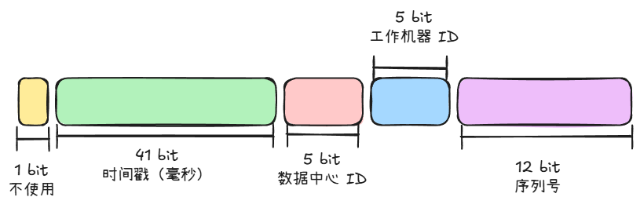
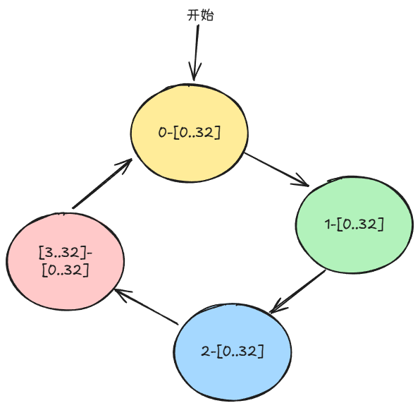

包括：

+ 添加 `Mybatis-Plus` 的分页拦截器
+ 实体基础属性（例如修改日期，创建日期等）
+ `Mybatis-Plus` 元数据处理
+ 自定义雪花算法

## `Mybatis-Plus` 分页拦截器
这个拦截器的作用是拦截所有 SQL 的执行（默认情况），并在调用 `selectPage` 方法中的 SQL 语句中自动修改该 SQL 语句，实现分页查询。

```java
public class MybatisPlusAutoConfiguration {

    @Bean
    public MybatisPlusInterceptor mybatisPlusInterceptor() {
        MybatisPlusInterceptor interceptor = new MybatisPlusInterceptor();
        interceptor.addInnerInterceptor(new PaginationInnerInterceptor(DbType.MYSQL));
        return interceptor;
    }
}
```

## 实体基础属性
```java
import com.baomidou.mybatisplus.annotation.FieldFill;
import com.baomidou.mybatisplus.annotation.TableField;
import lombok.Data;

import java.util.Date;

@Data
public class BaseDO {

    @TableField(fill = FieldFill.INSERT)
    private Date createTime;

    @TableField(fill = FieldFill.INSERT_UPDATE)
    private Date updateTime;

    @TableField(fill = FieldFill.INSERT)
    private Integer delFlag;
}

```

然后，所有的实体继承该 `BaseDO` 就可以获得这些字段。

## 元数据处理
```java
import com.baomidou.mybatisplus.core.handlers.MetaObjectHandler;
import org.apache.ibatis.reflection.MetaObject;
import org.opengoofy.index12306.framework.starter.common.enums.DelEnum;

import java.util.Date;

public class MyMetaObjectHandler implements MetaObjectHandler {

    // 在插入的时候自动填充字段
    @Override
    public void insertFill(MetaObject metaObject) {
        this.strictInsertFill(metaObject, "createTime", Date.class, new Date());
        this.strictInsertFill(metaObject, "updateTime", Date.class, new Date());
        this.strictInsertFill(metaObject, "delFlag", Integer.class, DelEnum.NORMAL.code());
    }

   @Override
    public void updateFill(MetaObject metaObject) {
        this.strictInsertFill(metaObject, "updateTime", Date.class, new Date());
    }
}   
```

然后，在配置类中注册成为 Bean。

## 自定义雪花算法
雪花算法的要求：

+ ID 自增：避免数据库中 B+ 树的页分裂
+ 高性能、高效率（高吞吐）

雪花算法的缺点：

+ ID 的唯一性依赖与系统的时间：如果时间回调，则可能会造成 ID 重复

### Mybatis-Plus 实现
64 bit（long 类型）的雪花算法的构成：



+ 41 bit 的毫秒时间戳可使用 69 年
+ 序列号用来解决同一机器在 1 毫秒内重复生成的 ID（自增该序列号就可以得到不重复的 ID）
+  5 bit 的数据中心 ID 和 5 bit 的工作机器 ID 可支持 1024 台机器同时使用
+ 数据中心 ID 和工作机器 ID 用于解决不同工作机器之间在同一毫秒内生成的 ID

Mybatis-Plus 中，数据中心 ID （`dataCenterId`）的生成策略：

```java
public static long getDataCenterId(long maxDatacenterId) {
    long id = 1L;
    final byte[] mac = NetUtil.getLocalHardwareAddress();
    if (null != mac) {
        id = ((0x000000FF & (long) mac[mac.length - 2])
                | (0x0000FF00 & (((long) mac[mac.length - 1]) << 8))) >> 6;
        id = id % (maxDatacenterId + 1);
    }

    return id;
}
```

`maxDatacenterId` 的默认值为 31，即 5 bit 的最大值。

工作机器 ID （`workerId`）：

```java
public static long getWorkerId(long datacenterId, long maxWorkerId) {
    final StringBuilder mpid = new StringBuilder();
    mpid.append(datacenterId);
    try {
        mpid.append(RuntimeUtil.getPid());
    } catch (UtilException igonre) {
        //ignore
    }
    return (mpid.toString().hashCode() & 0xffff) % (maxWorkerId + 1);
}
```

即通过数据中心 ID 和进程 ID 来确保工作机器 ID 的唯一性。

而数据中心 ID 是依赖于 MAC 地址来确保唯一性的。而这里所用到的 MAC 地址是有可能重复的：

+ MAC 地址由 IEEE 分配的前 24 bit + 厂商自己负责唯一性的 24 比特组成
+ 数据中心 ID 只使用了 MAC 地址的后 2 字节，而不同厂商生产的后 24 bit 是有可能相同的

为了解决 MAC 地址的重复问题，可以有 2 种解决方案：

+ 人为分配数据中心 ID 和工作机器 ID
+ 将数据中心 ID 和工作机器 ID 使用 redis、ZooKeeper、MySQL 等存储下来，申请一个之后加一

### 12306 实现
下面使用 Redis lua 脚本来分配数据中心 ID 和工作机器 ID：

```lua
local hashKey = 'snowflake_work_id_key'
local dataCenterIdKey = 'dataCenterId'
local workIdKey = 'workId'

if (redis.call('exists', hashKey) == 0) then
    -- 不存在，则 hincrby 会自动创建该哈希表，并创建该字段
    redis.call('hincrby', hashKey, dataCenterIdKey, 0)
    redis.call('hincrby', hashKey, workIdKey, 0)
    return { 0, 0 }
end

local dataCenterId = tonumber(redis.call('hget', hashKey, dataCenterIdKey))
local workId = tonumber(redis.call('hget', hashKey, workIdKey))

local max = 31
local resultWorkId = 0
local resultDataCenterId = 0

if (dataCenterId == max and workId == max) then
    -- 重置为 0，开始新一轮的循环
    redis.call('hset', hashKey, dataCenterIdKey, '0')
    redis.call('hset', hashKey, workIdKey, '0')

elseif (workId ~= max) then
    -- ~= 表示不等于
    resultWorkId = redis.call('hincrby', hashKey, workIdKey, 1)
    resultDataCenterId = dataCenterId

elseif (dataCenterId ~= max) then
    -- 到达这里时说明 wordId == max，这是，需要重置 workerId
    resultWorkId = 0
    resultDataCenterId = redis.call('hincrby', hashKey, dataCenterIdKey, 1)
    redis.call('hset', hashKey, workIdKey, '0')
end

return { resultWorkId, resultDataCenterId }

```

上述逻辑产生的结果（`dataCenterId-workerId`）：



