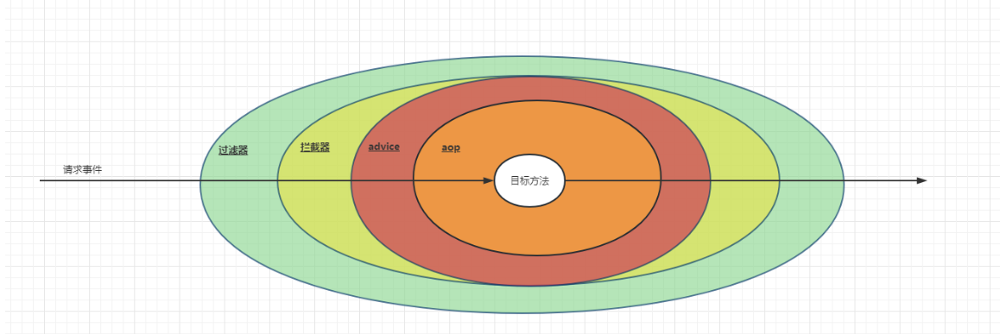

包含：

+ `JWT Token` 生成器
+ 当前请求用户的上下文
+ 拦截用户带 Token 的请求，并将其放入用户的上下文中

## JWT Token 生成器
```java
@Slf4j
public final class JWTUtil {
    // Token 的有效期
    // 单位为秒
    private static final long EXPIRATION = 86400L;
    public static final String TOKEN_PREFIX = "Bearer ";
    // 用于标识 JWT Token 的发布者
    public static final String ISS = "index12306";
    public static final String SECRET = "SecretKey039245678901232039487623456783092349288901402967890140939827";

    public static String generateAccessToken(UserInfoDTO userInfo) {
        Map<String, Object> customerUserMap = new HashMap<>();
        
        customerUserMap.put(USER_ID_KEY, userInfo.getUserId());
        customerUserMap.put(USER_NAME_KEY, userInfo.getUsername());
        customerUserMap.put(REAL_NAME_KEY, userInfo.getRealName());
        
        String jwtToken = Jwts.builder()
                .signWith(SignatureAlgorithm.HS512, SECRET)
                .setIssuedAt(new Date())
                .setIssuer(ISS)
                .setSubject(JSON.toJSONString(customerUserMap))
                .setExpiration(new Date(System.currentTimeMillis() + EXPIRATION * 1000))
                .compact();
        
        return TOKEN_PREFIX + jwtToken;
    }

    public static UserInfoDTO parseJwtToken(String jwtToken) {
        if (StringUtils.hasText(jwtToken)) {
            String actualJwtToken = jwtToken.replace(TOKEN_PREFIX, "");
            try {
                Claims claims = Jwts.parser().setSigningKey(SECRET).parseClaimsJws(actualJwtToken).getBody();
                Date expiration = claims.getExpiration();
                if (expiration.after(new Date())) {
                    String subject = claims.getSubject();
                    return JSON.parseObject(subject, UserInfoDTO.class);
                }
            } catch (ExpiredJwtException ignored) {
            } catch (Exception ex) {
                log.error("JWT Token解析失败，请检查", ex);
            }
        }
        return null;
    }
}

```

## 用户上下文的封装
```java
public final class UserContext {

    private static final ThreadLocal<UserInfoDTO> USER_THREAD_LOCAL = new TransmittableThreadLocal<>();

    public static void setUser(UserInfoDTO user) {
        USER_THREAD_LOCAL.set(user);
    }

    public static String getUserId() {
        UserInfoDTO userInfoDTO = USER_THREAD_LOCAL.get();
        return Optional.ofNullable(userInfoDTO).map(UserInfoDTO::getUserId).orElse(null);
    }

    public static String getUsername() {
        UserInfoDTO userInfoDTO = USER_THREAD_LOCAL.get();
        return Optional.ofNullable(userInfoDTO).map(UserInfoDTO::getUsername).orElse(null);
    }

    public static String getRealName() {
        UserInfoDTO userInfoDTO = USER_THREAD_LOCAL.get();
        return Optional.ofNullable(userInfoDTO).map(UserInfoDTO::getRealName).orElse(null);
    }

    public static String getToken() {
        UserInfoDTO userInfoDTO = USER_THREAD_LOCAL.get();
        return Optional.ofNullable(userInfoDTO).map(UserInfoDTO::getToken).orElse(null);
    }

    public static void removeUser() {
        USER_THREAD_LOCAL.remove();
    }
}
```

这里使用的 `ThreadLocal` 不是内置的 `ThreadLocal`，而是[https://github.com/alibaba/transmittable-thread-local](https://github.com/alibaba/transmittable-thread-local) 中的。

这个 `TransmittableThreadLocal` （TTL）主要提供 1 个核心功能：

+ 子线程可以继承父线程的 TTL

## 请求过滤器（拦截器）：解析用户信息并放入 UserContext
```java
public class UserTransmitFilter implements Filter {
    @Override
    public void doFilter(ServletRequest servletRequest, ServletResponse servletResponse, FilterChain filterChain) throws IOException, ServletException {
        HttpServletRequest httpServletRequest = (HttpServletRequest) servletRequest;
        String userId = httpServletRequest.getHeader(UserConstant.USER_ID_KEY);
        
        if (StringUtils.hasText(userId)) {
            String userName = httpServletRequest.getHeader(UserConstant.USER_NAME_KEY);
            String realName = httpServletRequest.getHeader(UserConstant.REAL_NAME_KEY);
            
            if (StringUtils.hasText(userName)) {
                userName = URLDecoder.decode(userName, UTF_8);
            }
            if (StringUtils.hasText(realName)) {
                realName = URLDecoder.decode(realName, UTF_8);
            }
            
            String token = httpServletRequest.getHeader(UserConstant.USER_TOKEN_KEY);
            UserInfoDTO userInfoDTO = UserInfoDTO.builder()
                    .userId(userId)
                    .username(userName)
                    .realName(realName)
                    .token(token)
                    .build();
            
            UserContext.setUser(userInfoDTO);
        }
        try {
            filterChain.doFilter(servletRequest, servletResponse);
        } finally {
            // 这里移除用户是为了避免线程池复用该线程，导致其他线程读取到该用户的数据
            // 这里之所以可以移除，是因为调用 filerChain.doFilter 方法之后，已经是响应阶段了
            // 不再是请求阶段了
            UserContext.removeUser();
        }
    }
}

```

下面一副图很好的解释了 `UserContext.removeUser` 方法：



为什么有了 token header 中还会有 `user{Id, name}`和 `realName` 呢？

 这是因为在网关组件中，网关会解析 token 并设置 header 来存储用户的信息。

token 是只有当用户注销的时候才携带的 token，否则，到达这个 Filter 的 header 是不会包含 token 的。

