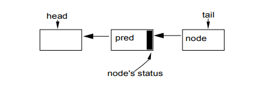

原文链接：

[AQS 框架论文翻译 —— The java.util.concurrent Synchronizer Framework](https://gonearewe.github.io/2021/04/10/AQS-%E6%A1%86%E6%9E%B6%E8%AE%BA%E6%96%87%E7%BF%BB%E8%AF%91-The-java.util.concurrent-Synchronizer-Framework/)

AQS 为构造同步器（锁）提供了一种通用的机制，并且被 j.u.c 包中的大部分类所使用。用户也可以用它来定义自己的同步器。

> 几乎任一同步器都可以用来实现其它形式的同步器。例如，可以用重入锁来实现信号量或者用信号量来实现重入锁。但是，这样做带来的开销、复杂性、不灵活是其主要的缺点。故而，需要一个框架来提供一种通用的机制，并且这个框架能够满足各种需求。
>

## 同步器
同步器一般有两种状态：

+ **独占状态**：在同一时间只有一个线程可以通过阻塞点
+ **共享状态**：在同一时间可以有多个线程在执行

同步器一般包含 2 种方法：

+ **acquire**：阻塞调用的线程，直到同步状态允许其继续执行
+ **release**：通过某种方式改变同步状态，使得一个或多个被 acquire 操作阻塞的线程继续执行

j.u.c 包为支持一系列常见的使用选项，每一个同步器都支持下面的操作：

+ **阻塞和非阻塞（eg. tryLock）的同步**
+ **可选的超时设置**
+ **通过中断实现的任务取消**：通常分为 2 个版本，一个 acquire 可取消，另一个不可以取消

## 设计与实现
AQS 有 3 个基本的组件：

+ **同步状态**的原子性管理
+ 线程的**阻塞与解除阻塞**
+ **队列**的管理

### 同步状态
AQS 使用单个 32 位的 int 值来保存同步状态，并提供下列方法来读取和更新这个状态：

+ getState
+ setState
+ compareAndSet 

> 现在已经有 AbstractQueuedLongSynchronizer 类来提供 64 位的 long 值的同步状态_<font style="color:rgb(199, 37, 78);background-color:rgb(249, 242, 244);"> </font>_
>

AQS 的实现类必须根据暴露出来的状态相关方法定义 tryAcquire 和 tryRelease 方法，以控制 acquire 和 release 操作（tryAcquire 和 tryRelease 方法就是模版方法）。

tryAcquire 和 tryRelease 方法都接受一个 int 类型的参数用于传递想要的状态。例如一个信号量，可以传递一个参数用来表示获取或者释放的资源数量。

### 阻塞
Thread.suspend 和 Thread.resume 方法可以用来阻塞和唤醒线程，但是无法解决竞态问题：<font style="color:rgb(64, 64, 64);">当一个非阻塞的线程在一个正准备阻塞的线程调用 suspend 前调用了 resume，这个 resume 操作将不会有什么效果。我们的理想行为是：这个 resume 操作会被“保存”下来，并导致接下来的 suspend 操作立刻返回。</font>

<font style="color:rgb(64, 64, 64);">j.u.c 的 </font>**<font style="color:rgb(64, 64, 64);">LockSupport </font>**<font style="color:rgb(64, 64, 64);">类提供了解决这个问题的办法：</font>

+ park 方法阻塞当前线程，直到有 unpark 方法被调用。
+ unpark 方法是没有被计数的：在一个 park 调用前多次调用 unpark 操作只会解除一个将来的 park 操作

### 队列
是指用来管理被阻塞的线程的队列，该队列是严格的 FIFO 队列，因此，不支持基于优先级的同步。

**同步队列的最佳选择是自身没有使用底层锁来构造的非阻塞数据结构**

同步队列主要有 2 个选择：

+ Mellor-Crummey 和 Scott 锁（**MCS 锁**）变体
+ Craig，Landin 和 Magersten 锁（**CLH 锁**）变体

AQS 选择使用 CLH 锁来实现队列，主要原因是：CLH 锁可以更容易地去实现取消和超时功能。

#### 原本的 CLH 锁
原本的 CLH 锁是**自旋锁**，并且是一个链表队列，通过 head 和 tail 来存取，这两个字段通过原子操作进行更新。



一个新的节点 node 可以通过如下操作入队：

```java
do {
    pred = tail;
} while(!tail.compareAndSet(pred, node));
```

每一个节点的“释放”状态都保存在其前驱节点中，换句话说，当前节点是否可以获取锁取决于前驱节点：

```java
while (pred.status != RELEASED); // spin
```

自旋后的出队操作（成功获取到锁）只需将 head 字段指向刚刚得到锁的节点：

```java
head = node;
```

优点：

+ 入队和出队操作是快速的，无锁的，无障碍的（<font style="color:rgb(64, 64, 64);">即使在竞争下，某个线程总会赢得一次插入机会而能继续执行</font>）
+ 探测是否有线程正在等待也是很快的（head == tail）
+ “释放”状态是分散的：几乎每个节点都保存了这个状态，当前节点保存了其后驱节点的“释放”状态，因此它们是分散的，不是集中于一块的

#### CLH 锁的改造
1. **为了将 CLH 队列用于阻塞式同步器（而非自旋式），当前节点需要保存其后继节点（next 指针）**

在自旋锁中，一个节点只需要改变其状态，下一次自旋中其后继节点就能注意到这个改变，所以节点间的链接并不是必须的。但在阻塞式同步器中，一个节点需要显式地唤醒（`unpark`）其后继节点。

2. **将每个节点都有的状态字段用于控制阻塞而非自旋**

在 AQS 中，仅当线程调用具体子类中的 tryAcquire 方法返回 true 时，队列中的线程才能从 acquire 方法中返回。这可以通过判断当前节点的前驱是否是 head 来完成。

除了原本 CLH 锁的 release 位，还有**取消位**需要设置。

为了避免没有必要的 park 和 unpark 调用造成的开销，在调用 park 前，线程设置一个**唤醒位**（signal me）位，然后再一次检查同步和节点状态。

> 这段话有点深奥，还没有看懂：
>
> 一个释放的线程会清空其自身状态。这样线程就不必频繁地尝试阻塞，特别是在锁相关的类中，这样会浪费时间等待下一个符合条件的线程去申请锁，从而加剧其它竞争的影响。除非后继节点设置了“唤醒”位，否则这也可避免正在 `release` 的线程去判断其后继节点。这反过来也消除了这些情形：除非“唤醒”与“取消”同时发生，否则必须遍历多个节点来处理一个似乎为 `null` 的 `next` 字段。
>

抛开细节，基本的 acquire 操作的最终实现：

```latex
if(!tryAcquire(arg)) {
    node = create and enqueue new node;
    pred = node's effective predecessor;
    while (pred is not head node || !tryAcquire(arg)) {
        if (pred's signal bit is set)
            park()
        else
            compareAndSet pred's signal bit to true;
        pred = node's effective predecessor;
    }
    head = node;
}
```

release 操作：

```java
if(tryRelease(arg) && head node's signal bit is set) {
    compareAndSet head's bit to false;
    unpark head's successor, if one exist
}
```

`acquire` 操作的主循环次数依赖于具体实现类中 `tryAcquire` 的实现方式

在没有取消操作的情况下，每一个组件的 `acquire`和 `release`操作都是一个 O(1) 操作

支持“取消”操作主要是要在 `acquire` 循环里的 `park` 返回时检查中断或超时。由超时或中断而被取消等待的线程会设置其节点状态，然后 `unpark` 其后继节点。<font style="color:rgb(64, 64, 64);">在有“取消”的情况下，判断其前驱节点和后继节点以及重置状态可能需要 O(n) 的遍历（n 是队列的长度）。由于“取消”操作，该线程再也不会被阻塞，节点的链接和状态字段可以被快速重建。</font>

### <font style="color:rgb(64, 64, 64);">条件队列</font>
`AQS` 框架提供了一个 `ConditionObject` 类，给维护**独占同步**的类以及实现 `Lock` 接口的类使用。一个锁对象可以关联任意数目的条件对象，可以提供典型的管程风格的 `await`、`signal` 和 `signalAll` 操作，包括带有超时的，以及一些检测、监控的方法。

`**ConditionObject**`**类使用了与同步器一样的内部队列节点，但是，是在单独的一个条件队列中维护这些节点的。**

`**signal**`** 操作是通过将节点从条件队列转移到锁队列中来实现的，而没有必要在需要唤醒的线程重新获取到锁之前将其唤醒**

只有在持有锁的情况下，才能执行 `await`和 `signal`操作，故而可以使用顺序列表队列操作来维护条件队列。

`acquire`操作：

```java
create and add new node to conditon queue;
 
release lock;
 
block until node is on lock queue;
 
re-acquire lock;
```

`signal`操作：

```java
transfer the first node from condition queue to lock queue;
```

<font style="color:rgb(64, 64, 64);">转移操作仅仅把第一个节点从条件队列中的链接解除，然后通过 </font>`<font style="color:rgb(64, 64, 64);">CLH</font>`<font style="color:rgb(64, 64, 64);"> 插入操作将其插入到锁队列上。</font>

<font style="color:rgb(64, 64, 64);">实现这些操作主要复杂在，因超时或 </font>`<font style="color:rgb(64, 64, 64);">Thread.interrupt</font>`<font style="color:rgb(64, 64, 64);"> 导致取消了条件等待时，该如何处理？</font>

+ <font style="color:rgb(64, 64, 64);">如果中断发生在 </font>`<font style="color:rgb(64, 64, 64);">signal</font>`<font style="color:rgb(64, 64, 64);"> 操作之前，</font>`<font style="color:rgb(64, 64, 64);">await</font>`<font style="color:rgb(64, 64, 64);"> 方法必须在重新获取到锁后，抛出 </font>`<font style="color:rgb(64, 64, 64);">InterruptedException</font>`
+ <font style="color:rgb(64, 64, 64);">如果中断发生在 </font>`<font style="color:rgb(64, 64, 64);">signal</font>`<font style="color:rgb(64, 64, 64);"> 后，</font>`<font style="color:rgb(64, 64, 64);">await</font>`<font style="color:rgb(64, 64, 64);"> 必须返回且不抛异常，同时设置线程的中断状态</font>

<font style="color:rgb(64, 64, 64);">为了维护适当的顺序，队列节点状态变量中的一个位记录了该节点是否已经（或正在）被转移。</font>

> 下面这段话还是有点深奥：
>
> <font style="color:rgb(64, 64, 64);">为了维护适当的顺序，队列节点状态变量中的一个位记录了该节点是否已经（或正在）被转移。“唤醒”和“取消”相关的代码都会尝试用 </font>`<font style="color:rgb(64, 64, 64);">compareAndSet</font>`<font style="color:rgb(64, 64, 64);"> 修改这个状态。如果某次 </font>`<font style="color:rgb(64, 64, 64);">signal</font>`<font style="color:rgb(64, 64, 64);"> 操作修改失败，就会转移队列中的下一个节点（如果存在的话）。如果某次“取消”操作修改失败，就必须中止此次转移，然后等待重新获得锁。后面的情况采用了一个潜在的无限的自旋等待。在节点成功的被插到锁队列之前，被“取消”的等待不能重新获得锁，所以必须自旋等待 </font>`<font style="color:rgb(64, 64, 64);">CLH</font>`<font style="color:rgb(64, 64, 64);"> 队列插入（即 </font>`<font style="color:rgb(64, 64, 64);">compareAndSet</font>`<font style="color:rgb(64, 64, 64);"> 操作）被“唤醒”线程成功执行。这里极少需要自旋，且自旋里使用 </font>`<font style="color:rgb(64, 64, 64);">Thread.yield</font>`<font style="color:rgb(64, 64, 64);"> 来提示应该调度某一其它线程，理想情况下就是执行 </font>`<font style="color:rgb(64, 64, 64);">signal</font>`<font style="color:rgb(64, 64, 64);"> 的那个线程。虽然有可能在这里为“取消”实现一个帮助策略以帮助插入节点，但这种情况实在太少，找不到合适的理由来增加这些开销。在其它所有的情况下，这个基本的机制都不需要自旋或 </font>`<font style="color:rgb(64, 64, 64);">yield</font>`<font style="color:rgb(64, 64, 64);">，因此在单处理器上保持着合理的性能。</font>
>


<font style="color:rgb(64, 64, 64);"></font>

