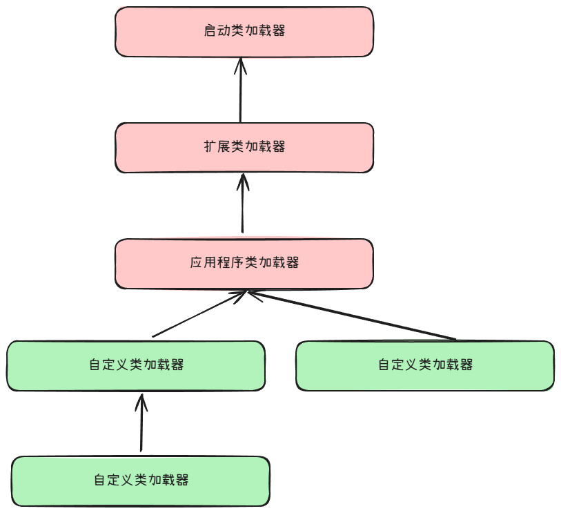

类加载器完成如下工作：

1. 把类的数据从 Class 文件加载到内存

2. 对数据进行校验、转换解析和初始化

3. 形成 JVM 可直接使用的 Java 类型

每个类加载器都为类提供了一个独立的类**命名空间**，不同的类加载器所加载的相同类（名称、路径、字段等都相同）也会被视为不同的，即：

- `equals`
- `hashcode` 
- `instanceof` 等

都会返回不相等。

## 双亲委派机制

Java 程序中有 3 种类加载器，并且这三个加载器具有层级关系：

1. **启动类加载器（Bootstrap Class Loader）**：加载存放于 `<JAVA_HOME>\lib` 目录，或者被 `-Xbootclasspath` 参数所指定的路径中存放的，而且是 JVM 能够识别的（按照文件名识别，如rt.jar、tools.jar，名字不符合的类库即使放在lib目录中也不会被加载）
2. **扩展类加载器（Extension Class Loader）**：负责加载 `<JAVA_HOME>\lib\ext` 目录中，或者被 `java.ext.dirs` 系统变量所指定的路径中所有的类库
3. **应用程序类加载器（Application Class Loader）**：负责加载 Java 应用程序中定义的类。由于应用程序类加载器是`ClassLoader`类中的`getSystemClassLoader()` 方法的返回值，所以有些场合中也称它为“系统类加载器”

其中，扩展类加载器和应用程序类加载器都是由 Java 程序实现的。而启动类加载器是由 JVM 实现。

这 3 个类加载器具有**层次结构**：



**双亲委派机制**是指：如果收到一个类加载请求，则优先将该类交由父加载器去完成，如果父加载器无法完成该请求，该类加载器才加载该类。

即如下代码所描述的逻辑：

```java
protected synchronized Class<?> loadClass(String name, boolean resolve) throws ClassNotFoundException {
    // 首先，检查请求的类是否已经被加载过了
    Class c = findLoadedClass(name);
    if (c == null) {
        try {
            if (parent != null) {
                c = parent.loadClass(name, false);
            } else {
                c = findBootstrapClassOrNull(name);
            }
        } catch (ClassNotFoundException e) {
            // 如果父类加载器抛出ClassNotFoundException
            // 说明父类加载器无法完成加载请求
        }
        if (c == null) {
            // 在父类加载器无法加载时
            // 再调用本身的findClass方法来进行类加载
            c = findClass(name);
        }
    }
    if (resolve) {
        resolveClass(c);
    }
    return c;
}
```

但是，双亲委派机制不是强制的，自定义类加载器可以不遵循此机制。

双亲委派机制的优点：

- Java中 的类随着它的类加载器一起具备了一种带有优先级的层次关系（例如，`Object` 具有最高的优先级，因为其由启动类加载器加载）
- 如果没有使用双亲委派模型，都由各个 类加载器自行去加载，如果用户自己也编写了一个名为 `java.lang.Object` 的类，并放在程序的 `ClassPath` 中，那系统中就会出现多个不同的 `Object` 类，Java 类型体系中最基础的行为也就无从保证，应用程序将会变得一片混乱

## 自定义类加载器

自定义类加载器要继承 `java.lang.ClassLoader`  抽象类，其中包含了 2 主要的方法：

- `protected class findClass(String name)`：根据类的全路径名找到该类并加载该类。如果要使用适用双亲委派机制的类加载器，则只需重写此方法就可以了
- `protected Class<?> loadClass(String name)`：默认情况下，使用双亲委派机制，如果覆盖掉此方法，就可以不再使用双亲委派机制了。

一般情况下，还要在方法中使用同步块来防止并发的时候加载类。

## SPI（Service Provider Interface）

SPI 接口（`interface`）由服务的提出者定义，而具体的接口实现由一个或者多个服务的提供者实现。

SPI 与 API 的区别在于：

- SPI 的接口由服务的提出者定义，实现者实现（可以有多个提供者）
- API 的接口由服务的实现者定义，提出者使用

SPI 的实现：

1. 提出者定义一个 SPI 接口：

   ```java
   public interface SPI {...}
   ```

2. 编写 SPI 接口对应的服务：

   ```java
   import java.util.ArrayList;
   import java.util.List;
   // 此类加载器用于加载 SPI 服务
   import java.util.ServiceLoader;
   
   public class SPIService {
       private static final SPIService SERVICE = new SPIService();
   
       private final SPI spi;
   
       private final List<SPI> spiList;
   
       private LoggerService() {
           ServiceLoader<SPI> spiServices = ServiceLoader.load(Logger.class);
           
           List<SPI> list = new ArrayList<>();
           for (SPI spi : loader) {
               list.add(log);
           }
           
           // list 包含了所有发现了的服务
           spiList = list;
           if (!list.isEmpty()) {
               // 只取其中的一个服务
               logger = list.get(0);
           } else {
               logger = null;
           }
       }
   
       public static SPIService getService() {
           return SERVICE;
       }
       
   	//....  更多的方法
   }
   ```

3. 服务的提供者导入服务定义者的 JAR 包（以获得 SPI 接口的定义），并实现 SPI 接口

4. 服务的**提供者**在 `META-INF/services/`  目录中创建文件：
   - 该文件的名称为：`<SPI 接口的全限定名>`
   - 该文件中的内容为：一个或多个 `<SPI 接口实现类的全限定名>`，如果有多个实现，则由换行来分隔

5. 服务的使用者将服务的提出者和实现者的 JAR 包都导入自己的项目：

   - 导入提出者的 JAR 包是可以使用 SPI 定义的服务
   - 导入实现者的 JAR 包是选择对应的实现

### SPI 原理

SPI 的主要原理是：

- `ServiceLoader` 加载所有 JAR 包下面的 `META-INF/services` 目录
- 通过该目录下面的文件名和文件内容找到对应的接口和对应的实现类
- 通过反射生成实现类的对象并保存在一个 `list` 中
