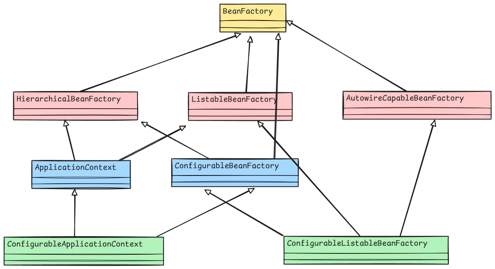

IOC 容器的继承关系：

上图展示的都是接口，而不是类。

| 接口名                            | 核心职责                                                     | 核心方法                                                     |
| --------------------------------- | ------------------------------------------------------------ | ------------------------------------------------------------ |
| `BeanFactory`                     | 基础 IoC 容器                                                | `Object getBean(String name);` `boolean containsBean(String name);` |
| `HierarchicalBeanFactory`         | 支持父子容器结构                                             | `BeanFactory getParentBeanFactory();` `boolean containsLocalBean(String name);` |
| `ListableBeanFactory`             | 获取当前容器中的所有 Bean 信息                               | `String[] getBeanDefinitionNames();` `Map<String, T> getBeansOfType(Class<T> type);` |
| `AutowireCapableBeanFactory`      | 自动装配、生命周期回调。提供了向容器内连接和注册其他 IOC 容器内的 Bean | `void autowireBean(Object existingBean);` `Object applyBeanPostProcessorsBeforeInitialization(Object existingBean, String beanName);` |
| `ConfigurableBeanFactory`         | 作用域注册、自定义配置支持                                   | `void registerSingleton(String beanName, Object singletonObject);` `void setScope(String scopeName, Scope scope);` |
| `ConfigurableListableBeanFactory` | 完整配置能力，支持 BeanDefinition 操作                       | `BeanDefinition getBeanDefinition(String beanName);` `boolean isAutowireCandidate(String beanName, DependencyDescriptor descriptor);` |
| `ApplicationContext`              | 企业级容器（资源、事件、国际化）                             | `String getMessage(String code, Object[] args, Locale locale);` `Resource getResource(String location);` |
| `ConfigurableApplicationContext`  | 编程式刷新、关闭等生命周期管理                               | `void refresh();` `void close();` `void registerShutdownHook();` |

其中，`BeanFactory` 可以提供如下功能：

- 是 Bean 的根容器
- 定义了 `singleton` 和 `prototype` 作用域
- 集成了环境配置，使得可以通过外部的配置文件来实现属性注入
- 支持多种类型的配置源，包括 XML、注解、关系型数据库等
- 可以实现层次性（由 `HierarchicalBeanFactory` 实现）
- 具有完整的生命周期控制机制