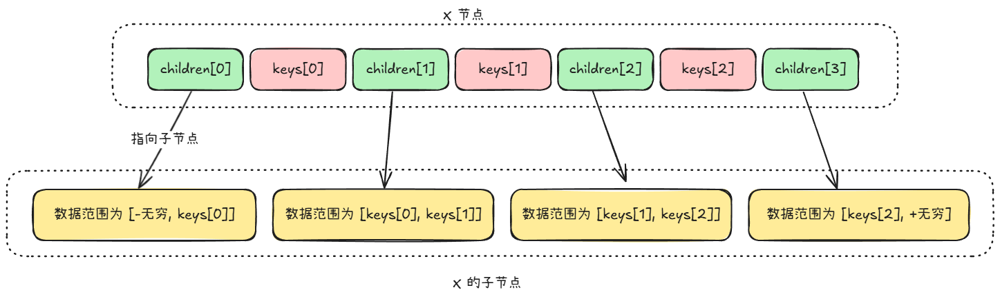
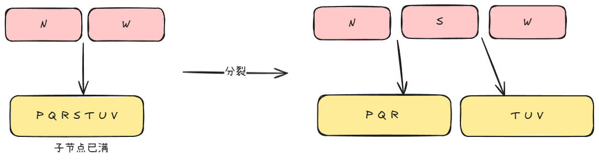

<font style="color:rgba(0, 0, 0, 0.87);">B 树（B-tree）是一种自平衡的搜索树，能够保持数据有序。</font>

<font style="color:rgba(0, 0, 0, 0.87);">这种数据结构能够让以下操作在</font>**<font style="color:rgba(0, 0, 0, 0.87);">对数时间</font>**<font style="color:rgba(0, 0, 0, 0.87);">内完成：</font>

+ <font style="color:rgba(0, 0, 0, 0.87);">查找数据</font>
+ <font style="color:rgba(0, 0, 0, 0.87);">顺序访问</font>
+ <font style="color:rgba(0, 0, 0, 0.87);">插入数据及删除</font>

<font style="color:rgba(0, 0, 0, 0.87);">在 B 树中，有 2 种节点：</font>

+ **内部节点（internal node）**：包含数据以及指向子节点的指针
+ **叶子节点（leaf node）**：只包含数据

## 性质
一个 m 阶的 B 树（一个节点的子节点数目最多为 m）的一个节点 x 具有如下性质：

+ x 具有如下字段
    - x.n 代表 x 中具有的关键字（数据）条数
    - x.keys 表示 x 中的数据
    - x.leaf 表示 x 是否是叶子节点
    - x.children 包含了 x.n + 1 个指向子节点的指针
+ x.keys 中的关键字以**非降序**的顺序进行存放
+ x.keys[i] 对存储在各子树中的关键字范围加以分割：



+ B 树的**最小度数（minmum degree）**为 t（t >= 2），t 决定了节点中关键字的最小和最大数目：
    - 除了根节点以外的节点至少要有 `t - 1` 个关键字
    - 每个节点至多可以包含 `2t - 1` 个关键字
+ 每个节点至多有 `2t` 个孩子节点，当一个节点有 `2t` 个子节点的时候，称该节点是**满（full）**的
+ 每个叶子节点具有相同的深度，即为树的高度 h

则 。

## 操作
### 搜索
搜索返回关键字 k 所在的节点以及在该节点中 x.keys 中的索引。

1. 对于输入的 k，要在 x.keys 中找到第一个小于等于 k 的关键字 x.keys[i]
2. 判断 x.keys[i] 是否等于 k，如果不等于，则递归地在 x.childre[i] 中查找 k

```rust
fn btree_search(x: BtreeNode, k: T) -> Option<(BtreeNode, usize)> {
    let mut i = 0;
    while i < x.keys().len() && x.keys()[i] > k {
        i += 1;
    }

    // 执行到这里之后，x.keys[i] <= k 了
    if x.keys()[i] == k {
        return Some((x, i));
    } else if x.leaf {
        return None;
    }

    btree_search(x.childre[i], k)
}
```

### 创建一颗空的 B 树
```rust
fn create_btree() -> Btree {
    let mut node = BtreeNode::New();
    node.leaf = true;
    node.n = 0;
    
    Btree {
        root: node,
        .....
    }
}
```

### 插入一个关键字
假设要插入的新的关键字为 k。

1. 将 k 插入到一个**已存在**的**叶子节点 **L 中
2. 如果 L 已满，则**分裂（split）**为 2 个各含有 `t - 1` 个关键字的节点，总共有 2t - 2 个节点，剩余 1 个节点
3. 剩余 1 个节点是**中间关键字（median key）**节点被提升到 L 的父节点中

实际过程中，并不是等到插入的时候才将满的叶子节点分裂，而是当从 root 向下遍历的过程中，只要遇到了满节点，则就将其分裂。

这样，就可以保证分裂一个子节点的时候，它的父节点是不满的，一定有空间来存放空间关键字节点。

#### 分裂操作


分裂操作的输入为已满的子节点的父节点 x，和已满子节点 x.children[i] 的下标 i。

```rust
fn b_tree_split_child(x: BtreeNode, i: usize) {
    let mut new_child = BtreeNode::New();
    let mut full_child = x.chilren[i];

    new_child.leaf = full_child.leaf;
    new_child.n = t - 1;

    // "复制"
    for j in 0..t - 1 {
        // 中间节点是 full_child.keys[t - 1]
        new_child.keys[j] = full_chlid.keys[j + t];
    }

    // 如果是内部节点，则还需要把孩子节点也复制过去
    if !full_child.leaf {
        for j in 0..t {
            // 各有 t 个孩子节点
            new_child.chlidren[j] = full_child.children[j + t];
        }
    }

    full_child.n = t - 1;

    // 将父节点 x 位置 i 以后的元素向后移动一个位置，为 new_child 让路
    for j in (i + 1..x.n).rev() {
        x.children[j + 1] = x.children[j];
    }

    // 将 new_child 插入到 x 中
    x.children[i + 1] = new_child;

    // 为中间节点让路
    // full_child 中元素的值都小于等于 x.keys[i]
    for j in (i..x.n).rev() {
        x.keys[j + 1] = x.keys[j];
    }

    // 将中间节点插入到 x 中
    x.keys[i] = full_child.keys[t - 1];
    x.n += 1;
}
```

#### 插入操作
在找 k 对应的叶子节点的同时，要分裂遇到的满节点。

如果根节点是满的，则需要特殊处理，因为这个根节点要被分裂。

```rust
fn btree_insert(btree: Btree, k: T)  {
    let root = btree.root;

    if root.n == 2 * t - 1 {
        new_root = BtreeNode::New();
        new_root.leaf = false;
        new_root.n = 0;
        new_root.children[0] = root;

        btree.root = new_root;

        btree_split_chlid(new_root, 0);
        btree_insert_not_full(new_root, k);
    } else {
        btree_insert_not_full(root, k);
    }
}       
```

其中，`btree_insert_not_full(x, k)` 保证 x 是不满的。

```rust
fn btree_insert_not_full(x: BtreeNode, k: T) {
    let mut i = x.n;

    if x.leaf {
        // 所有大于 k 的 key 都往后移一个位置
        while i as i32 >= 0 && k < x.keys[i] {
            x.keys[i + 1] = x.keys[i];
            i -= 1;
        }

        // 退出循环时，有 x.keys[i] >= k
        x.keys[(i as i32 + 1) as usize] = k;
        x.n += 1;
        return;
    }

    while i as i32 >= 0 && k < x.keys[i] {
        i -= 1;
    }

    i = (i as i32 + 1) as usize;

    if x.children[i].n == 2t - 1 {
        btree_split_child(x, i);

        // 由于分裂成了 2 个子节点，所以，需要选择哪一个孩子节点进行插入
        // x.keys[i] 是被提拔上来的中间节点
        if k > x.keys[i] {
            i += 1;
        }
    }

    btree_insert_not_full(x.children[i], k);
}
```

上述的方法是**尾递归**的，可以使用循环来消除。

### 删除关键字
要删除的关键字 k 不一定在叶子节点中，而可能在内部节点中。

如果 k 在内部节点中，则还需要调整 B 树的结构。

删除元素的各种情况：

1. k 在节点 x 中，并且 x 是叶子节点，则从 x 中删除 k
2. k 在 x 中的位置为 i，x 是内部节点，则：
    1. 如果 `x.children[i].n >= t`，则令 `k' = x.children[i].keys[x.children[i].n - 1]`，然后在 `x.children[i]` 中递归地删除 k'，然后用 k' 来**代替** k。
    2. 如果 `x.children[i].n < t`，则检查 `x.chilren[i + 1].n` 是否大于等于 t，如果是，则令 `k' = x.children[i + 1].keys[x.children[i + 1].n - 1]`,然后删除 k'，用 k' 来代替 k。
    3. 否则，说明 `x.children[i].n = x.children[i + 1].n = t - 1`，则：
        1. 将 k 和 `x.children[i + 1].keys` 全部合并进 `x.chlidren[i].keys` 中，这样，`c.children[i].keys` 中就是已满了
        2. 在 x 中释放 `x.children[i + 1]`
        3. 在 `x.children[i]` 中递归地删除 k
3. 如果 k 不在**当前**的内部节点 x 中，则找出 k 位于的那个子树 y（通过区间）。如果 y 只有 `t - 1` 个关键字，则：
    1. 如果 y 的相邻的兄弟至少有一个包含至少 t 个关键字，则将 x 中的某一个关键字下降到 y 中，将 y 的左兄弟或者右兄弟的一个关键字提升至 x。然后，将该兄弟对应的孩子指针移动到 y 中。这样，就保持了 x 和 y 中的关键字数量不变，y 的其中一个兄弟关键字数量减少。
    2. 如果 y 的相邻兄弟都只有 `t - 1` 个关键字，则将 y 与其中一个兄弟合并，然后将 x 中的一个关键字移至该合并后的节点，使该关键字称为该节点的中间关键字。
4. 如果 x 不在**当前**的内部节点 x 中，则找出 k 位于的那个子树 y（通过区间）。如果 y.n 大于等于 `t`，则递归调用该节点 y，在 y 中删除 k。

