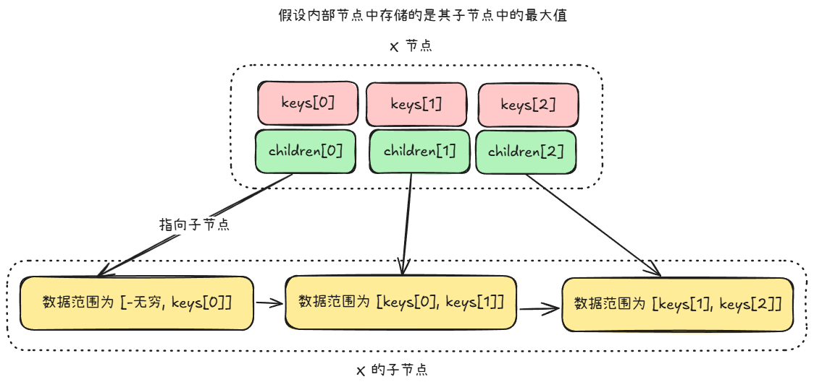

B+ 树与 B 树的不同点：

+ **核心区别**：B+ 树中，内部节点不存储数据，而是存储其子节点中的关键字最大值或者最小值（起到索引的作用）；而所有的数据都存储在了叶子节点中
+ B+ 树中，关键字和子节点的数目是一致的，即有多少个子节点就有多少个关键字；而 B 树中，关键字的数量总是比子节点的数目少一
+ B+ 树中，叶子节点可以通过一个指针联系，方便顺序读取所有的数据

B+ 树与 B 树的相同点：

+ 给定最小度数 t，则每一个节点中关键字的最小和最大数目分别都是 `t - 1` 和 `2t - 1`
+ 每个叶子节点具有相同的深度

B+ 树较 B 树的优点：

+ 提供高效的**范围查询**；如果 B 树要实现范围查询，则需要遍历整颗树
+ 内部节点仅存索引，可以降低树的高度

