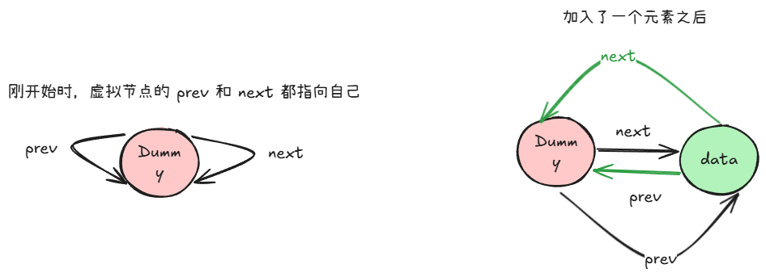

**最近最少使用（Least Recently Use）**一般用于管理缓存等需要淘汰掉**最旧**数据的场景。

LRU 支持 2 个核心操作：

+ 添加元素（`put(key, value)`）：如果元素已经存在，则更新为最新值
+ 访问元素（`get(key)`）：判断元素是否存在，存在返回其值。

其中，上述 2 个操作都会使元素成为**最新的**数据。

一般使用双向链表来存储数据：

+ 对首元素最新
+ 队尾元素最旧

这样，就可以表示队列中元素的新旧关系了。

这个双向链表使用一个虚拟头节点：



同时，为了能够做到 时间内访问和添加元素，还需要使用一个 `HashMap` 来存放 key 和双向链表节点之间的对应关系。

## 实现
```java
class LRUCache {
    private static class Node {
        int key, value;

        Node prev, next;

        public Node(int key, int value) {
            this.key = key;
            this.value = value;
        }
    }

    private int capacity;

    // 一个虚拟头节点
    private Node head;

    // 用于存放 key 和 node 之间的对应关系
    private HashMap<Integer, Node> map;

    public LRUCache(int capacity) {
        this.capacity = capacity;
        head = new Node(0, 0);
        head.next = head.prev = head;
        map = new HashMap();
    }
    
    public int get(int key) {
        if (!map.containsKey(key)) {
            return -1;
        }

        Node node = map.get(key);
        removeNode(node);
        addFirst(node);
        return node.value;
    }
    
    public void put(int key, int value) {
        Node node = map.get(key);
        if (node != null) {
            removeNode(node);
            addFirst(node);
            node.value = value;
            return;
        }

        node = new Node(key, value);
        addFirst(node);
        map.put(key, node);

        // 删除最旧的节点最好是放到最后，因为如果放到前面，还要判断 key 是否已经存在的情况，因为这种情况是替换，而不是新增
        if (map.size() == capacity) {
            Node lastNode = head.prev;
            map.remove(lastNode.key);
            removeNode(lastNode);
        }
    }

    private void addFirst(Node node) {
        node.prev = head;
        node.next = head.next;
        head.next = node;
        node.next.prev = node;
    }

    private void removeNode(Node node) {
        node.prev.next = node.next;
        node.next.prev = node.prev;
    }
}
```

