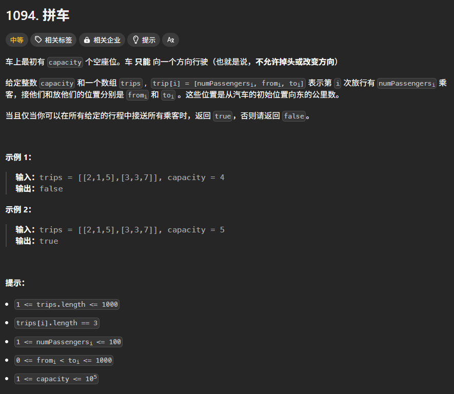

题目描述：



## 思路

可以使用 `a[i]` 数组表示在距离出发点为 i 的时候，车上的乘客数量。

则 `trips[i]` 的 `from` 和 `to` 就构成了一个区间，使得 `a[from..=to]` 元素全部要加一。这就可以用差分数组来做。

但是这个差分数组每一项开始都为 0，并不需要提前算出。

## 代码一

由于题目规定了 `from` 或者 `to` 小于 1000，所以可以创建一个长度为 1001 的数组来完全地实现差分数组。

```rust
impl Solution {
    pub fn car_pooling(trips: Vec<Vec<i32>>, capacity: i32) -> bool {
        let mut diffrence_array = vec![0; 1001];

        for trip in trips {
            let (number, from, to) = (trip[0], trip[1] as usize, trip[2] as usize);

            diffrence_array[from] += number;
            diffrence_array[to] -= number;
        }

        // 从差分数组中恢复出真实的 a[i] 数组
        let mut sum = 0;
        for num in diffrence_array {
            sum += num;

            if sum > capacity {
                return false;
            }
        }

        true
    }
}
```


## 代码二

可以使用平衡树数据结构（主要是因为平衡树可以根据键值排序）来存储车辆行驶了的距离。

然后按照距离的大小来遍历该树就可以得到车辆在某个距离时的人数了。

```rust
use std::collections::BTreeMap;

impl Solution {
    pub fn car_pooling(trips: Vec<Vec<i32>>, capacity: i32) -> bool {
        let mut d = BTreeMap::new();
        for t in trips {
            let (number, from, to) = (trip[0], trip[1], trip[2]);
            *d.entry(from).or_insert(0) += number;
            *d.entry(to).or_insert(0) -= number;
        }

        let mut sum = 0;
        for (_, v) in d {
            sum += v;
            if s > capacity {
                return false;
            }
        }
        
        true
    }
}
```

