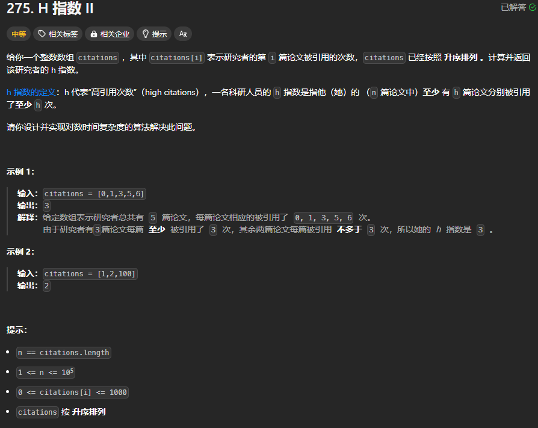

题目链接：[https://leetcode.cn/problems/h-index-ii/description/](https://leetcode.cn/problems/h-index-ii/description/)



## 思路和代码
假设 H 指数为 x，按题目要求数组中的 [n - x..] 都要大于等于 x。

由此，一种做法是枚举 x，然后看 nums[n - x] 是否大于等于 x：

```rust
impl Solution {
    pub fn h_index(citations: Vec<i32>) -> i32 {
        let n = citations.len();

        for x in (1..=n).rev() {
            if citations[n - x] >= x as i32 {
                return x as _;
            }
        } 

        0
    }
}
```

但是上述的算法是 O(n) 的，题目要求要 O(logn) 的时间复杂度。

如果我们一次知道了一半的元素是否是 nums[n - mid..] 都大于等于 mid，那么就可以快速确定 mid 了，mid 就是 H 指数。

所以，我们的目的就是枚举 mid（被称为**二分答案**），那么，我们就需要保证初始化的 left 和 right 计算出来的 mid 能够达到理论上 mid 的最大值和最小值。在这里，mid 的最大值是 n，最小值是  0，但是我们只可以初始化 left = 1, right = n。为什么 mid 的最小值为 0，而 left = 1呢？这是因为我们要 citations[n - mid] 来访问数组，如果 mid 为 0，则会导致数组越界。

```rust
impl Solution {
    pub fn h_index(citations: Vec<i32>) -> i32 {
        let n = citations.len();

        let mut left = 1;
        let mut right = n;
        // 初始化为 0 是因为 [1, n] 区间上没有答案 0，如果没有在 [1, n] 上找到答案，就返回 0
        let mut ans = 0;
        while left <= right {
            let mid = left + (right - left) / 2;

            if citations[n - mid] >= mid as i32 {
                ans = mid;
                // 这里在符合条件的情况下更新 left 的原因是最大化 ans
                left = mid + 1;
            } else {
                right = mid - 1;
            }
        }

        ans as _
    }
}
```

上述写法没有没有用到循环不变量：

+ right +1 一定不符合条件
+ left - 1 一定符合条件

这里的条件是指 `citations[n - x] >= x`。

结束 `while` 循环的时候，有` right = left - 1`，而我们需要的就是最大的 left - 1，所以返回 right 就是答案了。那么 right 可能会包含 0 吗？left 我们初始化为 1，当正确答案为 0 的时候，由于在区间 [1, n] 上的任一一个值都不满足条件，则 left 直到退出循环的时候都是为 1，则当结束循环的时候，right = left - 1 = 0，所以，此时 right 包含了正确的答案。

```rust
impl Solution {
    pub fn h_index(citations: Vec<i32>) -> i32 {
        let n = citations.len();

        let mut left = 1;
        let mut right = n;
        while left <= right {
            let mid = left + (right - left) / 2;

            if citations[n - mid] >= mid as i32 {
                left = mid + 1;
            } else {
                right = mid - 1;
            }
        }

        right as i32
    }
}
```

