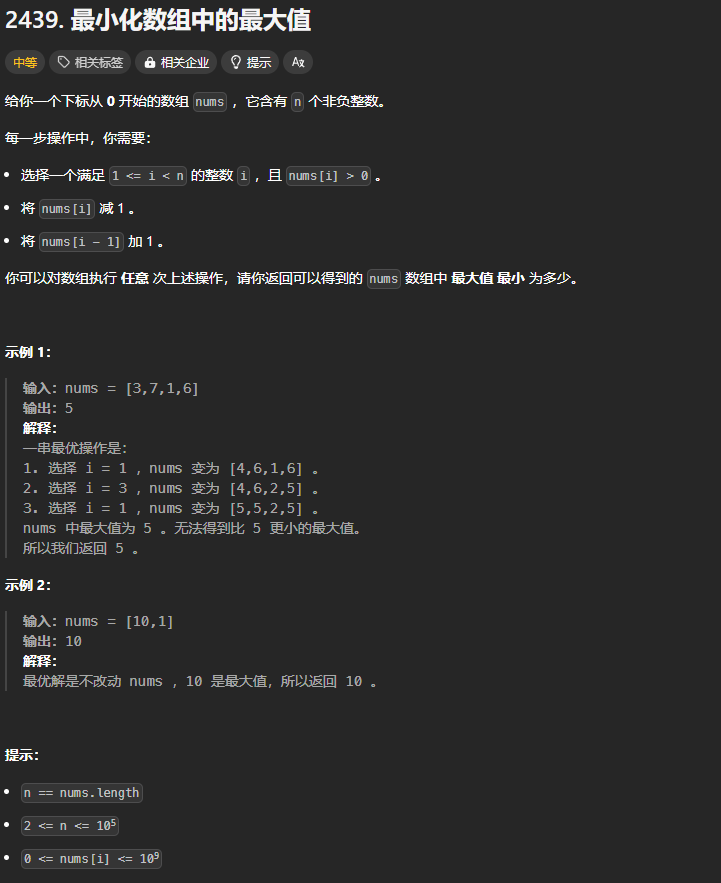
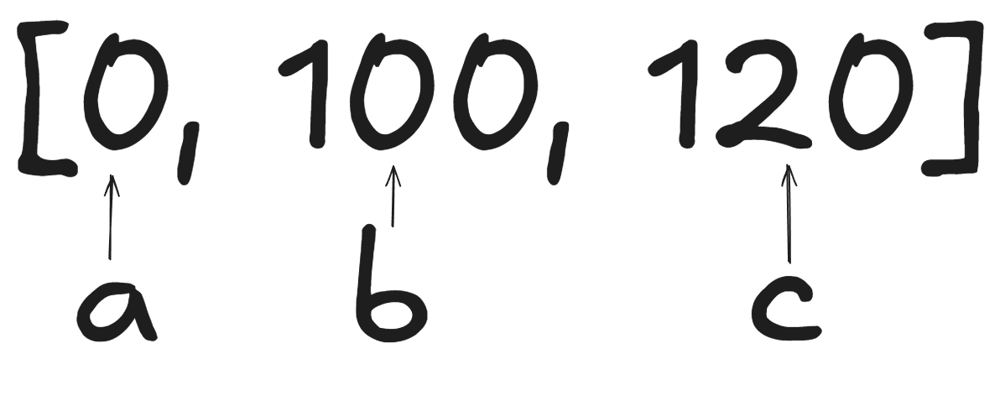

题目链接:[https://leetcode.cn/problems/minimize-maximum-of-array/description/](https://leetcode.cn/problems/minimize-maximum-of-array/description/)



## 思路
“最小化最大值”很明显就是二分答案。

我们枚举答案 mid，即执行一次“操作”之后，数组中的最大值。

所以，f 函数的目标是：看是否能通过执行任意次操作来使数组中的最大值小于等于 mid，如果能，则说明这个最大值是可行的，返回 true。

根据题目的“操作”规定，我们只能选择两个相邻的元素，假设为 (a, b)。我们可以发现，要达到“减小最大值”的目的，就需要使 a < b，这样我们才能减小最大值。而且，我们执行操作之后，最好的结果就是 a, b 都为 (a + b) / 2。但是这只是针对于 2 个元素的最好结果，对于全局而言就不是了。假如下面这种情况：



 我们需要让 a 位置大于 50，来尽可能地降低整个数组的最大值。

那么 a 位置的上限是多少，那就是传入 f 的 mid 值。由此，如果我们遍历完整个数组，都能够将最大值控制在 mid 以下（包含等于 mid 的情况），那么就是合法的答案。

## 代码
```rust
impl Solution {
    pub fn minimize_array_value(nums: Vec<i32>) -> i32 {
        let f = |mid: i32| -> bool {
            // 所有元素的最大值都要小于等于 mid
            if nums[0] > mid {
                return false;
            }

            let mut prev = nums[0] as i64;
            for &num in &nums[1..] {
                let mut current = num as i64;
                // prev 最多能从 nums[i] 减去 mid - prev
                // 这里会溢出，使用 i64
                current -= mid as i64 - prev;
                if current > mid as i64 {
                    return false;
                }
                prev = current;
            }

            true
        };

        // 答案的最小值
        let mut left = *nums.iter().min().unwrap();
        // 答案的最大值
        let mut right = *nums.iter().max().unwrap();
        // 循环不变量:
        //      f(left - 1) = false
        //      f(right + 1) = true
        while left <= right {
            let mid = left + (right - left) / 2;
            if f(mid) {
                // 最小化最大值
                right = mid - 1;
            } else {
                left = mid + 1;
            }
        }

        left
    }
}
```

对于 f，有一个更妙的写法，我上面这个写法是从前往后，但是还有一种写法是从后往前，如果后一个元素已经小于 mid 了，就不用从其中减去什么了。而如果大于 mid，则减去一定的值，将这个减去的值加给前面的一个值，让它处理这多余的部分。最后，只要 nums[0] <= mid，则符合条件。

```rust
let f = |mid: i32| -> bool {
    let mid = mid as i64;
    let mut extra = 0i64;
    for &num in nums[1..].iter().rev() {
        extra = (num as i64 + extra - mid).max(0);
    }

    extra + nums[0] as i64 <= mid
};
```

但是上面的写法虽然简洁，但是没有原来的写法效率高，因为原来的写法可以提前返回。而这个写法必须遍历完整个数组。

