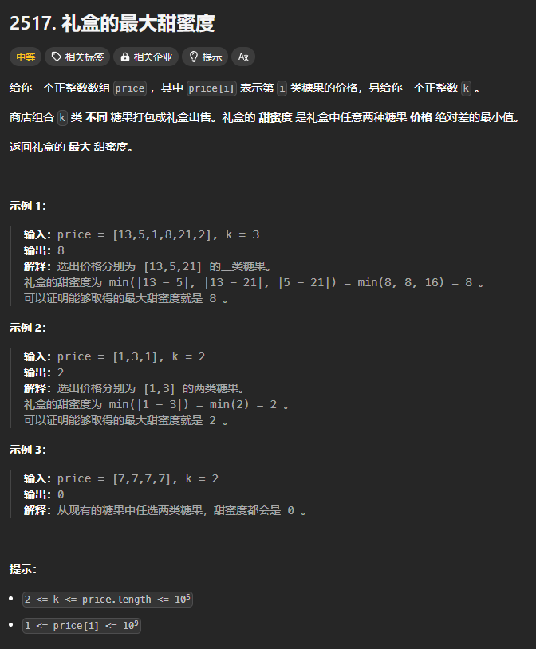

题目链接：[https://leetcode.cn/problems/maximum-tastiness-of-candy-basket/description/](https://leetcode.cn/problems/maximum-tastiness-of-candy-basket/description/)



## 思路
这题目的意思就是说最大化最小值，可以使用二分答案的思路。

用于判断是否满足条件的 f 函数怎么定义？

由于我们枚举的是答案，即任意两种糖果的价格的绝对差的最小值，我们可以考虑一下，什么时候价格的绝对值最小？答案是，价格最接近的两种糖果的价格的绝对差最小。所以，我们可以将价格数组排序，从而快速找到两种价格接近的糖果。然后统计数组中相邻糖果的价格绝对差大于等于 mid 的有多少种糖果，如果大于 k 中，就满足了条件。就是下面的这种思路：

```rust
// 之所以使用闭包的原因是我们需要捕获外部的变量 k 和 price
let f = |mid: i32| -> bool {
    // price 是已经排好序了的

    // 孤掌不鸣
    let mut cnt = 1;
    let mut prev = price[0];
    for &price in &price {
        // price 一定大于等于 prev
        if price - prev >= mid {
            cnt += 1;
            // 为什么只有在找到一种组合的时候才更新 prev？
            // 		因为要增大 price，来使差值增大，同时也避免了下述问题：
            //
            // 出现 [1,2,200] 这种的时候，假设 mid = 10，那么，算法的一个组合只会是 (1, 200)
            // 而不会出现 (2, 200)
            // 这避免了组合中同时出现 1 和 2 而导致整个分配方案的不合法，即 1 和 2 是互斥的
            //
            // 还有一点，price 已经加入到了组合中了，将 price 赋值给 prev 可以避免后续组合中
            // 有元素与 price 相减会小于 mid
            prev = price;
        }  
    }

    cnt >= k
}
```

## 代码
```rust
impl Solution {
    pub fn maximum_tastiness(mut price: Vec<i32>, k: i32) -> i32 {
        price.sort_unstable();
        let n = price.len();

        // 之所以使用闭包的原因是我们需要捕获外部的变量 k 和 price
        let f = |mid: i32| -> bool {
            // price 是已经排好序了的

            // 孤掌不鸣
            let mut cnt = 1;
            let mut prev = price[0];
            for &price in price.iter().skip(1) {
                // price 一定大于等于 prev
                if price - prev >= mid {
                    cnt += 1;
                    // 为什么只有在找到一种组合的时候才更新 prev？
                    // 		因为要增大 price，来使差值增大，同时也避免了下述问题：
                    //
                    // 出现 [1,2,200] 这种的时候，假设 mid = 10，那么，算法的一个组合只会是 (1, 200)
                    // 而不会出现 (2, 200)
                    // 这避免了组合中同时出现 1 和 2 而导致整个分配方案的不合法，即 1 和 2 是互斥的
                    //
                    // 还有一点，price 已经加入到了组合中了，将 price 赋值给 prev 可以避免后续组合中
                    // 有元素与 price 相减会小于 mid
                    prev = price;
                }  
            }

            cnt >= k
        };

        // 答案的最小值
        let mut left = 0;
        // 答案的最大值，即最大的甜蜜度，只可能是 price 中最大值减去最小值
        let mut right =  price[n - 1] - price[0];
        while left <= right {
            // 循环不变量：
            //      f(left - 1) = true
            //      f(right + 1) = false
            let mid = left + (right - left) / 2;
            if f(mid) {
                // 最大化答案
                left = mid + 1;
            } else {
                right = mid - 1;
            }
        }

        // 结束循环之后，有 right + 1 = left
        right
    }
}
```

