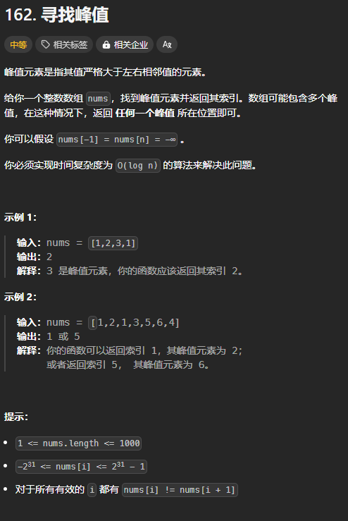
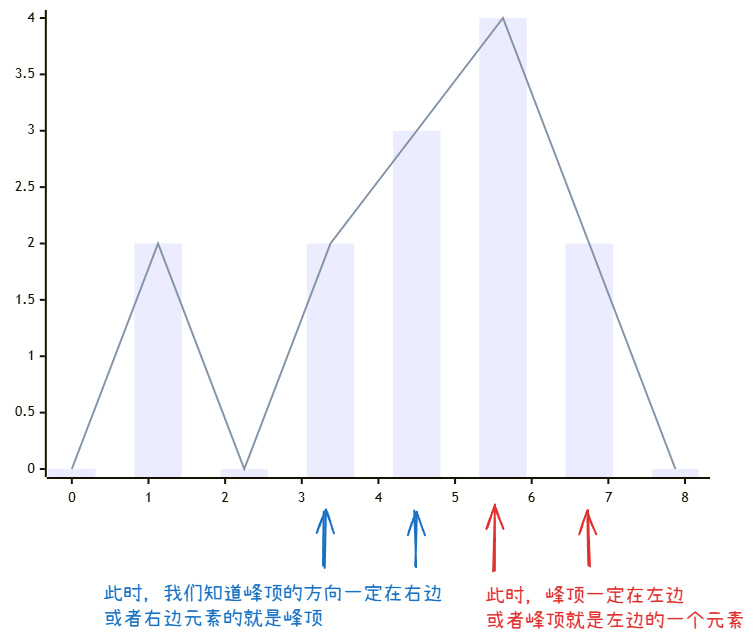

题目链接：[https://leetcode.cn/problems/find-peak-element/description/](https://leetcode.cn/problems/find-peak-element/description/)



## 思路
因为对于任意的 i，都有 `nums[i] != nums[i + 1]`，故而当我们判断两个相邻元素的大小之后，我们可以确定峰顶所在的方向：



故而我们可以使用红蓝染色法：

+ 在峰顶左侧的元素染为蓝色
+ 在峰顶右侧或者就是峰顶的元素染为红色

根据此定义，数组最右边的一个元素一定是红色的。

这样的话，我们就可以使用二分法来查找峰顶元素了。

## 代码
```rust
impl Solution {
    pub fn find_peak_element(nums: Vec<i32>) -> i32 {
        let n = nums.len();
        
        let mut left = 0;
        // 由于隐性的 nums[n] = 负无穷,所以 n - 1 一定是红色的
        let mut right = n - 2;
        // 循环不变量:
        //      right + 1 为红色
        //      left - 1 为蓝色
        while left as i32 <= right as i32 {
            let mid = (left + right) / 2;
            if nums[mid] < nums[mid + 1] {
                // 峰顶在右边
                left = mid + 1;
            } else {
                // 峰顶在左边
                right = mid - 1;
            }
        }

        left as _
    }
}
```


11 行之所以要转换为 i32 进行比较是因为如果峰顶在 0 处，则 right 此时为 -1，不应该再进入循环。


