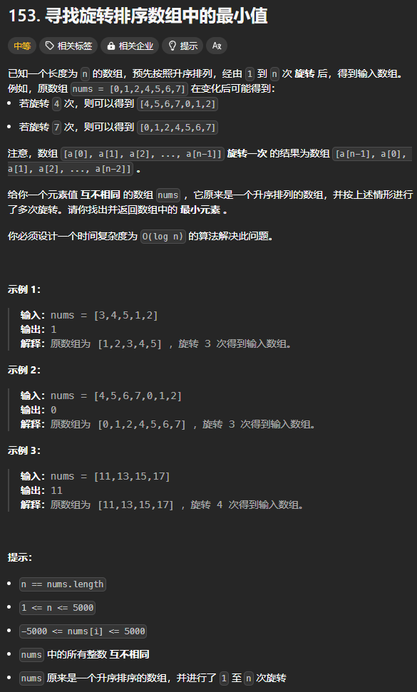
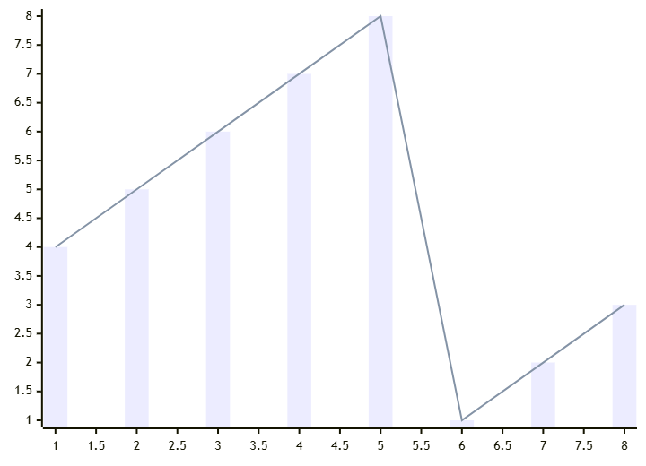
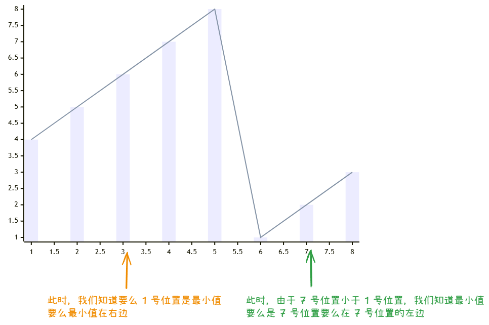

题目链接：[https://leetcode.cn/problems/find-minimum-in-rotated-sorted-array/description/](https://leetcode.cn/problems/find-minimum-in-rotated-sorted-array/description/)



## 思路


这里的思路也和寻找峰值那题的思路差不多，但是这里判断方向不能通过相邻的元素来判别，而是要让每个元素和一个固定的元素来比较才能判断方向，这里，我们假设所有元素都和 nums[0] 来进行比较来判别方向：




这样，我们就可以确定方向，从而找到最小值。

## 代码
```rust
impl Solution {
    pub fn find_min(nums: Vec<i32>) -> i32 {
        let n = nums.len();

        let mut left = 1;
        let mut right = n - 1;
        // 循环不变量：
        //      left - 1 一定大于 nums[0]
        //      right + 1 一定小于 nums[0]
        while left <= right {
            let mid = (left + right) / 2;
            if nums[mid] > nums[0] {
                // 要么 nums[0] 就是最小值，要么最小值在右边
                left = mid + 1;
            } else {
                // 要么 mid 就是最小值要么最小值在 mid 的左边
                right = mid - 1;
            }
        }

        // 结束循环有 left = right + 1
        if left == n { nums[0] } else { nums[left] }
    }
}
```

