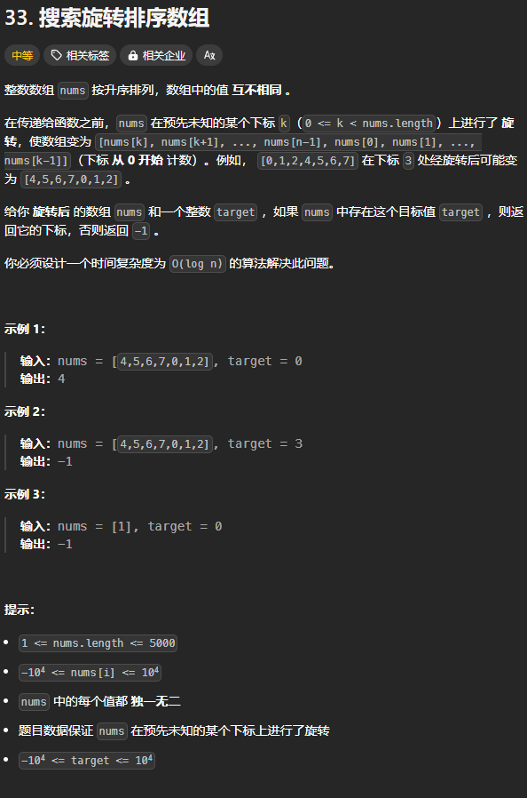
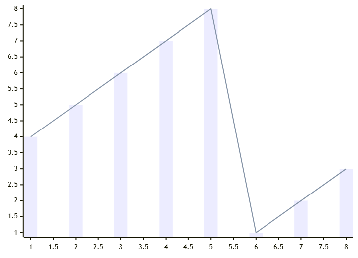
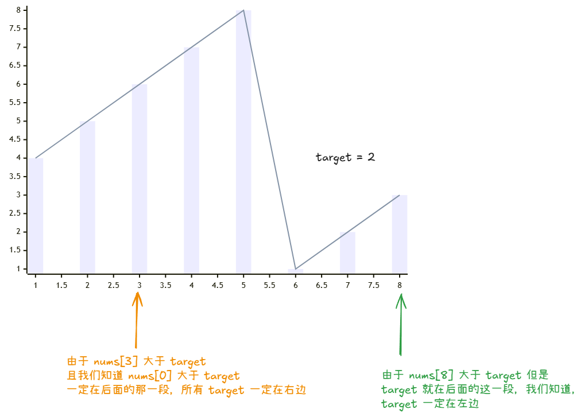

题目链接;[https://leetcode.cn/problems/search-in-rotated-sorted-array/description/](https://leetcode.cn/problems/search-in-rotated-sorted-array/description/)



## 思路


由于上图中， nums[n - 1] < nums[0]，所以我们知道，整个区间一定被分为了 2 段。那么 target 只会在两段中的某一段，并且可以知道方向：



所以，我们可以通过比较 nums[n - 1]、target、x = nums[mid] 之间的大小关系判断出方向:

核心思路：

1. 如果** **x** **和** **target** **在不同的递增段**：**
    - 如果 target 在第一段（`target > nums[n - 1]`），x 在第二段（`x < nums[n - 1]`），说明 x 在 target 右边。
    - 如果 target 在第二段（`target < nums[n - 1]`），x 在第一段（`x > nums[n - 1]`），说明 x 在 target 左边。
2. 如果** **x** **和 target** **在相同的递增段**：**
    - 比较 x 和 target 的大小即可。

让我们写一个函数来判断 x 是否在 target 的右边或者 x 就是 target：

1. 如果 x 位于第一段，则 target 也必须在第一段且 x >= target 才能保证 x 在 target 的右边，：

`x > nums[n - 1] && target > num[n - 1] && x >= target` 化简之后就是：`target > num[n - 1] && x >= target`

2. 如果 x 位于第二段（x <= nums[ n- 1]），则 target  可以位于第一段也可以位于第二段。如果 target 位于第一段，则需要保证 target > nums[n - 1]，如果位于第二段，则需要保证 target <= x:

`(x <= nums[n - 1] && target > nums[ n - 1]) || (x <= nums[n - 1] && x >= target)`

如果我们将 `x <= nums[ n - 1]` 写成一个 if 语句，只有满足这个条件的时候才进入这个分支，那么上述语句就可以简化为：

`target > nums[n - 1] || x >= target`

上述的第二种情况中包括了整个数组没有分段，全部为一个段的情况。

```rust
let is_x_right_of_target_or_eq_target = |x: i32| -> bool {
    if x <= nums[n - 1] {
        // x 位于第二段或者整个数组就一段
        return target > nums[n - 1] || x >= target;
    }

    // x 位于第一段
    target > nums[n - 1] && x >= target
};
```

## 代码
```rust
impl Solution {
    pub fn search(nums: Vec<i32>, target: i32) -> i32 {
        let n = nums.len();
        let is_x_right_of_target_or_eq_target = |x: i32| -> bool {
            if x <= nums[n - 1] {
                // x 位于第二段或者整个数组就一段
                return target > nums[n - 1] || x >= target;
            }

            // x 位于第一段
            target > nums[n - 1] && x >= target
        };

        let mut left = 0;
        let mut right = n - 1;
        // 循环不变量：
        //      right + 1 在 target 的右边或者就是等于 target
        //      left - 1 在 target 的左边
        while left as i32 <= right as i32 {
            let mid = (left + right) / 2;
            if is_x_right_of_target_or_eq_target(nums[mid]) {
                // x 在 target 的右边或者 x 就是 target
                // 那么我们就是 x 左移，即 mid 左移
                right = mid - 1;
            } else {
                left = mid + 1;
            }
        }
        
        // 循环结束时，有 left = right + 1
        // 而 right + 1 刚好是我们需要的答案
        if nums[left] == target { left as _ } else { -1 }
    }
}
```


