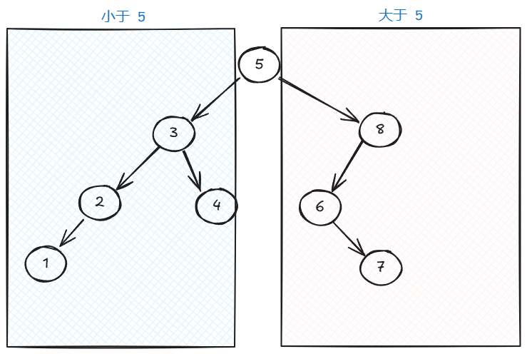
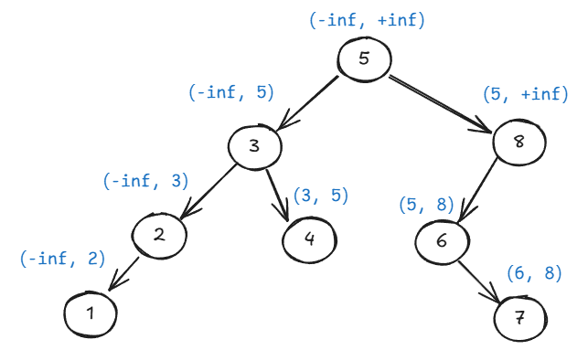
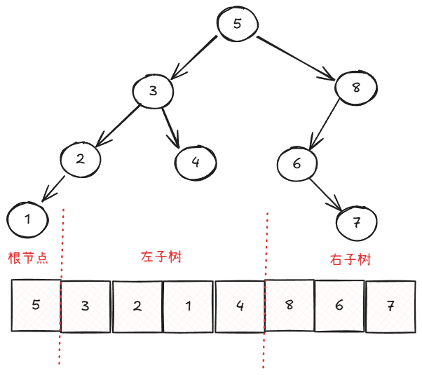
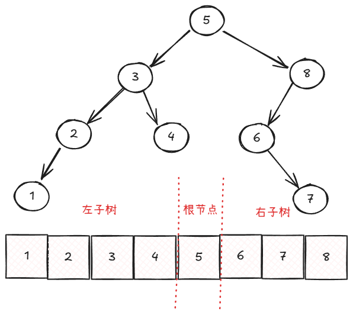
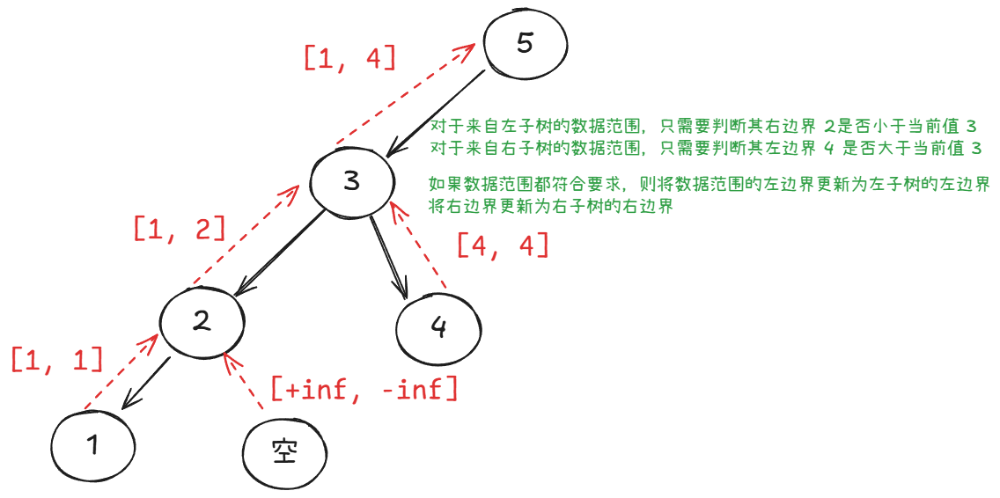
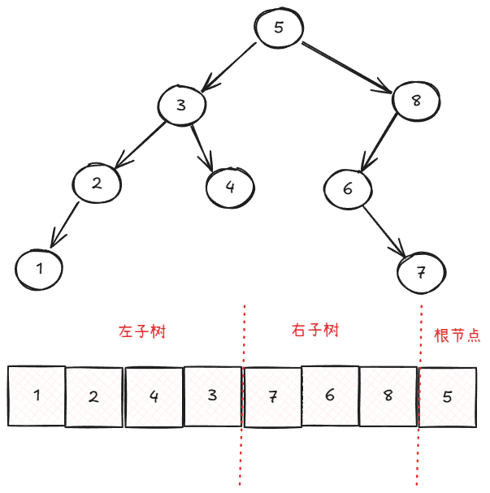

定义：对于一个节点，它的左子树的所有节点值都小于它的节点值，它的右子树的所有节点值都大于它的节点值。对于它的左孩子和右孩子，也要满足这个定义。



## 前序遍历
前序遍历按照 node、node.left、node.right 的顺序进行遍历。

从二叉搜索树的定义中，我们发现，我们前序遍历“递”的时候，我们就知道了这个节点的值的范围：

、

下图是前序遍历的最终结果：



我们可以看到，前序遍历结果数组具有以下性质：

+ 数组的第一个元素为根节点
+ 上述性质满足递归，例如标注为左子树的部分数组的第一个元素 3 也是一个根节点

## 中序遍历
中序遍历按照 node.left、node、node.right 的顺序进行遍历。

中序遍历有一个很好的结果：如果二叉搜索树合法，则在“归”的时候，会按照节点值从小到大的顺序进行“归”的操作。

下图是中序遍历后的结果：



从中，我们可以看到：

+ 如果能确定根节点，我们就能知道它左子树和右子树节点的数量。
+ 上述性质满足递归，例如上图标注为左子树的部分数组中的根节点 3 的左子树有 2 个节点，右子树有一个节点

上述性质通常用来和前序遍历一起来构造二叉树：

+ 通过前序遍历确定根节点
+ 通过中序遍历确定根节点左子树和右子树的节点的数量

## 后序遍历
后序遍历按照 node.left、node.right、node 的顺序进行遍历。

后序遍历在归的时候，可以将已经确定了的值的范围传递给父节点，从而让父节点确定这颗二叉树是否合法，或者用于别的用途：



注意，当从空节点返回的时候，是返回 [+inf, -inf] 而不是 [-inf, +inf]。

之所以返回 [+inf, -inf] 是因为如果这样返回的话，我们就不需要在判断二叉树是否合法的时候特殊处理（具体看下面的代码）。

如果在遍历的过程中，发现不是一颗二叉搜索树，可以通过返回 [-inf, +inf] 来使比较的最终结果也可以发现此颗树不是一颗二叉搜索树。

上述关于数据范围判断是否符合要求的核心思路是：

+ 左子树的最大值是否小于当前值
+ 右子树的最小值是否大于当前值

数据范围更新的核心思路是：

+ 将左边界更新为最小值（左子树的左边界）
+ 将右边界更新为最大值（右子树的右边界）

下图是后续遍历的结果：



从中我们可以看到：

+ 数组的最后一个元素为根节点

通常这个性质和中序遍历的性质一起使用：

+ 后序遍历确定根节点
+ 中序遍历确定左右子树的节点数量

## 验证二叉搜索树
### 使用前序遍历来验证
```rust
/// 通过前序遍历验证树是否是二叉搜索树
///
/// min 和 max 代表 (min, max) 开区间
fn preorder(root: Option<Rc<RefCell<TreeNode>>>, (min, max): (i64, i64)) -> bool {
    if let Some(root) = root {
        let root = root.borrow();
        let val = root.val as i64;

        if val <= min || val >= max {
            return false;
        }

        Self::preorder(root.left.clone(), (min, val))
            && Self::preorder(root.right.clone(), (val, max))
    } else {
        true
    }
}
```

### 使用中序遍历来验证
```rust
/// 通过中序遍历来验证树是否是二叉搜索树
fn inorder(root: Option<Rc<RefCell<TreeNode>>>, previous_val: &mut i64) -> bool {
    if let Some(root) = root {
        let root = root.borrow();
        let val = root.val as i64;

        let left_result = Self::inorder(root.left.clone(), previous_val);
        if val <= *previous_val {
            return false;
        }
        // 不能将此语句移至下一条语句的后面
        *previous_val = val;
        let right_result = Self::inorder(root.right.clone(), previous_val);

        left_result && right_result
    } else {
        true
    }
}
```


### 使用后序遍历来验证
```rust
fn postorder(root: Option<Rc<RefCell<TreeNode>>>) -> (i64, i64) {
    if let Some(root) = root {
        let root = root.borrow();
        let (left_min, left_max) = Self::postorder(root.left.clone());
        let (right_min, right_max) = Self::postorder(root.right.clone());

        let val = root.val as i64;
        
        // 将为 None 的节点返回值设置为 (inf, -inf) 的目的是让这里的条件判断始终为 false
        // 因为如果左子节点是 None，则 left_max = -inf，如果右子节点是 None，则 right_min = inf
        if val <= left_max || val >= right_min {
            return (Self::NEGATIVE_INF, Self::POSITIVE_INF);
        }

        (left_min.min(val), right_max.max(val))
    } else {
        (Self::POSITIVE_INF, Self::NEGATIVE_INF)
    }
}
```

