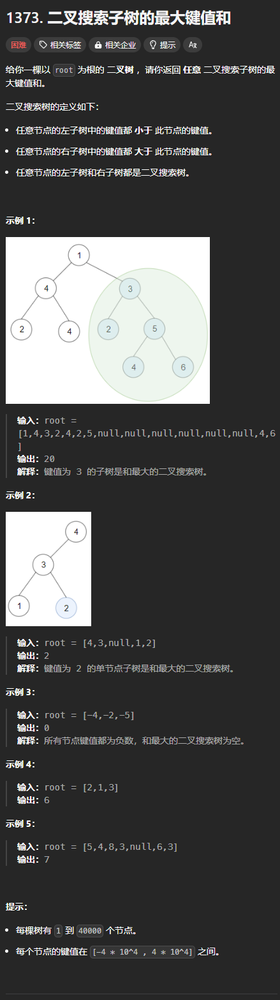
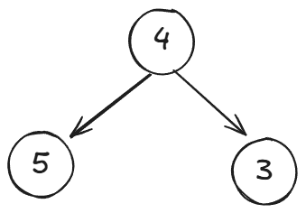

题目链接：[https://leetcode.cn/problems/maximum-sum-bst-in-binary-tree/description/](https://leetcode.cn/problems/maximum-sum-bst-in-binary-tree/description/)



## 思路
我们通过定义知道，二叉搜索树一定包括叶子节点。所以，我们可以从叶子节点往上推这是不是一颗二叉搜索树，如果是，则将其加入和当中，如果不是，则清空和。

后序遍历可以用来从叶子节点往上推出当前节点是否是二叉搜索树的一个节点。

## 代码
```rust
use std::cell::RefCell;
use std::rc::Rc;
impl Solution {
    const NEGATIVE_INF: i32 = i32::MIN;
    const POSITIVE_INF: i32 = i32::MAX;

    pub fn max_sum_bst(root: Option<Rc<RefCell<TreeNode>>>) -> i32 {
        /// 返回值是 (min, max, sum),其中 min 和 max 是闭区间 [min, max]，代表子树的取值范围
        /// sum 是二叉树搜索树之和
        fn postorder_validate_bst(
            root: Option<Rc<RefCell<TreeNode>>>,
            max_sum: &mut i32,
        ) -> (i32, i32, i32) {
            if let Some(root) = root {
                let root = root.borrow();
                let val = root.val;

                let (left_min, left_max, left_sum) =
                    postorder_validate_bst(root.left.clone(), max_sum);
                let (right_min, right_max, right_sum) =
                    postorder_validate_bst(root.right.clone(), max_sum);

                if val <= left_max || val >= right_min {
                    // 此时，这个节点不是二叉搜索树
                    *max_sum = (*max_sum).max(left_sum.max(right_sum));
                    return (Solution::NEGATIVE_INF, Solution::POSITIVE_INF, 0);
                }

                *max_sum = (*max_sum).max(left_sum + right_sum + val);

                (left_min.min(val), right_max.max(val), left_sum + right_sum + val)
            } else {
                (Solution::POSITIVE_INF, Solution::NEGATIVE_INF, 0)
            }
        }

        let mut ans = 0;
        postorder_validate_bst(root, &mut ans);
        ans
    }
}
```

为什么二叉搜索树之和需要使用返回值返回，而不是使用一个全局变量来记录？



例如上面这种情况，由于是后序遍历，如果使用全局变量的话，归的顺序就是 5 -> 3 -> 4，那么，而 5 和 3 在归的时候，都认为其是二叉搜索树的一个节点，所以它们都会更新 sum，从而导致 sum 为 8。当归到 4 的时候，就会导致 8 成为最终的答案，而实际的答案应该是 5。

