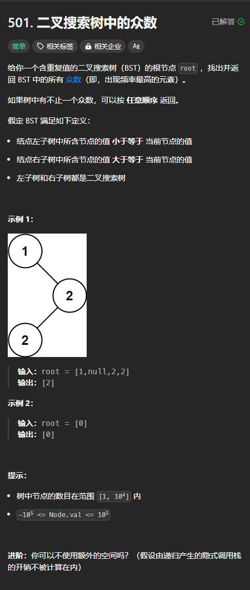

题目链接：[https://leetcode.cn/problems/find-mode-in-binary-search-tree/description/](https://leetcode.cn/problems/find-mode-in-binary-search-tree/description/)



## 思路
利用二叉搜索树遍历是有序的这一特点，可以进行优化，而不是统计每个元素的出现频率，然后排序得出答案。

可以使用 2 个变量，一个 prev 代表中序遍历的前一个元素，一个 cnt，代表 prev 出现的频率。还有一个答案的 max_cnt 代表答案中的元素的频率，ans 代表答案数组。

这样的话，只要 cnt 大于 max_cnt 我们就清空 ans，等于 ans 就将 prev 加入 ans。

为了避免频繁进行 cnt 和 max_cnt 的比较而清空 ans，应该只有当 prev 和当前元素不相等的时候才进行比较。因为这时的 cnt 是 prev 这个元素出现的频率的最终结果。

## 代码
```rust
use std::cell::RefCell;
use std::cmp::Ordering::{Equal, Greater, Less};
use std::rc::Rc;
impl Solution {
    pub fn find_mode(root: Option<Rc<RefCell<TreeNode>>>) -> Vec<i32> {
        #[derive(Debug)]
        struct Args {
            /// 中序遍历的前一个元素
            prev: i32,
            /// prev 的出现频率
            cnt: usize,
            /// ans 中节点值的出现次数
            max_cnt: usize,
            ans: Vec<i32>,
        }

        impl Args {
            fn update_ans(&mut self) {
                match self.cnt.cmp(&self.max_cnt) {
                    Less => {}
                    Equal => self.ans.push(self.prev),
                    Greater => {
                        self.ans.clear();
                        self.ans.push(self.prev);
                        self.max_cnt = self.cnt;
                    }
                }
            }
        }

        fn inorder_find(root: Option<Rc<RefCell<TreeNode>>>, args: &mut Args) {
            if let Some(root) = root {
                let root = root.borrow();
                inorder_find(root.left.clone(), args);

                if root.val != args.prev {
                    args.update_ans();
                    args.prev = root.val;
                    args.cnt = 1;
                } else {
                    args.cnt += 1;
                }

                inorder_find(root.right.clone(), args);
            }
        }

        let mut args = Args {
            // 一个不可能的节点值
            prev: 100001,
            cnt: 0,
            max_cnt: 0,
            ans: vec![],
        };
        inorder_find(root, &mut args);

        // 之所以这里还要调用一次 update_ans 是因为答案可能是树中最大的一个元素
        // 而此时由于没有后续的元素，不会在递归的过程中更新答案，此时就需要手动更新
        args.update_ans();

        args.ans
    }
}
```

如果每次都更新 ans 的话，就不需要额外调用一次 args.update_ans()。

