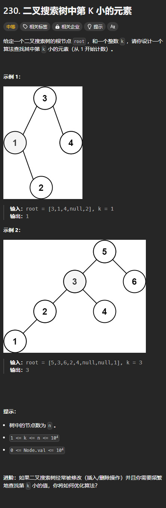

题目链接：[https://leetcode.cn/problems/kth-smallest-element-in-a-bst/description/](https://leetcode.cn/problems/kth-smallest-element-in-a-bst/description/)



## 思路
由于题目说的是第 K 小，而不是倒数第 K 大，所以还是很简单的。

利用二叉搜索树中序遍历是有序的性质（要意识到只是在归的过程当中有序），我们可以用一个全局变量 index 来表明现在是中序遍历的第几个元素（从 1 开始计数）。如果等于 k，则说明第 K 小的元素就是此值。

由于在归的过程当中是有序的，所以我们需要在归的过程中递增 index。

## 代码
```rust
use std::cell::RefCell;
use std::rc::Rc;
impl Solution {
    pub fn kth_smallest(root: Option<Rc<RefCell<TreeNode>>>, k: i32) -> i32 {
        fn inorder_find(
            root: Option<Rc<RefCell<TreeNode>>>,
            k: i32,
            index: &mut i32,
            ans: &mut i32,
        ) {
            if let Some(root) = root {
                let root = root.borrow();

                inorder_find(root.left.clone(), k, index, ans);

                if *index == k {
                    *ans = root.val;
                }
                *index += 1;

                inorder_find(root.right.clone(), k, index, ans);
            }
        }

        let mut ans = 0;
        inorder_find(root, k, &mut 1, &mut ans);

        ans
    }
}
```

上述代码还有可以优化的地方：我们可以只使用一个变量 k 来计数，每次归的过程 k 就减一，这样的话，当 k 等于 0 的时候，我们就知道当前节点的值就是答案。

```rust
use std::cell::RefCell;
use std::rc::Rc;
impl Solution {
    pub fn kth_smallest(root: Option<Rc<RefCell<TreeNode>>>, mut k: i32) -> i32 {
        fn inorder_find(root: Option<Rc<RefCell<TreeNode>>>, k: &mut i32, ans: &mut i32) {
            if let Some(root) = root {
                let root = root.borrow();

                inorder_find(root.left.clone(), k, ans);

                *k -= 1;
                if *k == 0 {
                    *ans = root.val;
                }

                inorder_find(root.right.clone(), k, ans);
            }
        }

        let mut ans = 0;
        inorder_find(root, &mut k, &mut ans);

        ans
    }
}
```

