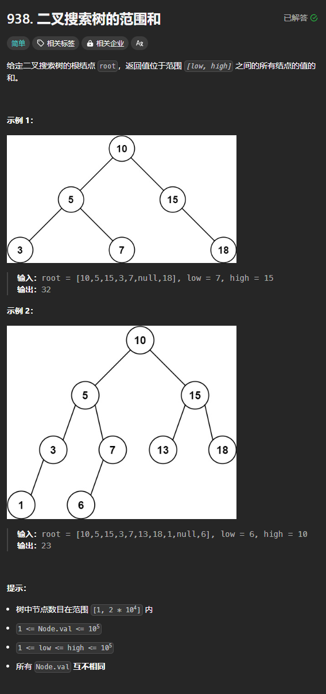

题目链接：[https://leetcode.cn/problems/range-sum-of-bst/description/](https://leetcode.cn/problems/range-sum-of-bst/description/)



## 思路
由于当 root 不在范围的时候，其子树也有可能有节点在范围内，所以，可以使用前序遍历事先遍历每个节点，如果其节点值在范围内就加入到和中。

## 代码
```rust
use std::rc::Rc;
use std::cell::RefCell;
impl Solution {
    pub fn range_sum_bst(root: Option<Rc<RefCell<TreeNode>>>, low: i32, high: i32) -> i32 {
        /// 寻找在**闭区间** [low, high] 范围内的节点值,并返回它们的和
        fn preorder_search(root: Option<Rc<RefCell<TreeNode>>>, low: i32, high: i32) -> i32 {
            if let Some(root) = root {
                let root = root.borrow();
                let val = root.val;

                preorder_search(root.left.clone(), low, high)
                    + preorder_search(root.right.clone(), low, high)
                    + if val < low || val > high { 0 } else { val }
            } else {
                0
            }
        }

        preorder_search(root, low, high)
    }
}
```

上述这种写法比较简洁。但是还有优化（剪枝）措施没有应用：

+ 如果当前节点的值小于了 low，则可以只递归右子树
+ 如果当前节点的值大于了 high，则可以只递归左子树


