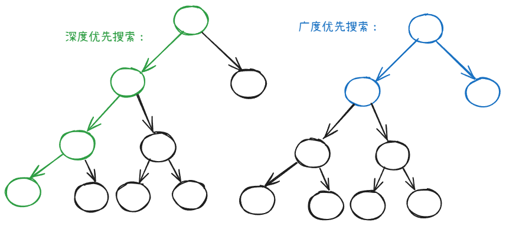

前序、中序、后序遍历都是深度优先搜索算法（DFS）。

广度优先搜索从根节点出发，优先遍历所有的“直系”子节点。而深度优先搜索优先遍历子节点的子节点。

## 实现
用两个数组，一个 current 一个 next 分别表示当前遍历的根节点们和下一次需要遍历的根节点们。

当我们遍历 current 的时候，就将 current 根节点的直系子节点加入到 next 中，下一次遍历的时候，就将 next 赋给 current，如此循环，直至 current 当中没有根节点。

我们可以将上述算法优化为使用一个数组，即将 current 和 next 合二为一，使用一个双端队列来存储：

+ 每次遍历根节点的时候，事先保存这次遍历的根节点的数量 n，然后循环 n 次，每遍历一个根节点就将其从队列头中删除
+ 根节点的直系子节点直接加入队尾

代码看：

[二叉树的层序遍历](https://www.yuque.com/cline-mly1u/bgacuc/kuk4k41lzlp2a79x)

## 应用
+ 用来实现树的层序遍历
+ 可以被用来实现树的深度有关的代码

