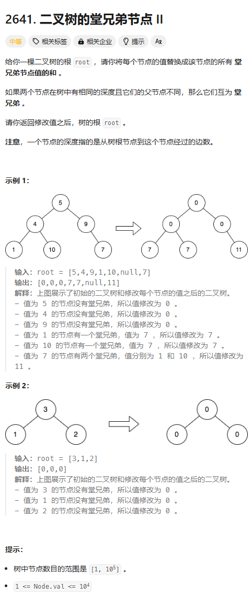

题目链接：[https://leetcode.cn/problems/cousins-in-binary-tree-ii/description/](https://leetcode.cn/problems/cousins-in-binary-tree-ii/description/)

、

## 思路
我们可以这样搞，根节点在将直系子节点加入到 roots 中去的时候，连同子节点的亲兄弟节点的值也一起加入进去。这样的话，我们一次遍历就能获取到本层的所有和 sum（需要注意的是，由于我们加入的使它亲兄弟节点的值，如果它是独生子，则会没有亲兄弟，所以，这是要加入 sum 要加入它本身的值）。子节点用 sum 减去自己亲兄弟的值和自己的值，就可以快速地得到所有堂兄弟的和。

## 代码
```rust
use std::cell::RefCell;
use std::collections::VecDeque;
use std::rc::Rc;
impl Solution {
    pub fn replace_value_in_tree(
        root: Option<Rc<RefCell<TreeNode>>>,
    ) -> Option<Rc<RefCell<TreeNode>>> {
        if root.is_none() {
            return root;
        }

        let mut level_roots = VecDeque::new();
        level_roots.push_back((root.clone(), 0));

        while !level_roots.is_empty() {
            let the_level_sum = level_roots
                .iter()
                .map(|(root, x)| {
                    if *x == 0 {
                        root.as_ref().unwrap().borrow().val
                    } else {
                        *x
                    }
                })
                .sum::<i32>();

            for _ in 0..level_roots.len() {
                let (root, sibling_value) = level_roots.pop_front().unwrap();
                let root = root.unwrap();
                let mut root = root.borrow_mut();

                match (root.left.is_some(), root.right.is_some()) {
                    (true, true) => {
                        level_roots.push_back((
                            root.left.clone(),
                            root.right.as_ref().unwrap().borrow().val,
                        ));
                        level_roots.push_back((
                            root.right.clone(),
                            root.left.as_ref().unwrap().borrow().val,
                        ));
                    }
                    (true, false) => {
                        level_roots.push_back((root.left.clone(), 0));
                    }
                    (false, true) => {
                        level_roots.push_back((root.right.clone(), 0));
                    }
                    (false, false) => {}
                }
                root.val = the_level_sum - sibling_value - root.val;
            }
        }

        root.clone()
    }
}
```


