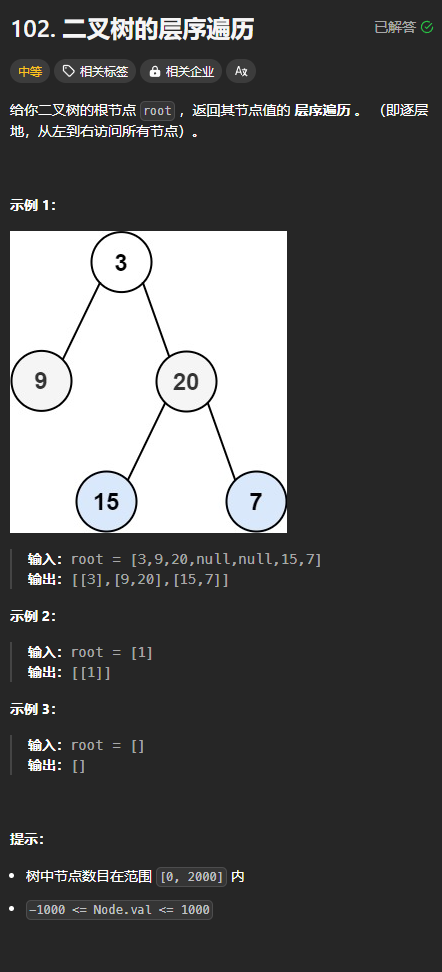

题目链接：[https://leetcode.cn/problems/binary-tree-level-order-traversal/description/](https://leetcode.cn/problems/binary-tree-level-order-traversal/description/)



## 思路
BFS 模版题。

## 代码
```rust
use std::cell::RefCell;
use std::collections::VecDeque;
use std::rc::Rc;
impl Solution {
    pub fn level_order(root: Option<Rc<RefCell<TreeNode>>>) -> Vec<Vec<i32>> {
        if root.is_none() {
            return vec![];
        }

        let mut roots = VecDeque::new();
        roots.push_back(root);

        let mut ans = vec![];

        // 对于这个 while 循环来说，只要循环一次，就代表层数加一
        while !roots.is_empty() {
            // 本层的遍历结果
            let mut the_level_result = vec![];
            // 事先将要遍历的根节点数量 n 保存下来，并循环 n 次
            for _ in 0..roots.len() {
                let mut root = roots.pop_front().unwrap().unwrap();
                the_level_result.push(root.borrow().val);
                
                if root.borrow().left.is_some() {
                    roots.push_back(root.borrow_mut().left.take());
                }
                if root.borrow().right.is_some() {
                    roots.push_back(root.borrow_mut().right.take());
                }
            }
            ans.push(the_level_result);
        }
        ans
    }
}
```

