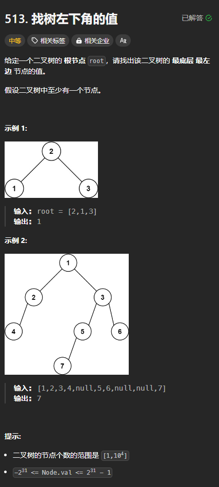

题目链接：[https://leetcode.cn/problems/find-bottom-left-tree-value/description/](https://leetcode.cn/problems/find-bottom-left-tree-value/description/)



## 思路
还是层序遍历（BFS），只是这题更简单，只需要保存每层结果的第一个，且下一层的结果会覆盖上一层的结果。

这样的话，遍历结束的时候就是答案。

## 代码
```rust
use std::rc::Rc;
use std::cell::RefCell;
use std::collections::VecDeque;
impl Solution {
    pub fn find_bottom_left_value(root: Option<Rc<RefCell<TreeNode>>>) -> i32 {
        let mut roots = VecDeque::new();
        roots.push_back(root);

        let mut ans = 0;
        while !roots.is_empty() {
            for i in 0..roots.len() {
                let root = roots.pop_front().unwrap();
                let root = root.unwrap();
                if root.borrow().left.is_some() {
                    roots.push_back(root.borrow_mut().left.take());
                }
                if root.borrow().right.is_some() {
                    roots.push_back(root.borrow_mut().right.take());
                }

                if i == 0 {
                    ans = root.borrow().val;
                }
            }
        }
        ans
    }
}
```

