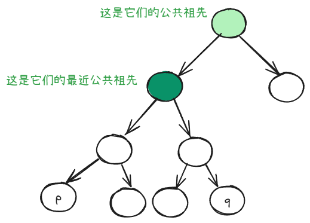
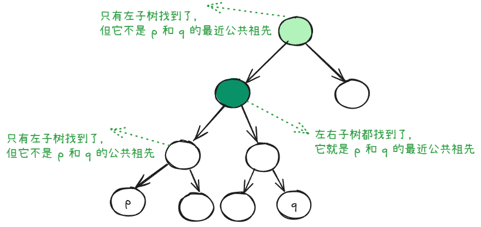

定义：

对于同一颗树的两个不同的节点 p、q，它们的最近公共祖先是同时将 p 和 q 作为后代并且深度最深的节点。需要注意的是，p 和 q 可以自己当自己的祖先。

## 寻找方法
可以在递归遍历的时候，“归”的过程中判断左右子树是否找到。

在递的过程中，判断当前节点是否是 p 和 q。如果是，就不再继续递归，而是提前返回找到了这一信号。

我们看归的 3 中情况：

+ 只有左子树找到：说明当前节点要么不是 p 和 q 的公共祖先，要么不是当前节点不是 p 和 q 的最近公共祖先，只需返回左子树找到了的信号
+ 只有右子树找到：和上面一样，只需返回右子树找到了的信号
+ 左右子树都找到了：由于“归”的过程是自底向上的，所以，此根节点就是 p 和 q 的最近公共祖先

再看递的 2 中情况：

+ 当前根节点就是 p 或者 q：看左右子树中是否找到，如果有，则此节点就是最近公共祖先
+ 当前根节点不是 p 或者 q：继续递归，直至遇到空节点

由于当前节点无论是否是 p 或 q，我们都需要遍历左右子树，所以，我们可以使用后序遍历。

