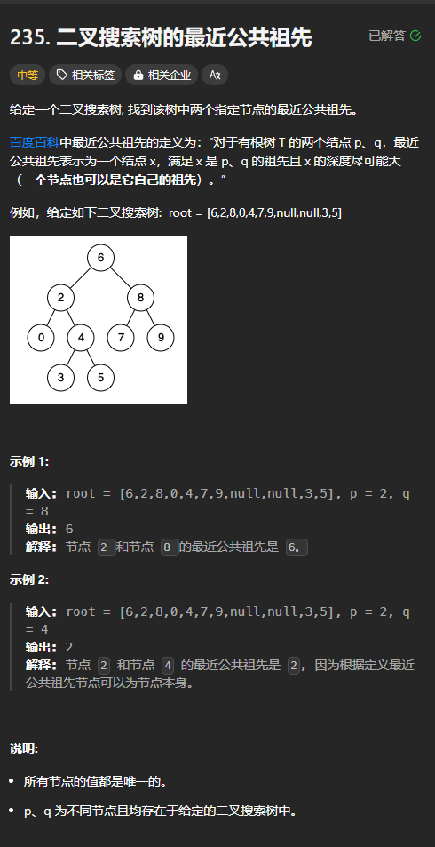

题目链接：[https://leetcode.cn/problems/lowest-common-ancestor-of-a-binary-search-tree/description/](https://leetcode.cn/problems/lowest-common-ancestor-of-a-binary-search-tree/description/)



## 思路
相比于普通二叉树，我们只能搜索来判断左右子树是否存在 p 和 q，二叉搜索树只要我们知道了根节点的大小，我们就可以知道 p 和 q 是否位于左右子树中。

所以，我们递的时候，可以选择性的递：

+ 如果 p 和 q 都位于左（右）子树，就递归左（右）子树
+ 如果 p 位于左子树、q 位于右子树，则答案就是当前节点
+ 如果当前节点就是 p 或者 q，则答案就是当前节点。这是因为我们递的过程中，始终保证 p 和 q 位于当前节点或者子树中。如果当前节点就是 p 或者 q 的话，另外一个值一定在其子树中。

## 代码
```rust
use std::cell::RefCell;
use std::rc::Rc;
impl Solution {
    pub fn lowest_common_ancestor(
        root: Option<Rc<RefCell<TreeNode>>>,
        p: Option<Rc<RefCell<TreeNode>>>,
        q: Option<Rc<RefCell<TreeNode>>>,
    ) -> Option<Rc<RefCell<TreeNode>>> {
        fn lowest_common_ancestor(
            root: Option<Rc<RefCell<TreeNode>>>,
            p: i32,
            q: i32,
        ) -> Option<Rc<RefCell<TreeNode>>> {
            if let Some(origin_root) = root {
                let root = origin_root.borrow();
                let val = root.val;

                if p.max(q) < val {
                    //  p q 都位于左子树中
                    // 只需要递归左子树就可以了
                    // 并且最近公共祖先一定在左子树中，所以返回就可以了
                    lowest_common_ancestor(root.left.clone(), p, q)
                } else if p.min(q) > val {
                    // p q 都位于右子树中
                    lowest_common_ancestor(root.right.clone(), p, q)
                } else if val == p || val == q {
                    // 当前节点一定是最近公共祖先
                    Some(origin_root.clone())
                } else {
                    // 一个在左子树、一个在右子树
                    // 那么当前节点一定是最近公共祖先
                    Some(origin_root.clone())
                }
            } else {
                None
            }
        }

        lowest_common_ancestor(root, p.unwrap().borrow().val, q.unwrap().borrow().val)
    }
}
```

上述代码第 26~33 行很明显可以合并为一个分支，保留上述代码的目的是为了保持可读性。

还有一点，将 26~33 行合并为一个分支之后，我们就只需要 p 和 q 的最大值与最小值，所以，我们不需要每次都调用 min 和 max 方法来计算最值。而是直接计算了传给函数就行了。


