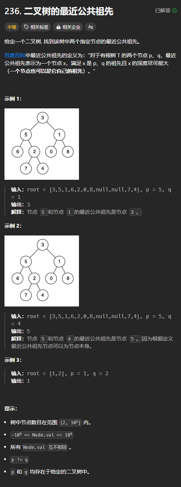

## 思路
[最近公共祖先](https://www.yuque.com/cline-mly1u/bgacuc/lce6mdz1daqxwbyw)

## 代码
```rust
use std::cell::RefCell;
use std::rc::Rc;
impl Solution {
    pub fn lowest_common_ancestor(
        root: Option<Rc<RefCell<TreeNode>>>,
        p: Option<Rc<RefCell<TreeNode>>>,
        q: Option<Rc<RefCell<TreeNode>>>,
    ) -> Option<Rc<RefCell<TreeNode>>> {
        fn lowest_common_ancestor(
            root: Option<Rc<RefCell<TreeNode>>>,
            p: i32,
            q: i32,
        ) -> Option<Rc<RefCell<TreeNode>>> {
            if let Some(origin_root) = root {
                let root = origin_root.borrow();

                let left = lowest_common_ancestor(root.left.clone(), p, q);
                let right = lowest_common_ancestor(root.right.clone(), p, q);

                if (root.val == p || root.val == q) 
                    || (left.is_some() && right.is_some())
                {
                    // 当前节点就是最近公共祖先或者虽然不是最近公共祖先，但是找到了 p 或者 q
                    // 而 p 或者 q 也可能是最近公共祖先，但是由于无论 p 和 q 是否是最近公共
                    // 祖先，都要返回 root，故而减少了判断
                    return Some(origin_root.clone());
                }

                if left.is_some() { left } else if right.is_some() { right } else { None }
            } else {
                None
            }
        }

        lowest_common_ancestor(root, p.unwrap().borrow().val, q.unwrap().borrow().val)
    }
}
```


