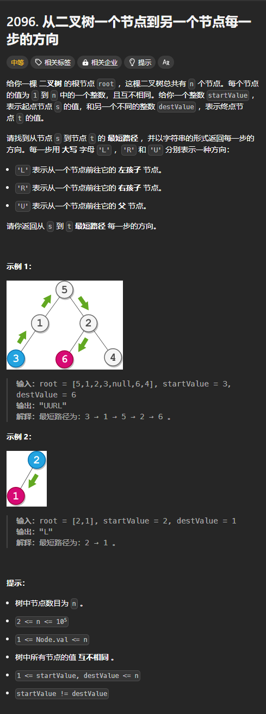

题目链接：[https://leetcode.cn/problems/step-by-step-directions-from-a-binary-tree-node-to-another/description/](https://leetcode.cn/problems/step-by-step-directions-from-a-binary-tree-node-to-another/description/)



## 思路
很明显，假设 s 和 t 的最近公共祖先为 lca，则最短路径就是：

+ s 到 lca，方向始终都是父节点方向（U），长度为 s 和 lca 的高度差
+ lca 到 t，方向可能为 L，可能为 R

由于寻找普通二叉树的 LCA 只能在归的时候确定是否找到，那么：

+ s 到 lca 的路径刚好与 s 到 lca 归的路径相同
+ lca 到 t 的路径刚好与 t 到 lca 归的路径相反

可以这样解决：

+ 当找到的节点是 s，在还没确定 lca 的时候，每次归的时候都向 s 到 lca 的路径中写一个 U
+ 当找到的节点是 t，则在每次归的时候，由父节点判断是左子树找到了还是右子树找到了，从而在 lca 到 t 的路径中写对应的 L 或者 R。需要注意的是，如果是写入尾部的话，最后就需要翻转数组。这个操作同样要在还没有确定 lca 的时候进行写入。

如果已经确定了 lca，则不在需要在每次归的时候写入路径。

所以，我们还要使用一个变量来表示是否找到了 lca。

## 代码
```rust
use std::cell::RefCell;
use std::rc::Rc;
impl Solution {
    pub fn get_directions(
        root: Option<Rc<RefCell<TreeNode>>>,
        start_value: i32,
        dest_value: i32,
    ) -> String {
        fn find_lca(
            root: Option<Rc<RefCell<TreeNode>>>,
            have_found_lca: &mut bool,
            start_value: i32,
            dest_value: i32,
            start_to_lca_path: &mut String,
            lca_to_dest_path: &mut String,
        ) -> Option<i32> {
            // 如果 root 是 None，则返回 None
            let root = root.as_ref()?.borrow();
            let val = root.val;

            let left = find_lca(
                root.left.clone(),
                have_found_lca,
                start_value,
                dest_value,
                start_to_lca_path,
                lca_to_dest_path,
            );
            let right = find_lca(
                root.right.clone(),
                have_found_lca,
                start_value,
                dest_value,
                start_to_lca_path,
                lca_to_dest_path,
            );

            // 不再需要写入路径了
            if *have_found_lca {
                return None;
            }

            match (left, right) {
                (None, None) => {
                    if val == start_value || val == dest_value {
                        Some(val)
                    } else {
                        None
                    }
                }
                (None, Some(right)) => {
                    // 只有右子树找到了
                    if right == start_value {
                        start_to_lca_path.push('U');
                    } else {
                        lca_to_dest_path.push('R');
                    }

                    if val == start_value || val == dest_value {
                        *have_found_lca = true;
                    }

                    Some(right)
                }
                (Some(left), None) => {
                    if left == start_value {
                        start_to_lca_path.push('U');
                    } else {
                        lca_to_dest_path.push('L');
                    }

                    if val == start_value || val == dest_value {
                        *have_found_lca = true;
                    }

                    Some(left)
                }
                (Some(left), Some(right)) => {
                    *have_found_lca = true;
                    if left == start_value {
                        start_to_lca_path.push('U');
                        lca_to_dest_path.push('R');
                    } else {
                        start_to_lca_path.push('U');
                        lca_to_dest_path.push('L');
                    }

                    None
                }
            }
        }

        let mut start_to_lca_path = String::new();
        let mut lca_to_dest_path = String::new();
        find_lca(
            root,
            &mut false,
            start_value,
            dest_value,
            &mut start_to_lca_path,
            &mut lca_to_dest_path,
        );

        start_to_lca_path.push_str(&lca_to_dest_path.chars().rev().collect::<String>());

        start_to_lca_path
    }
}
```


