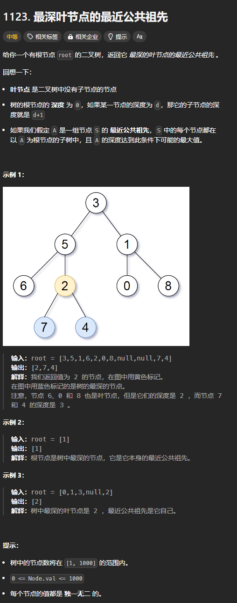
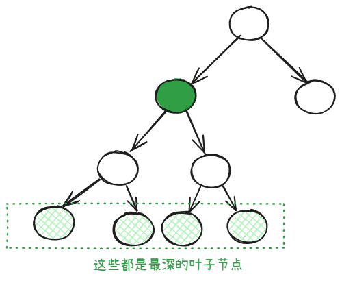
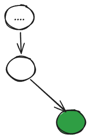

题目链接：[https://leetcode.cn/problems/lowest-common-ancestor-of-deepest-leaves/description/](https://leetcode.cn/problems/lowest-common-ancestor-of-deepest-leaves/description/)



## 思路


 

上述图片描述的深绿色的都是最深叶子节点的最近公共祖先。

我们可以这样，先递归左子树，再递归右子树。

我们在递的时候，维护一个已知叶子节点最大深度的全局变量 leaf_max_depth。同时，在递的时候传递一个 depth 变量表示当前节点的深度。

当递到的叶子节点的深度还没有已知的 leaf_max_depth 深时，它就不可能是 LCA（最近公共祖先）。

如果叶子节点的 depth 大于等于 leaf_max_depth，则它可能是最深的叶子节点，返回它。

由于在递的时候，leaf_max_depth 可能随时在改变，可能导致返回的叶子节点不是最深的，所以我们除了返回可能是最深的叶子节点本身，我们还需要返回该叶子节点的深度。

那么，既然还要返回叶子节点的深度，干脆让所有的叶子节点都返回它本身和它的深度。然后让它的祖先节点判断该返回谁。这样就不必维护 leaf_max_depth 了。

那么，对于叶子节点的祖先来说，最深的叶子节点 LCA 将可能出现 3 中情况：

+ 在左子树中：左子树的叶子节点的深度大于右子树的深度
+ 在右子树中：右子树的叶子节点的深度大于左子树的深度
+ 就是该根节点：左子树的叶子节点的深度等于于右子树的深度

## 代码
```rust
use std::cell::RefCell;
use std::cmp::Ordering::{Equal, Greater, Less};
use std::rc::Rc;
impl Solution {
    pub fn lca_deepest_leaves(
        root: Option<Rc<RefCell<TreeNode>>>,
    ) -> Option<Rc<RefCell<TreeNode>>> {
        /// 返回叶子节点的最大深度和它们的公共祖先
        fn find_lca_deepest_leaves(
            mut root: Option<Rc<RefCell<TreeNode>>>,
            depth: usize,
        ) -> (usize, Option<Rc<RefCell<TreeNode>>>) {
            if root.is_none() {
                return (0, None);
            }
            if root.as_ref().unwrap().borrow().left == root.as_ref().unwrap().borrow().right {
                // 说明 root.left = root.right = None
                // 即 root 是一个叶子节点
                // 直接返回 root
                return (depth, root.take());
            }

            let (left_depth, left_lca) =
                find_lca_deepest_leaves(root.as_ref().unwrap().borrow().left.clone(), depth + 1);
            let (right_depth, right_lca) =
                find_lca_deepest_leaves(root.as_ref().unwrap().borrow().right.clone(), depth + 1);

            match left_depth.cmp(&right_depth) {
                Less => {
                    // LCA 在右子树
                    (right_depth, right_lca)
                }
                Equal => {
                    // LCA 就是本节点
                    (left_depth, root)
                }
                Greater => {
                    // LCA 在左子树
                    (left_depth, left_lca)
                }
            }
        }

        find_lca_deepest_leaves(root, 0).1
    }
}
```


