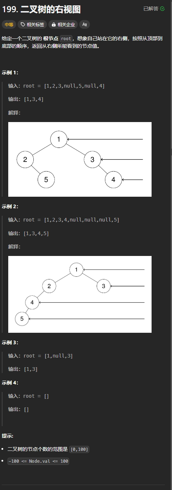

题目链接：[https://leetcode.cn/problems/binary-tree-right-side-view/description/](https://leetcode.cn/problems/binary-tree-right-side-view/description/)



## 思路
可以换一种说法来表达题目的意思：返回树的每层节点中最右边节点的值。

已经找到最右边的值的层数我们可以用数组的长度来表示，当数组的长度为 1 的时候，我们就知道有一层最右边的节点已经被找出来了。

所以，我们还要在递的过程中，维护一个当前的层数，用于确定当前层的最右边的值是否找到。

我们先递归右子树，当右子树递归完了，我们再递归左子树。根节点肯定比左右子树的层级高一层，故而递归左右子树之前，还要检查根节点这一层的最右边的节点是否找到了。

## 代码
```rust
use std::rc::Rc;
use std::cell::RefCell;
impl Solution {
    pub fn right_side_view(root: Option<Rc<RefCell<TreeNode>>>) -> Vec<i32> {
        fn dfs(root: Option<Rc<RefCell<TreeNode>>>, depth: usize, ans: &mut Vec<i32>)  {
            if let Some(root) = root {
                if ans.len() == depth {
                    // 说明这一层的最右边的节点还没有找到
                    // 那么就是根节点
                    ans.push(root.borrow().val);
                }

                // 先递归右子树
                dfs(root.borrow().right.clone(), depth + 1, ans);
                // 再递归左子树
                dfs(root.borrow().left.clone(), depth + 1, ans);
            }
        }

        let mut ans = vec![];
        dfs(root, 0, &mut ans);
        ans
    }
}
```

