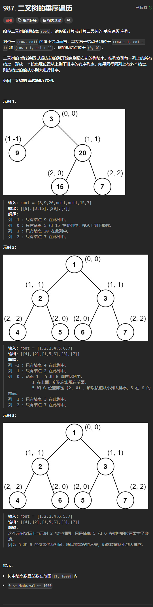

题目链接：[https://leetcode.cn/problems/vertical-order-traversal-of-a-binary-tree/description/](https://leetcode.cn/problems/vertical-order-traversal-of-a-binary-tree/description/)



## 思路
我们递的时候，将子节点的坐标传递给它，然后使用一个 BTreeMap<col, Vec<(row, val)>> 来存储它的坐标和值。使用 BtreeMap 的原因是我们要保证 col 有序，而我们之所以还要在 Vec 中存储 row 的原因是，题目规定，当 row 和 col 都相同的时候，要根据 val 来进行排序，而我们使用 (row, val) 元组来排序的时候，就是当 row 相同的时候，根据 val 来进行排序。

## 代码
```rust
use std::cell::RefCell;
use std::collections::BTreeMap;
use std::rc::Rc;
impl Solution {
    pub fn vertical_traversal(root: Option<Rc<RefCell<TreeNode>>>) -> Vec<Vec<i32>> {
        fn f(
            root: Option<Rc<RefCell<TreeNode>>>,
            (row, col): (i32, i32),
            records: &mut BTreeMap<i32, Vec<(i32, i32)>>,
        ) {
            if let Some(root) = root {
                let val = root.borrow().val;
                records
                    .entry(col)
                    .and_modify(|list| list.push((row, val)))
                    .or_insert(vec![(row, val)]);

                f(root.borrow().left.clone(), (row + 1, col - 1), records);
                f(root.borrow().right.clone(), (row + 1, col + 1), records);
            }
        }

        let mut records = BTreeMap::new();
        f(root, (0, 0), &mut records);

        records
            .into_values()
            .map(|mut value| {
                // 如果 row 相等，则会按照 val 进行排序
                value.sort();
                // 排序完成之后， val 已经按照我们想要的顺序排列
                value.into_iter().map(|element| element.1).collect()
            })
            .collect()
    }
}
```

