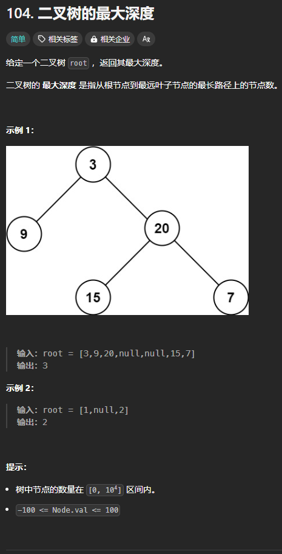

题目链接：[https://leetcode.cn/problems/maximum-depth-of-binary-tree/description/](https://leetcode.cn/problems/maximum-depth-of-binary-tree/description/)



## 思路
对于一颗树，我们可以将其分解为左子树、右子树、根节点这三部分，其中，左右子树可以按照此分解方法递归分解。这就是我们**递的方法**。

**边界条件**就是当根节点为空的时候，因为此时它没有左右子树，不满足分解的条件。

递归函数的返回值就是子树的最大高度。

那么，很明显，当是边界条件的时候，返回值是 0。

那我们如何**组合答案**呢？

我们发现，一颗树的深度为左子树和右子树深度的最大值加一。这就是我们组合答案的算法。

## 代码
```go
func maxDepth(root *TreeNode) int {
    // 边界条件
    if root == nil {
        // 这颗子树的深度为 0
        return 0
    }

    // 递的方法
    leftDepth := maxDepth(root.Left)
    rightDepth := maxDepth(root.Right)

    // 归的算法
    return max(leftDepth, rightDepth) + 1
}
```

