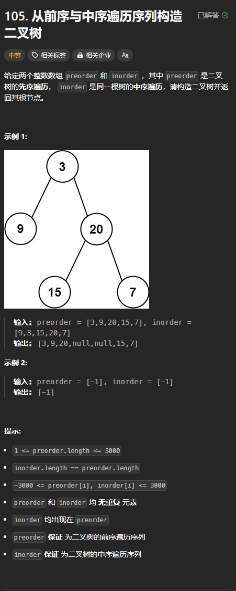
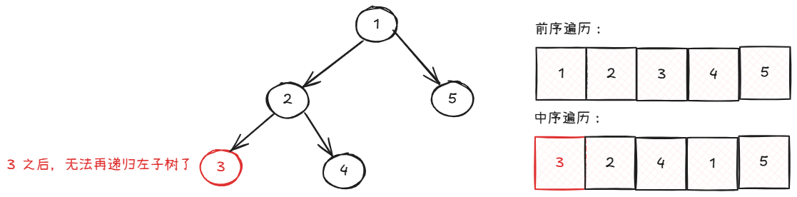
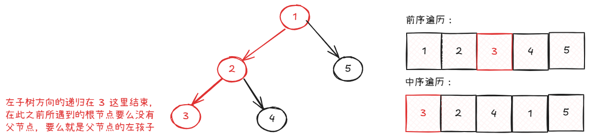
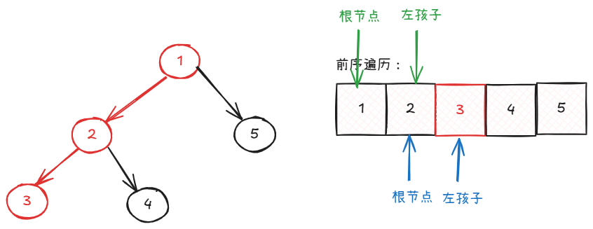
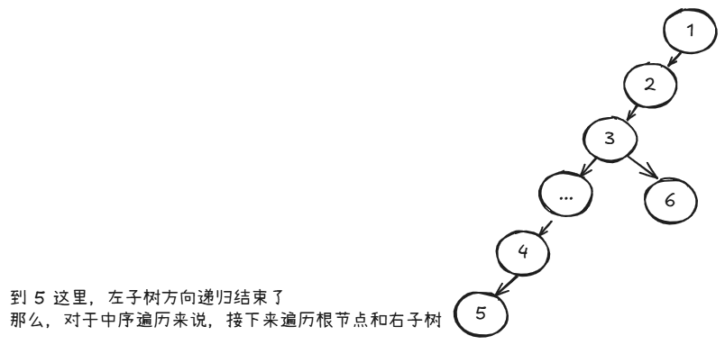
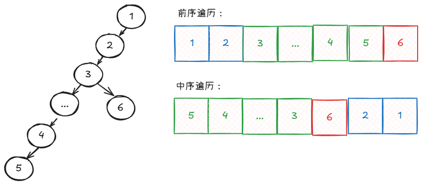

题目链接：[https://leetcode.cn/problems/construct-binary-tree-from-preorder-and-inorder-traversal/description/](https://leetcode.cn/problems/construct-binary-tree-from-preorder-and-inorder-traversal/description/)



## 思路一：递归
先看：

[二叉搜索树](https://www.yuque.com/cline-mly1u/bgacuc/izcuiuz60l3gvi03)

利用前序遍历的结果可以确定根节点，中序遍历的结果可以确定左右子树节点数量的性质，可以还原出一颗二叉搜索树。

先递归构造出左子树，然后再递归地构造右子树。

由于先构造出左子树和右子树，所以我们必然要知道构造出来的左右子树的根节点，这样我们才能在根节点中设置它的 left 和 right。所以递归函数的返回值就是左右子树的根节点。这刚好符合题目的意思。

### 代码
```rust
use std::cell::RefCell;
use std::rc::Rc;
impl Solution {
    pub fn build_tree(preorder: Vec<i32>, inorder: Vec<i32>) -> Option<Rc<RefCell<TreeNode>>> {
        fn build_tree(preorder: &[i32], inorder: &[i32]) -> Option<Rc<RefCell<TreeNode>>> {
            if preorder.is_empty() || inorder.is_empty() {
                // 当数组为空的时候，说明没有任何节点
                return None;
            }

            // preorder[0] 即是根节点
            let root = preorder[0];
            let root_index = inorder
                .iter()
                .enumerate()
                .find(|&(index, &value)| value == root)
                .unwrap()
                .0;

            // 先递归左子树, 只传递左子树部分的数组
            // 通过中序遍历可以得到左子树部分的长度为 root_index
            let left_root = build_tree(&preorder[1..=root_index], &inorder[0..root_index]);

            // 递归右子树
            let right_root = build_tree(&preorder[root_index + 1..], &inorder[root_index + 1..]);

            // 构建出 root 节点
            Some(Rc::new(RefCell::new(TreeNode {
                val: root,
                left: left_root,
                right: right_root,
            })))
        }

        build_tree(&preorder, &inorder)
    }
}
```

## 思路二：迭代
中序遍历的顺序是：左子树 -> 根节点 -> 右子树

那么，中序遍历的结果中，第一个元素一定是左子树方向递归的末尾：



前序遍历的顺序是：根节点 -> 左子树 -> 右子树

那么，在左子树方向递归结束之前，所遇到的根节点要么没有父节点（例如 1），要么就是父节点的左儿子（例如 2 和 3）：



我们进一步可以发现，在左子树方向递归结束之前，前序遍历的结果是按照根节点、左孩子的顺序排列的：



所以，我们可以按顺序遍历前序遍历的结果：

+ 如果当前正在遍历的元素不等于中序遍历的第一个元素，则说明它是父节点（如果有的话）的左儿子。而要让它的父节点指向它，就需要能找到它的父节点，所以，我们使用一个 FIFO 的栈来保存它的父节点，使栈顶总是当前遍历元素的父节点。
+ 如果当前遍历的元素等于中序遍历的第一个元素，则说明此节点是左子树方向递归的末尾，后面要遍历的一个元素 next 要么是当前遍历元素 cur 的右孩子，要么是 cur 的祖先节点的一个右儿子（例如上图中 4 是 2 的右孩子，而 2 是 3 的祖先节点）。那么，我们的下一个问题是，next 是哪个祖先节点的右儿子？

为了找出这个问题的答案，我们考虑一个特殊的二叉树：



中序遍历接下来会遍历根节点，如果该根节点有右子树，还会递归右子树。

由于要遍历根节点，上图中，根节点的顺序一定是 5、4、...、3，然后 3 有一个右子树，接下来的遍历结果会是 6，然后才是 2 和 1。即5、4、...、3、6、2、1

而对于前序遍历而言，由于根节点在递归左右子树之前就已经遍历了，那么，根节点的顺序就刚好和中序遍历的相反。前序遍历中，就一定有这么一段子数组 3、...、4、5 和 1、2。



可以看到，在递归左子树方向上，前序遍历和中序遍历的结果顺序相反。

由于我们使用栈来存储前序遍历的父节点，栈弹出的时候，刚好与原来的顺序相反，即会与中序遍历的顺序相同。所以，为了让右孩子能找到父节点，我们可以让栈不断地弹出，同时，用一个指针来表示中序遍历中期望弹出的值，每次弹出一个值之后，该指针加一。这个指针还可以用来判断上面所说的左子树递归方向是否结束。

如果栈顶的元素和期望弹出的值不相同，那么栈就不弹出。而此时，上一个被弹出栈的节点就是它的父节点。

到现在，一个节点和另一个节点的关系已经完全可以确定了，至于正确性就交给数学归纳法吧。多的也不说了。

### 代码
```rust
use std::cell::RefCell;
use std::rc::Rc;
impl Solution {
    pub fn build_tree(preorder: Vec<i32>, inorder: Vec<i32>) -> Option<Rc<RefCell<TreeNode>>> {
        let root = Some(Rc::new(RefCell::new(TreeNode::new(preorder[0]))));
        // 当前遍历元素的祖先节点
        let mut ancestors = vec![root.clone()];
        // 希望从祖先节点中弹出的节点值在中序遍历结果中的索引
        let mut expect_pop_value_index = 0;

        for &val in &preorder[1..] {
            let mut node = Some(Rc::new(RefCell::new(TreeNode::new(val))));

            if ancestors.last().unwrap().as_ref().unwrap().borrow().val
                != inorder[expect_pop_value_index]
            {
                // 此时，左子树方向上的递归还没有结束
                ancestors
                    .last()
                    .unwrap()
                    .as_ref()
                    .unwrap()
                    .borrow_mut()
                    .left = node.clone();
            } else {
                // 如果父节点和期望弹出的值相同，则说明在上次的循环中，已经到达左子树方向递归的末尾
                // 现在遍历的这个节点一定是某个祖先节点的右儿子
                let mut parent = None;
                while let Some(&last) = ancestors.last().as_ref() {
                    if last.as_ref().unwrap().borrow().val != inorder[expect_pop_value_index] {
                        break;
                    }
                    expect_pop_value_index += 1;
                    parent = ancestors.pop().unwrap();
                }

                // 上一个弹出的节点就是 node 的父节点
                parent.as_ref().unwrap().borrow_mut().right = node.clone();
            }
            ancestors.push(node);
        }

        root
    }
}
```

由于 rust 复杂的所有权，导致代码中充斥着与算法不相关的代码，所以，使用 go 语言便于看清代码逻辑：

```go
func buildTree(preorder []int, inorder []int) *TreeNode {
    root := &TreeNode { Val: preorder[0] }
    // 当前遍历元素的祖先节点（使用栈来存储）
    ancestors := []*TreeNode{ root }
    // 在中序遍历中，希望从栈中弹出的节点值的索引
    expectPopValueIndex := 0

    for i := 1; i < len(preorder); i++ {
        node := &TreeNode{ Val: preorder[i] }

        if ancestors[len(ancestors) - 1].Val != inorder[expectPopValueIndex] {
            // 此时，左子树方向上的递归还没有结束
            // 栈顶节点就是 node 的父节点
            ancestors[len(ancestors) - 1].Left = node
        } else {
            // 如果父节点和期望弹出的值相同，则说明在上次的循环中，已经到达左子树方向递归的末尾
            // 现在遍历的这个节点一定是某个祖先节点的右儿子
            var father *TreeNode = nil
            for len(ancestors) > 0 && ancestors[len(ancestors) - 1].Val == inorder[expectPopValueIndex] {
                expectPopValueIndex++
                father = ancestors[len(ancestors) - 1]
                ancestors = ancestors[:len(ancestors) - 1]
            }

            // 上一个弹出的节点就是 node 的父节点
            father.Right = node
        }
        
        ancestors = append(ancestors, node)
    }

    return root
}
```

