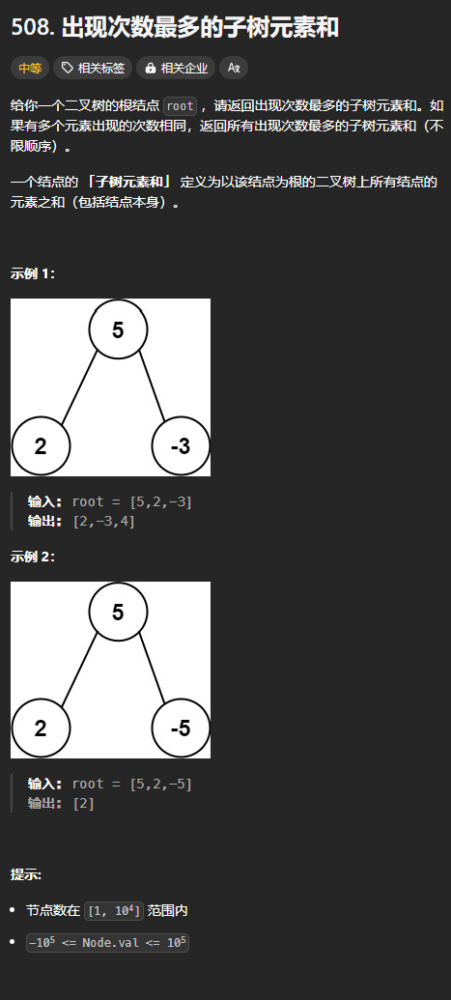

题目链接：[https://leetcode.cn/problems/most-frequent-subtree-sum/description/](https://leetcode.cn/problems/most-frequent-subtree-sum/description/)



## 思路
定义一个函数，用来返回根节点的元素和。

一个根节点的元素和等于左右子树之和再加上根节点的值。

对于左右子树也是如此，具有递归的结构。

然后在归的过程中，统计出现每个元素和出现的次数，从而得出答案。

## 代码
```rust
use std::cell::RefCell;
use std::collections::HashMap;
use std::rc::Rc;
impl Solution {
    pub fn find_frequent_tree_sum(root: Option<Rc<RefCell<TreeNode>>>) -> Vec<i32> {
        if root.is_none() {
            return vec![];
        }

        fn tree_sum(root: Option<Rc<RefCell<TreeNode>>>, recorder: &mut HashMap<i32, i32>) -> i32 {
            if let Some(root) = root {
                let root = root.borrow();

                let sum = root.val
                    + tree_sum(root.left.clone(), recorder)
                    + tree_sum(root.right.clone(), recorder);

                recorder.entry(sum).and_modify(|cnt| *cnt += 1).or_insert(1);

                sum
            } else {
                0
            }
        }

        let mut cnt = HashMap::new();
        tree_sum(root, &mut cnt);
        
        let mut cnt = cnt.into_iter().collect::<Vec<_>>();
        cnt.sort_unstable_by(|(_, v1), (_, v2)| v2.cmp(v1));

        let max = cnt[0].1;
        let mut ans = vec![];
        for (key, cnt) in cnt {
            if cnt == max {
                ans.push(key);
            } else {
                break;
            }
        }

        ans
    }
}
```


