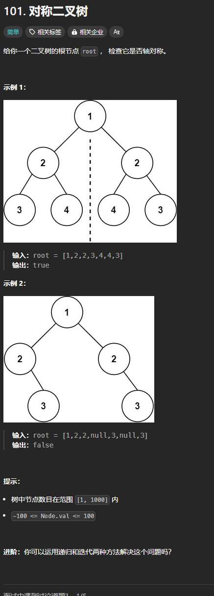

题目链接:[https://leetcode.cn/problems/symmetric-tree/description/](https://leetcode.cn/problems/symmetric-tree/description/)



## 思路
递归检查左子树的右子树和右子树的左子树、左子树的左子树和右子树的右子树是否相等。

## 代码
```rust
use std::rc::Rc;
use std::cell::RefCell;
impl Solution {
    pub fn is_symmetric(root: Option<Rc<RefCell<TreeNode>>>) -> bool {
        if let Some(root) = root {
            Self::is_same_tree(root.borrow().left.clone(), root.borrow().right.clone())
        } else {
            true
        }
    }

    fn is_same_tree(
        p: Option<Rc<RefCell<TreeNode>>>,
        q: Option<Rc<RefCell<TreeNode>>>,
    ) -> bool {
        match (p, q) {
            (None, None) => true,
            (Some(p), Some(q)) => {
                p.borrow().val == q.borrow().val
                    // 左子树的左子树和右子树的右子树
                    && Solution::is_same_tree(p.borrow().left.clone(), q.borrow().right.clone())
                    // 左子树的右子树和右子树的左子树
                    && Solution::is_same_tree(p.borrow().right.clone(), q.borrow().left.clone())
            }
            _ => false,
        }
    }
}
```


