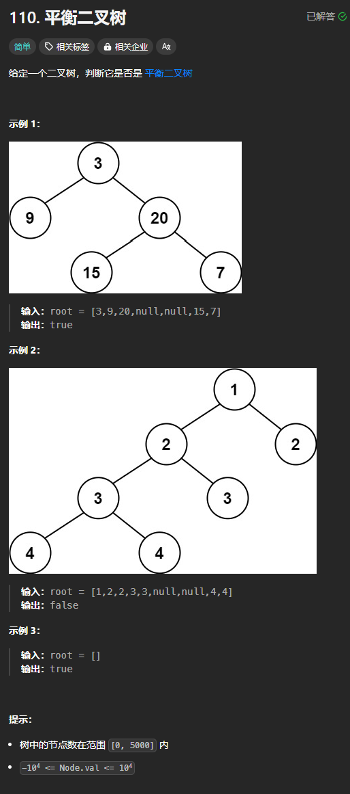

题目链接：[https://leetcode.cn/problems/balanced-binary-tree/description/](https://leetcode.cn/problems/balanced-binary-tree/description/)



平衡二叉树：指该树的所有节点的左右子树的高度差相差不超过 1.

## 思路
我们定义一个函数用于返回树的高度，如果我们发现左右子树的高度差大于 1 了，我们就返回负数，因为这样高度不可能为负数。

## 代码
```rust
use std::rc::Rc;
use std::cell::RefCell;
impl Solution {
    pub fn is_balanced(root: Option<Rc<RefCell<TreeNode>>>) -> bool {
        fn depth(root: Option<Rc<RefCell<TreeNode>>>) -> i32 {
            if let Some(root) = root {
                let left_depth = depth(root.borrow().left.clone());
                let right_depth = depth(root.borrow().right.clone());

                if left_depth < 0 || right_depth < 0 {
                    return -1;
                }

                if left_depth.abs_diff(right_depth) > 1 {
                    -1
                } else {
                    // 返回高度
                    left_depth.max(right_depth) + 1
                }
            } else {
                0
            }
        }

        depth(root) != -1
    }
}
```


