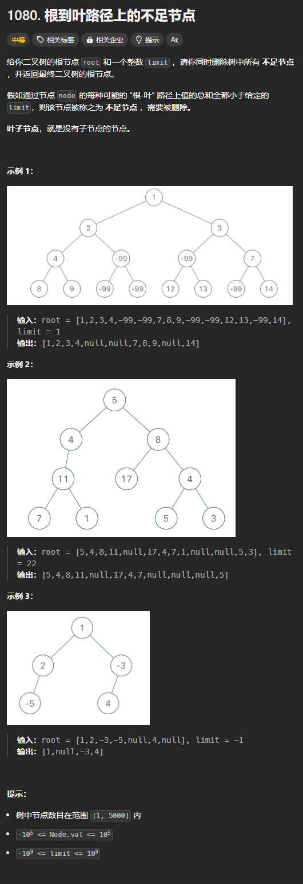

题目链接：[https://leetcode.cn/problems/insufficient-nodes-in-root-to-leaf-paths/description/](https://leetcode.cn/problems/insufficient-nodes-in-root-to-leaf-paths/description/)



## 思路
这题很明显的一点是只能从叶子节点出发，从下到上计算路径的总和。并且对于某个节点来说，只有它的左子树和右子树的路径总和加上这个节点的值都小于 limit 的时候，才可以将其删除。

所以，我们只能在归的过程中处理。

我们定义一个函数，用来返回其从叶子节点开始往上计算的路径总和。

那么，当节点 A 不满足 limit 的条件，如何删除呢？我们肯定是从它的父节点删除该节点的，那么父节点就要知道它的哪个子节点不符合条件。我们可以通过返回一个特殊的值来代表节点不符合条件。我们可以返回 i32::MAX 或者 i32::MIN，因为这些值都不可能是合法的 limit 的值。

---

上述思路经过后来的编码证明是错误的。有这个问题：

+ 没有理解题目的意思：题目的意思是，从根节点 root 到叶子节点的完整路径中，如果经过的某个节点 node 的值太小，导致 root 经过 node 到叶子节点的路径总和都小于 limit，则说明应该删除 node。上述的思路没有计算从 root 到叶子节点的完整路径和

所以，我们要在“递”的过程中就维护一个变量来记录路径的总和，当叶子节点发现路径总和小于 limit 的时候，它就要表明，我们应该删除这条路径上的某个节点。

那么，如何确定某个节点是否要被删除呢？

如果一个节点的左子树和右子树都向该节点传递了需要被删除的信号，则该节点就要被删除，同时，要将该信号继续向上传递。

为什么要将信号继续向上传递？

因为可能导致了路径和小于 limit 的节点的原因可能并不止是此节点，而是多个节点共同作用的。

经过上面的纠正，编写出一个函数用于判断某个节点的父节点是否需要被删除，如果需要，则返回 true，否则返回 false。

## 代码
```rust
use std::cell::RefCell;
use std::rc::Rc;
impl Solution {
    pub fn sufficient_subset(
        root: Option<Rc<RefCell<TreeNode>>>,
        limit: i32,
    ) -> Option<Rc<RefCell<TreeNode>>> {
        /// 判断是否需要删除 root 的父节点
        fn should_delete_parent(
            root: Option<Rc<RefCell<TreeNode>>>,
            path_sum: i32,
            limit: i32,
        ) -> bool {
            if let Some(mut root) = root {
                let mut root = root.borrow_mut();

                let left = should_delete_parent(root.left.clone(), path_sum + root.val, limit);
                let right = should_delete_parent(root.right.clone(), path_sum + root.val, limit);

                if left && right || left && root.right.is_none() || right && root.left.is_none() {
                    // 当通过这个节点通往的叶子节点只有一条路径时，如果这条路径返回了此节点应该被删除，则它就要被删除
                    // 应该删除它的父节点，这相当于同时删除了此节点
                    return true;
                }

                if left {
                    // 左子树要求此节点被删除，但是由于右子树要求保留，所以此节点不能被删除，只能将左子树删除
                    root.left = None;
                }
                if right {
                    root.right = None;
                }
                
                // 它的父节点不应该被删除
                false
            } else {
                path_sum < limit
            }
        }

        if should_delete_parent(root.clone(), 0, limit) {
            None
        } else {
            root
        }
    }
}
```


