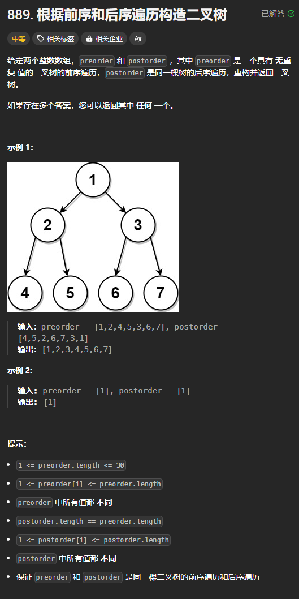
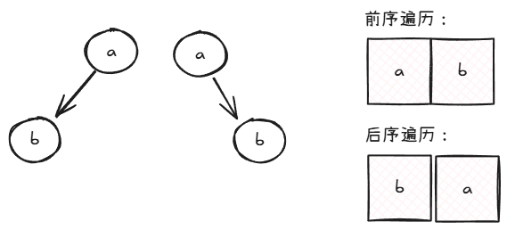
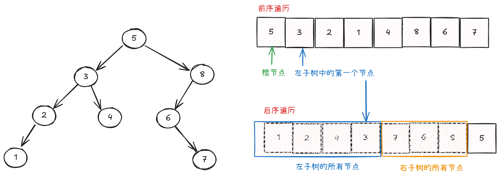

题目链接：[https://leetcode.cn/problems/construct-binary-tree-from-preorder-and-postorder-traversal/description/](https://leetcode.cn/problems/construct-binary-tree-from-preorder-and-postorder-traversal/description/)



## 思路
对于前序遍历和后序遍历来构造二叉树，其结果不一定唯一：



上图中，两颗不同的二叉树其遍历结果是相同的。

也间接地说明了对于前序遍历和后序遍历，我们不能确定子树是根节点的左子树还是右子树。

但是题目要求我们返回任一答案，我们就可以默认紧跟根节点之后的节点位于左子树中。

还有一点，我们需要知道左子树的节点数量，才能区分左子树和右子树。

我们看下图：



我们在后序遍历中找到根节点的左子树的第一个节点，我们就能确定左子树和右子树的数量。

## 代码
```rust
use std::cell::RefCell;
use std::rc::Rc;
impl Solution {
    pub fn construct_from_pre_post(
        preorder: Vec<i32>,
        postorder: Vec<i32>,
    ) -> Option<Rc<RefCell<TreeNode>>> {
        fn build_tree(preorder: &[i32], postorder: &[i32]) -> Option<Rc<RefCell<TreeNode>>> {
            if preorder.is_empty() || postorder.is_empty() {
                return None;
            }

            let root = preorder[0];
            if preorder.len() == 1 {
                // 只有一个根节点
                return Some(Rc::new(RefCell::new(TreeNode::new(root))));
            }

            let left_first_child = preorder[1];

            // 在后序遍历中找到 left_first_child
            let left_first_child_post_index = postorder
                .iter()
                .enumerate()
                .find(|&(index, &value)| value == left_first_child)
                .unwrap()
                .0;

            // 递归创建左子树
            // 左子树的长度为 left_first_child_post_index + 1
            let left = build_tree(
                &preorder[1..=left_first_child_post_index  + 1],
                &postorder[..=left_first_child_post_index],
            );

            // 右子树
            let right = build_tree(
                &preorder[left_first_child_post_index + 2..],
                &postorder[left_first_child_post_index + 1..postorder.len() - 1],
            );

            Some(Rc::new(RefCell::new(TreeNode {
                val: root,
                left,
                right,
            })))
        }

        build_tree(&preorder, &postorder)
    }
}
```

