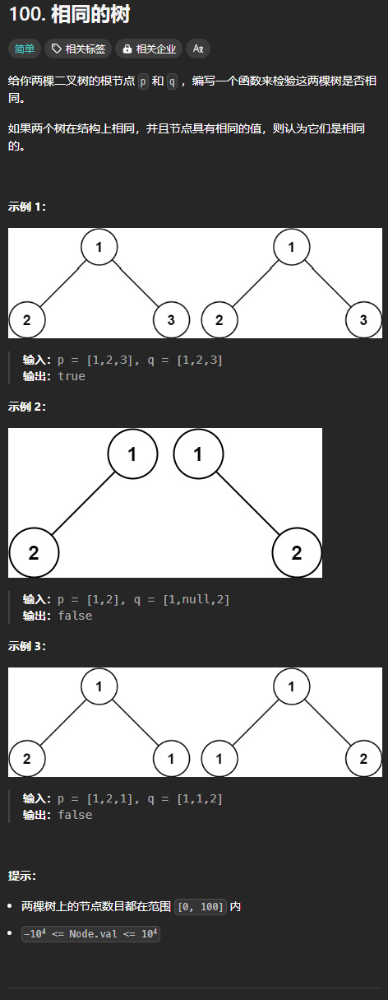

题目链接：[https://leetcode.cn/problems/same-tree/](https://leetcode.cn/problems/same-tree/)



## 思路
只要这两棵树的根节点相同，子树们也相同，则它们就相同，同时，子树也可以按照此方法递归判断。

## 代码
```rust
use std::cell::RefCell;
use std::rc::Rc;
impl Solution {
    pub fn is_same_tree(
        p: Option<Rc<RefCell<TreeNode>>>,
        q: Option<Rc<RefCell<TreeNode>>>,
    ) -> bool {
        if p.is_none() || q.is_none() {
            return p == q;
        }

        // 现在 p 和 q 都不是 None
        let p = p.unwrap();
        let q = q.unwrap();

        if p.borrow().val != q.borrow().val {
            return false;
        }

        Solution::is_same_tree(p.borrow().left.clone(), q.borrow().left.clone())
            && Solution::is_same_tree(p.borrow().right.clone(), q.borrow().right.clone())
    }
}
```

更 rust 的写法：

```rust
use std::cell::RefCell;
use std::rc::Rc;
impl Solution {
    pub fn is_same_tree(
        p: Option<Rc<RefCell<TreeNode>>>,
        q: Option<Rc<RefCell<TreeNode>>>,
    ) -> bool {
        match (p, q) {
            (None, None) => true,
            (Some(p), Some(q)) => {
                p.borrow().val == q.borrow().val
                    && Solution::is_same_tree(p.borrow().left.clone(), q.borrow().left.clone())
                    && Solution::is_same_tree(p.borrow().right.clone(), q.borrow().right.clone())
            }
            _ => false,
        }
    }
}
```

