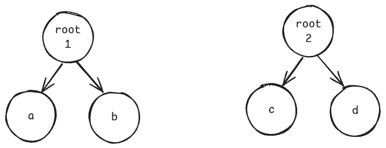

题目链接：[https://leetcode.cn/problems/flip-equivalent-binary-trees/description/](https://leetcode.cn/problems/flip-equivalent-binary-trees/description/)


## 思路
两棵树要反转之后相等，假设这两颗树的左右子树分别为 a 和 b，c 和 d。



那么，两颗树要翻转后等价，则有 `root1.val == root2.val && ((a == c && b == d) || (a == d && b == c))`

其中，`a == b`的含义是 a 经过翻转之后等价于 c。

## 代码
```rust
use std::cell::RefCell;
use std::rc::Rc;
impl Solution {
    pub fn flip_equiv(
        root1: Option<Rc<RefCell<TreeNode>>>,
        root2: Option<Rc<RefCell<TreeNode>>>,
    ) -> bool {
        match (root1, root2) {
            (None, None) => true,
            (Some(p), Some(q)) => {
                let p = p.borrow();
                let q = q.borrow();
                p.val == q.val
                    && ((Self::flip_equiv(p.left.clone(), q.left.clone())
                            && Self::flip_equiv(p.right.clone(), q.right.clone()))
                        || (Self::flip_equiv(p.left.clone(), q.right.clone())
                            && Self::flip_equiv(p.right.clone(), q.left.clone())))
            }
            _ => false,
        }
    }
}
```

