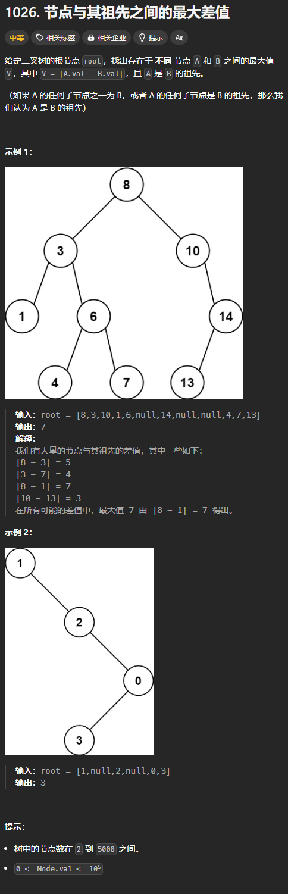

题目链接：[https://leetcode.cn/problems/maximum-difference-between-node-and-ancestor/description/](https://leetcode.cn/problems/maximum-difference-between-node-and-ancestor/description/)



## 思路
最大绝对差只会在最大值和最小值之间产生。

所以，我们需要在递的过程中维护每条路径的最小值和最大值。并且，最大值和最小值不能是同一个节点（当一棵树只有一个节点的情况下会出现这种情况），由于树中的节点数在 2~5000 之间，所以，不会出现这种情况。

当递归函数进入归的部分的时候，这条路径的最大差值已经在边界条件中算出来了。

## 代码
```rust
use std::cell::RefCell;
use std::rc::Rc;
impl Solution {
    pub fn max_ancestor_diff(root: Option<Rc<RefCell<TreeNode>>>) -> i32 {
        fn dfs(root: Option<Rc<RefCell<TreeNode>>>, mut min: i32, mut max: i32) -> i32 {
            if let Some(root) = root {
                let root = root.borrow();

                min = min.min(root.val);
                max = max.max(root.val);

                let left_max = dfs(root.left.clone(), min, max);
                let right_max = dfs(root.right.clone(), min, max);

                left_max.max(right_max)
            } else {
                max - min
            }
        }

        dfs(root, i32::MAX, i32::MIN)
    }
}
```


