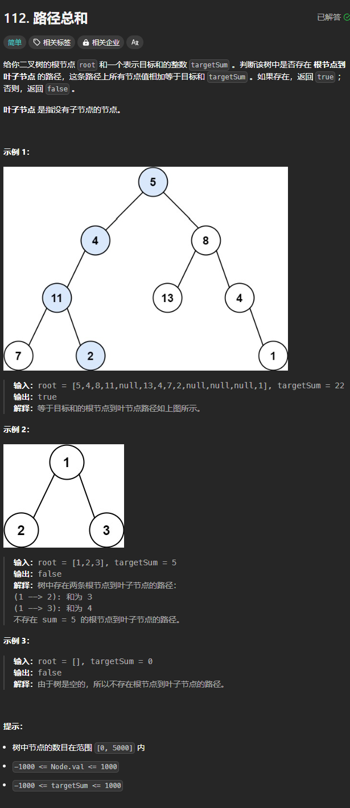

题目链接：[https://leetcode.cn/problems/path-sum/description/](https://leetcode.cn/problems/path-sum/description/)



## 思路
我们可以在递的过程中，就将递的路径所经过的节点之和记录在参数中，如果递归到叶子节点，发现加上叶子节点的值刚好等于 targetSum，则返回 true

归的算法：只要有任意一条路径返回 true，我们就应该返回 true。

## 代码
```go
func hasPathSum(root *TreeNode, targetSum int) bool {
    var recursiveFunction func(root *TreeNode, pathSum int) bool
    recursiveFunction = func (root *TreeNode, pathSum int) bool {
        if root == nil {
            return false
        } else if root.Left == nil && root.Right == nil {
            return pathSum + root.Val == targetSum
        }

        left := recursiveFunction(root.Left, pathSum + root.Val)
        right := recursiveFunction(root.Right, pathSum + root.Val)

        return left || right 
    }

    return recursiveFunction(root, 0)
}
```

还有一种更简洁的写法：

```go
func hasPathSum(root *TreeNode, targetSum int) bool {
    if root == nil {
        return false
    }

    targetSum -= root.Val
    if root.Left == root.Right {
        // 只可能是叶子节点
        return targetSum == 0
    }

    return hasPathSum(root.Left, targetSum) || hasPathSum(root.Right, targetSum)
}
```

