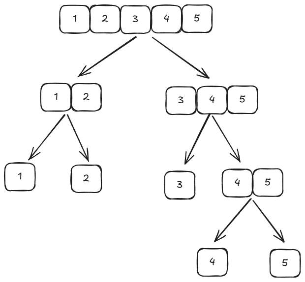
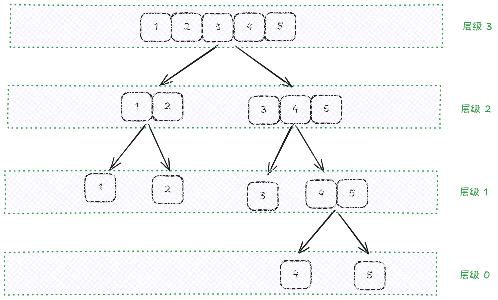
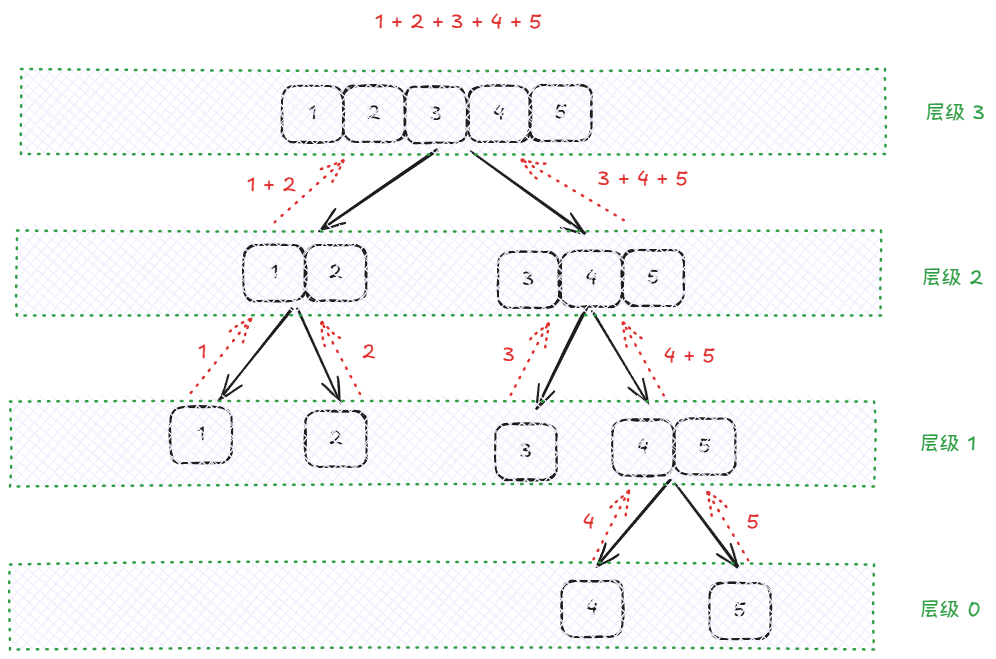
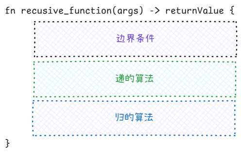
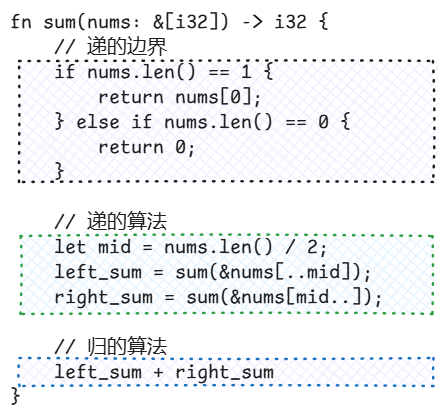

递归就是指一个调用自身的函数。

递归分为 2 个部分：

+ **递**：这个部分将原问题分解为子问题
+ **归**：这个部分将子问题的答案组合成一个新的答案。归到最后，会形成一个原问题的答案

## 递
### 递的方法
递这个阶段是要**找到一个合适的方法来将原问题分解**，而且分解出来的子问题也要可以用这个方法进行分解。

反过来说，**原问题能不能分解是决定能不能使用递归的一个条件**。

例如，我们用一个另类的方法求数组之和：

我们将原数组 [1, 2, 3, 4, 5] 分解为更小的数组。这里我们分解的方法是：将原数组从中间的那个元素分开，分为 2 个子数组，然后再将子数组视为原数组执行上述操作（递归）。这就是问题分解的方法。

### 递的边界
每一个问题都必须有一个递的边界，对于上述的求和过程来说，递的边界就是当数组元素只有一个，不能再分的时候。

当问题不能再分的时候，算法就进入到了归的部分。

## 归
我们可以直观的看到，在“递”将问题分解的同时，也将问题**层级化**了：

“归”部分的算法就是将更低层级的答案合并成本层级的答案，然后将本层级的答案传递给更高的层级。每一层级的答案合并算法都是一样的。

答案传递的路径与原路相反：

## 递归三大要素
我认为，递归的 3 大要素是：

+ 递的算法（问题分解的算法）
+ 递的边界（问题不可再分的边界条件）
+ 归的算法（答案合并的算法）

除此以外，递归函数的其他东西都是为了这三者服务的。例如，返回值是为归的算法服务的；参数是为递的算法和边界条件或者归的算法服务的；甚至我们可以使用全局变量来为这三要素服务。

有些时候，可以在“递”之前检查下一个子问题是不是符合边界条件，如果是，则不调用递归函数，这样的话，就不需要编写“递的边界”的相关算法了。

递归函数的一般模版：

例如，上述数组求和的代码：

对于更复杂的情况，可能三者之间的分界并没有这么清晰，而是相互耦合的。

## 递归与循环
递归与循环本质上都是复用一段代码，都是将原问题分解为多个子问题。

但是，递归的优势是能**将问题层级化**。

这允许我们，将答案在本层处理之后，再返回给上一层。在这其中，我们可以控制的东西很多。例如，整个算法约定使用某个特殊的答案代表某个特殊的情况，那么，只要当某个层级出现了这种情况，它返回这个特定的答案，它的上一层级就可以知道这个情况，从而进行处理（类比 Java 中的异常）。

