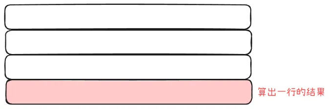

## 0-1 背包问题
描述：给定 n **个**物品和一个最大容量为 capacity 的背包，每个物品具有价值 v[i] 和体积 w[i]，需要从这 n 个物品中选择一些物品，使背包所容纳物品的价值最大。

---

对于每个物品来说，有选或不选 2 种情况，所以，如果使用回溯的思路，则定义一个 `dfs(i, c)`，表示当前背包的容量为 `c`, 要决定选择或不选择的物品的索引为 `i`，返回值表示继续选择物品，当前节点所能获得的最大价值。

对于物品 i 有下述 2 种情况：

+ 如果选择物品 i，则递归到 dfs(i + 1, c + w[i])
+ 如果不选择物品 i，则递归到 dfs(i + 1, c)

边界条件：

+ 如果 i == n,则说明选择完毕，要判断 c 是否小于等于背包的 capacity，如果是，则返回 0，代表此时不能选择物品，故而价值为 0；如果不是，则返回 -inf,代表此时没有价值。

归的算法：

+ `dfs(i, c) = max(dfs(i + 1, c + w[i]) + v[i], dfs(i + 1, c))`

上述思路转换为递推：

+ 定义一个二维数组 dp，其中，行数为 n + 1,列数为 capacity + max(w[i[)
+ 递推公式：`dp[i][c] = max(dp[i + 1][c + w[i]] + v[i], dp[i + 1][c])`
+ 遍历顺序：由于 dp[i] 依赖于 dp[i + 1]，故而倒序遍历 i；同样的原因，倒序遍历 c

### 空间优化
#### 滚动数组
注意观察下式：

+ `dp[i][c] = max(dp[i + 1][c + w[i]] + v[i], dp[i + 1][c])`

这个递推公式中，要计算 dp[i] 只需要知道 dp[i + 1] 就行了。

当 i 倒序遍历减小的时候，当前的 dp[i] 就是下一个 i 的 dp[i + 1]，所以，我们只需要 2 行就行了。

所以，我们只需要创建具有 2 行， capacity + max(w[i]) 列的 dp 数组，然后递归公式转化为下面：

+ `dp[i % 2][c] = max(dp[(i + 1) % 2][c + w[i] + v[i]], dp[(i + 1) % 2][c])`

类似地，如果 dp[i] 与 dp[i + 1] 和 dp[i + 2] 有关，则我们只需要 3 行 dp 数组就可以搞定了，然后模 3。

#### 一个数组
滚动数组只优化了关于行这方面的空间，下面来看关于列方面的优化：

由于 c 列的值只与大于等于 c 的列有关，所以，可以这样：

+ 算出了 dp[i + 1] 的结果之后，直接存储在 dp[i] 的行中，这样，我们就可以去掉 dp 数组的“行”这一个维度
+ 计算 dp[i] 行的时候，**正序遍历**列，这样的话，就不会导致 dp[i + 1] 的结果被覆盖；因为我们需要 dp[i + 1] 的结果来计算 dp[i][c] 的结果

所以，上述的递推公式被简化为了:

+ `dp[c] = max(dp[c + w[i]) + v[i], dp[c])`

注意，简化成这个递推公式之后，需要**正序遍历列**，而不是倒序遍历（这是简化空间之前的遍历顺序）。

如何记住上述的简化公式？

上述优化只使用与 dp[i][c] 依赖于 dp[i + 1] 的情况，如果 dp[i] 同时依赖于 dp[i + 1] 和 dp[i + 2]，则无法应用上述优化，因为计算 dp[i + 1] 的时候，就会把所有的 dp[i + 2] 的结果给覆盖掉了，即 dp[i]、dp[i + 1]、dp[i+2] 三者无法同时存在，**无法达成**下面这种情况：

## 完全背包
描述：给定 n **种**物品和一个最大容量为 capacity 的背包，每种物品具有价值 v[i] 和体积 w[i]，需要从这 n 种物品中选择一些物品，使背包所容纳物品的价值最大。注意，每种物品有无数个，可以选择无数次。

---

主要与 0-1 背包的区别是每种物品可以选择很多次。

还是用 0-1 背包回溯的思路来思考：

对于每种物品来说，有选或不选 2 种情况，定义一个 `dfs(i, c)`，表示当前背包的容量为 `c`, 要决定选择或不选择的物品种类的索引为 `i`，返回值表示继续选择物品，当前节点所能获得的最大价值。

对于物品 i 有下述 2 种情况：

+ 如果选择物种 i，则递归到 dfs(i, c + w[i])，注意不是 dfs(i + 1, c),因为选择了之后还可以选
+ 如果不选择物种 i，则递归到 dfs(i + 1, c)

边界条件：

+ 如果 i == n,则说明选择完毕，要判断 c 是否小于等于背包的 capacity，如果是，则返回 0，代表此时不能选择物品，故而价值为 0；如果不是，则返回 -inf,代表此时没有价值。

归的算法：

+ `dfs(i, c) = max(dfs(i, c + w[i]) + v[i], dfs(i + 1, c))`

转化为递推与 0-1 背包是类似的。

递推公式为 `dp[i][c] = max(dp[i][c + w[i]] + v[i], dp[i + 1][c])`

### 空间优化
+ 由于 dp[i] 只依赖于 dp[i] 本身和 dp[i + 1]，所以，可以使用滚动数组来优化空间
+ 由于 dp[i][c] 只依赖于 dp[i][c + w[i]] 和 dp[i + 1][c]，所以，可以使用一个数组来优化空间；因为 c 列只依赖于大于等于 c 列的列，且只依赖于它的下一行，而不是依赖于 i 后面的多行

## 遍历顺序与内外层循环
由于要遍历 i 和 c，故而肯定会有 2 个循环，并且肯定是嵌套的。那么，就只有 2 中情况：

+ i 的遍历在外，c 的遍历在内：先算出一行的结果。

+ i 的遍历在内，c 的遍历在外：先算出一列的结果。

下面，就来分别讨论这 2 中情况下对不同空间优化情况的遍历顺序的影响。

### 无空间优化
递推公式为 `dp[i][c] = max(dp[i + 1][c + w[i]] + v[i], dp[i + 1][c])`。

这个递推公式的特点是：

+ 依赖于 i 的下一行（dp[i + 1]）同时依赖于下一行 c 后面的所有列

我们在给 dp 数组赋初值的时候，相当于是保证最后一行和最后一列的结果是已知的。这样，才可以开始递推。

下面看不同嵌套顺序对遍历顺序的影响：

+ 先算出一行的结果：由于计算当前行的时候，必须知道下一行的结果，所以要倒序遍历 i。在计算当前行的某一列的结果的时候，由于下一行的所有列的结果都是已知的，所以 c 的遍历顺序无限制。

+ 先算出一列的结果：计算当前列的时候，必须知道后面的所有列的结果，所以要倒序遍历 c。在计算当前列的某一行的时候，由于需要知道 dp[i + 1][c]，即同一列的下一行的结果，而我们只知道 dp[..][c + 1..] 的结果，所以必须倒序遍历 i。

### 滚动数组
递推公式：`dp[i % 2][c] = max(dp[(i + 1) % 2][c + w[i] + v[i]], dp[(i + 1) % 2][c])`。

不同嵌套顺序对遍历顺序的影响：

+ 先算出一行的结果：因为 dp[i % 2] 依赖于 dp[(i + 1) % 2]，所以必须倒序遍历 i。同时，由于 dp[(i + 1) % 2] 的所有列都是已知的，而我们只依赖于 dp[(i + 1) % 2] 的列，所以，c 的遍历顺序没有限制。
+ 先算出一列的结果：由于我们使用滚动数组来优化空间的时候，将多个行合并为了一行，故而如果先计算出一列的结果，那么将没有足够的空间来存储所有的结果，无法像无空间优化那样，存储每一行的某一列的结果，而造成结果被覆盖，就会造成某些行的某一列的结果丢失，不能正确得出答案。

### 一个数组
一个数组的递推公式：`dp[c] = max(dp[c + w[i]) + v[i], dp[c])`。

我们在初始化这个 dp 数组的时候，相当于在初始化无空间优化的 dp 数组的最后一行。所以，这就相当于最后一行始终是已知的。

下面来看嵌套顺序对遍历顺序的影响：

+ 先算出一行的结果：由于当前行的结果和当前行的下一行的结果位于同一个数组中，而当前行 c 列需要下一行 c + 1 及其后面所有列的结果，所以，不能覆盖 c + 1 列后面的结果，故而 c 只能使用正序遍历。而对于 i，它没有依赖于其他的东西，所以，遍历顺序无限制。
+ 先算出一列的结果：和滚动数组是一样，一个数组很明显不能存储所有列的结果，会造成结果被覆盖，所以不能得出正确的答案

## 常见变形
有 3 种常见变形：

+ **至多**装 capacity，求**方案数** or **最大价值和**
+ **恰好**装 capacity, 求**方案数** or **最大价值和** or **最小价值和**
+ **至少**装 capacity，求**方案数 **or **最小价值和**

上述的描述词“至多”、“恰好” 和“至少”描述的是边界条件。只需要更改返回时的条件判断就可以了。

求的东西就需要更改对应的归的算法，也就是递推公式。

