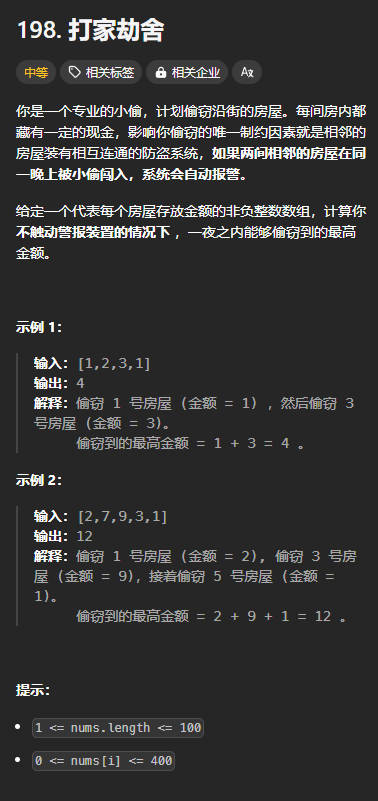
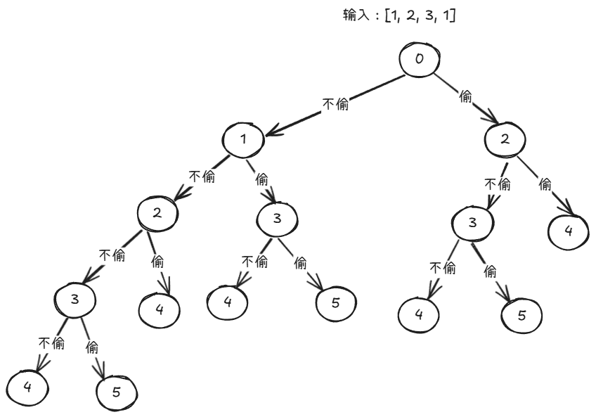
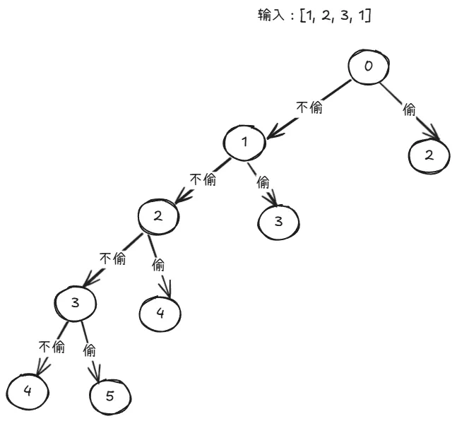
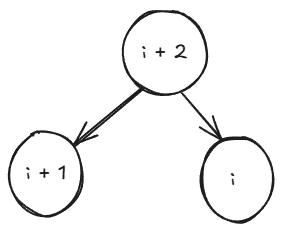

## 引例：打家劫舍
题目链接：[https://leetcode.cn/problems/house-robber/description/](https://leetcode.cn/problems/house-robber/description/)



### 思路
从回溯的思路来看，每个房屋我们都可以偷或者不偷，如果偷了 index，则只能从 index  + 2 开始偷。如果不偷 index，则可以从 index + 1 开始偷。

我们可以从 0 开始枚举每个 index，也可以从 n 倒着枚举 index。

可以在递的过程中维护一个变量，用来表示当前偷到的钱。

为了使金额最大，可以在递归边界的时候，将偷到的金额进行返回，这样，在归的时候，对每条路径取最大值，到根节点的时候，所得到的最大值就是答案。

这是这个思路的代码：

```rust
impl Solution {
    pub fn rob(nums: Vec<i32>) -> i32 {
        fn dfs(index: usize, money: i32, nums: &[i32]) -> i32{
            if index >= nums.len() {
                return money;
            }

            // 偷或不偷两种路径取一个最大值
            dfs(index + 2, money + nums[index], nums).max(dfs(index + 1, money, nums))
        }

        dfs(0, 0, &nums)
    }
}
```

下面是这个思路的 DFS 树（假设从 0 开始枚举每个 index）：



### 记忆化搜索
从上图中我们可以看到存在大量重复的节点，所以，我们可以将每个 index 对应的结果存储下来，这样的话，遇到重复的节点，我们就可以提前返回。这被称为**记忆化搜索。**

我们可以用一个 cache 数组来存储 index 和对应的结果，其中 cache 数组的长度为 n。

初始化时可以将每个 index 对应的结果初始化为 -1，因为答案不可能为负数。

记忆化搜索的代码：

```rust
impl Solution {
    pub fn rob(nums: Vec<i32>) -> i32 {
        let mut cache = vec![-1; nums.len()];
        fn dfs(index: usize, nums: &[i32], cache: &mut [i32]) -> i32 {
            if index >= nums.len() {
                return 0;
            }

            if cache[index] != -1 {
                // 结果已经被缓存下来了
                return cache[index];
            }

            // 偷或不偷两种路径取一个最大值
            cache[index] = dfs(index + 1, nums, cache).max(dfs(index + 2, nums, cache) + nums[index]);
            cache[index]
        }

        dfs(0, &nums, &mut cache)
    }
}
```

注意上述代码，有另外一个很大的变化：money 参数被移除，而是在归的过程中计算。

这是因为，记忆化搜索只使用与自底向上计算答案的递归过程。如果当前结果依赖于祖先节点，则无法使用记忆化化搜索，因为当依赖于祖先节点的时候，即使节点相同（index）相同，它的结果也不相同。因为它们的祖先节点不相同。

而对于自底向上计算结果的递归过程，每个相同的节点的子节点们也都是相同的，而结果只依赖于子节点的计算结果，所以可以使用记忆化搜索。

下面是记忆化搜索剪枝后的 DFS 树：



### 从记忆化搜索到递推
从上图中，我们可以看到，4、5 归到 3；3、4 归到 2, 2、3 归到 1；1、2 归到 0。

那么，如果有 6、7，应该归到哪儿呢？很明显，按照规律，应该归到 5。

所以，如果我们知道了叶子节点，我们就知道了它的父节点。例如，上图中，3 有 2 个父节点，一个是 2，一个是 1。

那我们干脆就不使用递归，而使用一个数组来表示 index 和 它的结果。这样的话，我们还省去了递归“递”的过程，只保留归的过程。我们可以使用一个数组，一般称为 dp，将其初始化为 0，表示偷的金额在刚开始的时候为 0。其中，dp[i] 表示当前 i 能够偷到的最大金额。

下面研究如何从递归到递推：


上图中，dp[3] 的结果依赖于 dp[4] 和 dp[5]，即：

+ 不偷 3： dp[3] = dp[4]
+ 偷3：dp[3] = dp[5] + nums[3]

然后，在归的过程中，3 会取一个最大值： dp[3] = dp[4].max(dp[5] + nums[3])。

对于其他的节点 i，都有：

+ `dp[i] = dp[i + 1].max(dp[i + 2] + nums[i])`，此即递推公式

然后按照 i 从大到小的顺序进行“归”的过程（即循环）。

上述“归”的过程的代码：

```rust
impl Solution {
    pub fn rob(nums: Vec<i32>) -> i32 {
        let n = nums.len();
        let mut dp = vec![0; n + 2];

        for i in (0..n).rev() {
            dp[i] = dp[i + 1].max(dp[i + 2] + nums[i]);
        }

        dp[0]
    }
}
```

## 结论
回溯到递推可以分为 2 步走：

1. 将回溯转化为记忆化搜索
2. 将记忆化搜索转换为递推

其中，第一步存在条件：

1. 回溯的递归过程**自底向上**计算答案。换句话说，在递归的“归”过程计算答案，一个节点的结果并不依赖于其祖先节点。
2. 回溯的“归”过程中的节点存在重复的情况，否则，将其转换为记忆化搜索就是没有意义的

第二步就是模拟递归的“归”过程。

那么，是否有捷径直接将回溯转换为递推？

引例中的递归函数其意义相当于是：定义一个 dfs(i) 表示当前 i 所能偷取到的最大金额，那么， `dfs(i) = dfs(i + 1).max(dfs(i + 2) + nums[i])`。

类似地，我们定义一个 dp 数组, dp[i] 表示当前 i 所能偷取到的最大金额，那么， `dp[i] = dp[i + 1].max(dp[i + 2] + nums[i])`。

可以看到，只需要简单地将 dfs[i] 转换为 dp[i] 就好了。

但是，需要注意的一点是，为了模拟递归“归”的过程，需要倒着遍历 i。

也可以正序遍历 i，但是递推公式就变为了 `dp[i] = dp[i - 1].max(dp[i - 2] + nums[i])`,即让 dp[i] 依赖于当前前面的 dp，而不是后面的 dp，这样的话，就可以从前往后遍历。

那么，当 i = 0 或者 i = 1 的时候， dp[i - 1] 或者 dp[i - 2] 等于多少呢？这相当于递归中的边界条件，等于 0.

所以，上述的递推公式相当于 `dp[i + 2] = dp[i + 1].max(dp[i] + nums[i + 2])`,然后，i 从 0 开始遍历。

可以想象，如果 dp[i] 的计算依赖于 dp[i - 3]，也是同样的处理。

这种正序遍历的方式也类似于递归过程的“归”的过程，但是，这个是从大到小遍历 index 时 DFS 树的递归过程:



可以看到，要正序遍历还是倒序遍历取决于 dp[i] 的计算依赖于前面还是后面：

+ `dfs(i) = dfs(i + 1).max(dfs(i + 2) + nums[i])`,dp[i] 依赖于 dp[i + 1] 和 dp[i + 2]，依赖于后面，所以要倒序遍历
+ `dp[i + 2] = dp[i + 1].max(dp[i] + nums[i + 2])`，dp[i] 依赖于 dp[i - 1] 和 dp[i - 2],依赖于前面，所以要正序遍历

但是，上述递推公式都是可以相互转化的，所以，结果是一样的。

