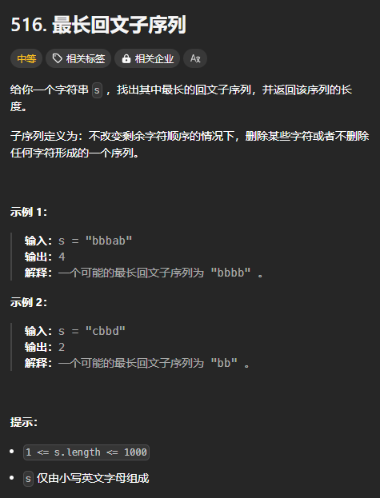
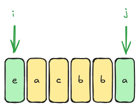
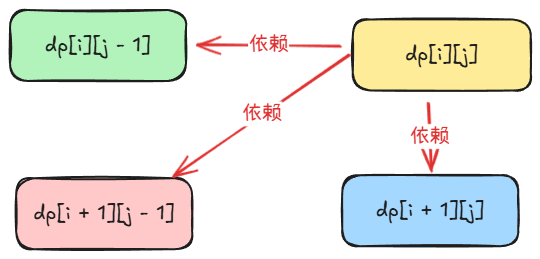

题目链接：[https://leetcode.cn/problems/longest-palindromic-subsequence/description/](https://leetcode.cn/problems/longest-palindromic-subsequence/description/)



## 思路
子序列问题还是使用选或不选的思路来进行思考。

但是，区间 DP 与普通的线性 DP 不一样，它是在一个区间上进行 DP（类似于 LCS）：



对于 i 和 j 两处位置的元素，我们可以都选，只选择其中一个。

这和 LCS 类似，但是 LCS 是两个线性 DP 的组合，而区间 DP 是操作同一个数组，而 LCS 操作两个数组。

## 归的算法
定义 `dfs(i, j)` 表示在 `s[i..=j]` 中寻找到的最长回文子序列的长度。

+ 如果 `s[i] == s[j]`，都选，而不是只选择其中一个，具体看 LCS 的相关表述：`dfs(i, j) = dfs(i + 1, j - 1) + 2`
+ 如果 `s[i] != s[j]`，则可以只选择其中一个，或者两个都不选：
    - 选择 `s[i]`：`dfs(i, j) = dfs(i, j - 1)`
    - 选择 `s[j]`：`dfs(i, j) = dfs(i + 1, j)`
    - ~~都不选：~~ `~~dfs(i, j) = dfs(i + 1, j - 1)~~`，因为只要上面两种情况存在，就会递归到 `dfs(i + 1, j - 1)` 这种情况，所以没有必要在显式地递归一次了。

### 边界条件
+ 当 `i > j` 的时候，返回 0
+ 当 `i == j` 的时候，返回 1。

### 转换为递推
+ 如果 `s[i] == s[j]`，`dp[i][j] = dp[i + 1][j - 1] + 2`
+ 如果 `s[i] != s[j]`, `dp[i][j] = dp[i + 1][j].max(dp[i][j - 1])`

由于 `dp[i][j]` 依赖于 `dp[i + 1][j - 1]`，所以倒序遍历 i，正序遍历 j。

`i + 1` 与 `j - 1` 都不会导致数组越界。具体看代码。

## 代码
```rust
impl Solution {
    pub fn longest_palindrome_subseq(s: String) -> i32 {
        let s = s.into_bytes();
        let n = s.len();

        let mut dp = vec![vec![0; n]; n];

        for i in (0..n).rev() {
            dp[i][i] = 1;
            // 如果 i + 1 >= n,则不会进入循环
            // 如果 i = 0，则 j = 1，j - 1 不会越界
            for j in i + 1..n {
                if s[i] == s[j] {
                    dp[i][j] = dp[i + 1][j - 1] + 2;
                } else {
                    dp[i][j] = dp[i + 1][j].max(dp[i][j - 1])
                }
            }
        }

        dp[0][n - 1]
    }
}
```

一个数组空间优化：



为了避免新的 `dp[i][j - 1]` 将上一行的 `dp[i + 1][j - 1]` 覆盖，可以先将 `dp[i + 1][j - 1]` 保存下来。

```rust
impl Solution {
    pub fn longest_palindrome_subseq(s: String) -> i32 {
        let s = s.into_bytes();
        let n = s.len();

        let mut dp = vec![0; n];

        for i in (0..n).rev() {
            dp[i] = 1;
            let mut prev_old = 0;
            for j in i + 1..n {
                let temp = dp[j];
                if s[i] == s[j] {
                    dp[j] = prev_old + 2;
                } else {
                    dp[j] = dp[j].max(dp[j - 1])
                }
                prev_old = temp;
            }
        }

        dp[n - 1]
    }
}
```

